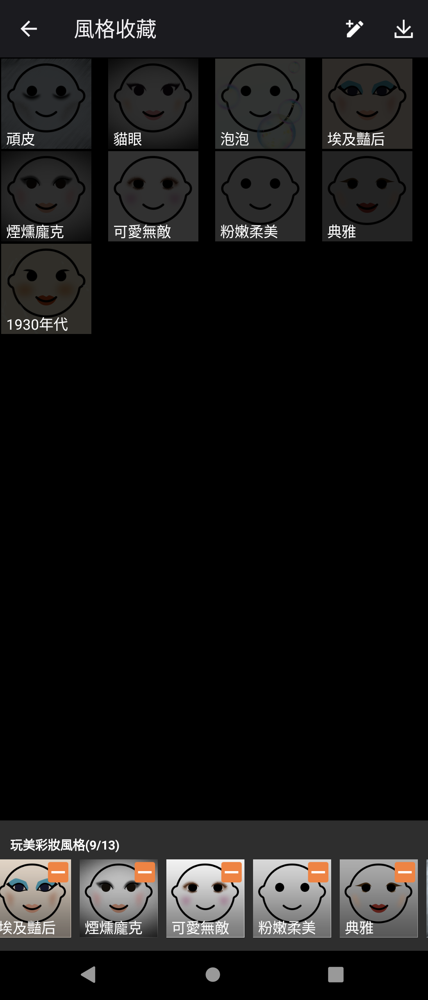
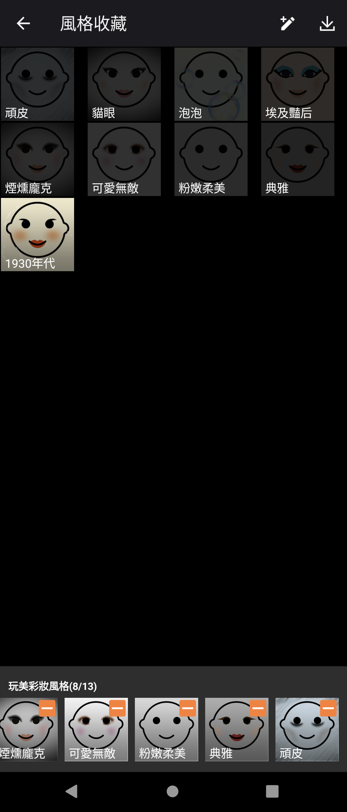

# 1930's 1.0.1

> 本項研究、修復實作、實機驗證、工具與文件由專案擁有者指導
> OpenAI Codex 完成；實體 Sony 與 HTC 手機操作由使用者監督。本項是獨立
> 保存研究，與 Sony、HTC、Google 或 APKMirror 無隸屬、贊助或背書關係。

## Status

最新且唯一的目錄版本 `1.0.1` 已在 Sony Android 13 的真實 Style portrait
host 中通過。Add-on 安裝及執行不需 Root；Style portrait host 的 21:9 黑邊
也已以最小 manifest 修補排除。相同最終 add-on APK 可在 HTC Android 6
安裝，但 HTC 沒有 Style portrait host，因此結論是 `accepted_sony_only`，
不宣稱跨品牌可用。

## Identity

| Field | Value |
| --- | --- |
| 840-app catalog index | 0 |
| APKMirror catalog name | 1930's |
| Catalog slug | `1930s` |
| Publication brand | Sony |
| Package | `com.sonymobile.styleportrait.addon.china30s` |
| Final version | `1.0.1` (`versionCode 101`) |
| SDK / ABI | minimum and target API 21; no native ABI payload |
| Component | Style portrait resource add-on; no standalone launcher |
| Genuine host | `com.sonymobile.android.addoncamera.styleportrait` |
| Runtime Root/Magisk | Not required |

## History

[APKMirror 的 1930's 目錄](https://www.apkmirror.com/apk/sony-mobile-communications/1930s/)
只保存 `1.0.1`。它屬於 Sony Style portrait 的年代造型 add-on，而不是可在
App 抽屜獨立啟動的相機 App。名稱中的年代是濾鏡主題，不代表發布年代。

## Purpose

此 APK 向 Style portrait host 提供 `1930年代` 造型的預覽、裝飾、眼妝、
腮紅、唇色及處理資源。Host 負責顯示 collection、加入或移除收藏，以及在
相機流程中套用資源；add-on 本身沒有帳號、網路服務或獨立 UI。

## Version decision

`1.0.1` 是目錄最新且唯一版本，因此沒有回退。原始 add-on 可在 Sony 使用，
但 manifest 把 Sony 私有 `com.sony.device` shared library 宣告為必需，造成
非 Sony package manager 拒絕安裝；portable v1 保留版本與 package，只將該
library 改為 optional 並重新簽章。

沒有比 `1.0.1` 更新而遭拒的候選。配套 host 採用本研究已驗證的 Style
portrait `30.0.A.0.1`。

## Repairs

### 1930's add-on

- `com.sony.device`: `android:required="true"` 改為 `false`。
- 沒有新增權限、launcher、網路、帳號或替代 Sony 服務。
- 因 APK 內容改變，最終檔使用專案本機測試金鑰重新簽章。

### Style portrait host

- 原 host 的 `resizeableActivity=false` 在 21:9 Sony 顯示器留下約 395 px
  相容性區域。
- 直接改成 resizable 雖填滿畫面，collection 內容卻變黑，故已淘汰。
- 最終方案保持 non-resizable，只將 binary manifest 的該 attribute slot
  精準改寫為 `android:maxAspectRatio="3.0"`。
- v3 雖可安裝與執行，但 Stage 9 還原驗證發現其 ZIP extra field 結構損壞，
  因此已拒絕並淘汰。v4 改由原始 APK 逐 entry 乾淨重建，清除所有 local 與
  central extra fields；`unzip -t`、CRC、zipalign 與簽章驗證均通過。
- 最終 host 除 `AndroidManifest.xml` 外，1,899 個非簽章 logical entries
  均與修補前基底一致。

### Deliberately unrestored features

沒有為 HTC 仿造或移植 Sony Style portrait host，也沒有繞過相機 HAL、OEM
授權或 Sony 私有服務。Add-on 在缺少 genuine host 的裝置仍無法實際使用。

## Tested platforms

| Device | OS/API | Root during runtime | Result |
| --- | --- | --- | --- |
| Sony Xperia 1 III XQ-BC72 | Android 13/API 33 | Not required | Genuine host discovery, full-height layout and favorite action passed |
| HTC One M8 | Android 6.0.1/API 23 | Not used | Exact APK installed; runtime blocked because Style portrait host is absent |

## Screenshots

以下為 exact final add-on 搭配 final max-aspect host 的 Sony 實機畫面。公開
副本已逐像素與 metadata 檢查，不含帳號、通知文字或裝置識別碼。

| Sony Android 13 restored state | Representative removal result |
| --- | --- |
|  |  |
| 直屏 collection 填滿可用 app area，`1930年代` 可用且收藏為 `(9/13)`。 | 移除後 `1930年代` 仍在 collection，收藏由 `(9/13)` 變 `(8/13)`。重新點選後恢復至左圖狀態。 |

## Verification

- Sony 端 final add-on 與 final host 均從已安裝位置 pull 回，SHA-256 與候選
  完全相同。
- 真實 collection 顯示 `1930年代`；移除收藏 `(9/13 -> 8/13)`，點選 tile
  後恢復 `(8/13 -> 9/13)`。
- Home/resume、back/reopen、force-stop/cold-reopen 都保留恢復後狀態。
- 最新 clean-log cold launch 為 235 ms，Activity 保持 resumed，無可歸因的
  fatal exception、ANR、linkage、resource、security 或 native crash。
- Host 實際 UI root 為 1096 x 2434；邊緣 back 與收藏控制觸控位置一致。
- Host 即使請求 landscape lock 仍保持 `ROTATION_0`，所以橫屏為有證據的
  `not applicable`，不是宣稱橫屏通過。
- 本 package 沒有 drawer entry 或獨立控制；完整 host-contract 行為取代一般
  launcher/deep-control 測試。
- HTC 同檔案安裝與 pull-back hash 通過，但 host 缺失，結果如實列為
  `htc_tested_failed_dependency`。

技術摘要見 [technical-test-summary.md](evidence/records/technical-test-summary.md)，
跨品牌資料見 [cross-oem-result.tsv](evidence/records/cross-oem-result.tsv)，公開
script 的逐 entry 重建驗證見
[reproducible-build.md](evidence/records/reproducible-build.md)。

## Known limitations

- 1930's 必須由相容的 Sony Style portrait host 載入，不能獨立啟動。
- HTC 沒有 genuine host，因而不具實際可用性；不推論其他 OEM 會成功。
- Collection manager 在本測試路徑固定直屏。
- 舊 host 的部分刪除圖示沒有 accessibility label；這是未改動的 host 限制，
  不是 add-on 新增的控制。
- 公開 repository 不散布 Sony APK；使用者須自行合法取得並核對輸入雜湊。

## Artifacts and integrity

| Artifact | SHA-256 / signer |
| --- | --- |
| 1930's Sony original `1.0.1` | `a8831dd72c66bf48e26e09509d975c8a11f3bfbcfb16825943c88ac3aa291e26` |
| Original Sony certificate | SHA-256 `bc01a8cd9e5d87854f6dc4c84aed49edc34ac196c00b89623cea6ccbbdea627b` |
| 1930's portable v1 exact tested APK | `ab092774e54ca9527fe7bff03ed6fc8bd478292252240273899446d664462eb7` |
| Style portrait original `30.0.A.0.1` input | `0f844f1cbc37154370642fab3398b74a2804003dd2825953a3ce0919d53d8c5f` |
| Style portrait max-aspect v4 clean-ZIP exact tested APK | `d910876ad0dfa484aa2907bd58520491f7bba7df04532a1436d19a1b169c7913` |
| Final local test certificate | SHA-256 `b5e26a13f091dd593e8f8024e7de21cc0426d0d383feae3300035b84def9d618` |

最終 APK 驗證為 v2/v3 簽章有效，且通過 `unzip -t`、CRC 與
`zipalign -c -p 4`。公開 build script 以乾淨 ZIP 重建方式重現已測的邏輯
修補；ZIP 時間戳、apktool 版本及使用者簽章不同時，輸出整檔 SHA-256 預期
會不同。

## Installation and rollback

使用者須自行提供上表兩個原始 APK 與自己的 keystore。先執行：

```bash
KEYSTORE_PASSWORD='your-password' KEY_PASSWORD='your-password' \
  ./scripts/build-and-sign.sh \
  1930s-1.0.1-original.apk style-portrait-30.0.A.0.1-original.apk \
  ./out ./your.keystore your-alias
```

一般安裝順序為 host 後 add-on：

```bash
adb install out/style-portrait-30.0.A.0.1-maxaspect.apk
adb install out/1930s-1.0.1-portable.apk
```

回溯前先備份原系統版本。此組為相同本機簽章，可直接卸載：

```bash
adb uninstall com.sonymobile.styleportrait.addon.china30s
adb uninstall com.sonymobile.android.addoncamera.styleportrait
```

再安裝已備份且簽章相符的原版本。不要用不同簽章直接覆蓋既有 package。

## Distribution and legal notice

發佈模式為 `patchset_only`。Repository 只提供本專案撰寫的文件、修補工具、
規格與隱私驗收後的測試證據；不包含 Sony 原始／重簽 APK、反編譯完整原始碼、
Sony 圖示或簽章私鑰。MIT License 只涵蓋本專案有權授權的內容；Sony 程式、
資源、名稱、商標及其他 OEM 資產仍屬原權利人。

## Research and authorship

- 專案方向、實機監督、警告確認與發布決策：專案擁有者。
- 版本分析、binary AXML 工具、修補、測試自動化、證據驗收與文件：OpenAI
  Codex，依擁有者指示完成。
- 1930's、Style portrait 及 Sony 發佈資產：原權利人。
- 來源：[APKMirror 1930's](https://www.apkmirror.com/apk/sony-mobile-communications/1930s/)、[APKMirror Style portrait](https://www.apkmirror.com/apk/sony-mobile-communications/style-portrait/)。
