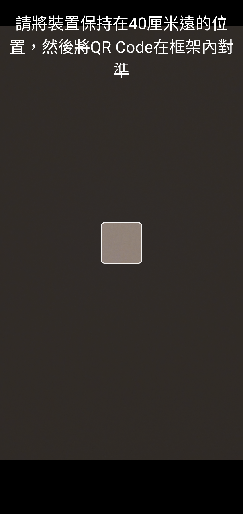
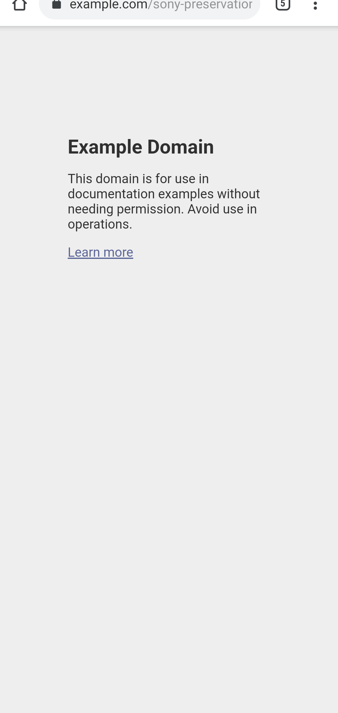

# Sony 2D Code Scanner 1.0.2.A.0.1 可攜式修復 v2

> 本項研究、反編譯分析、最小修復、測試自動化與文件整理，由專案擁有者
> 指導 OpenAI Codex 完成；Sony 與 HTC 實體手機測試由使用者監督。本項是
> 獨立保存研究，與 Sony、HTC、Google 或 APKMirror 無隸屬、贊助或背書關係。

## 狀態

最新版經兩項 Manifest 最小修復後，不需 Root 即可在 Sony Xperia 1 III
Android 13 啟動，並完成實體鏡頭掃描 QR、解析網址及交給瀏覽器開啟的完整
流程。HTC One M8 已用同一份 artifact 測試，但因手機只有 32 位元 ABI、而
最新版只有 arm64 native library，無法安裝。因此誠實標示為
`accepted_sony_only`，不宣稱通用跨品牌。

公開模式是 `patchset_only`；本 repository 不提供 Sony 原始或重簽 APK。

## 身分

| 欄位 | 內容 |
| --- | --- |
| 840 筆總目錄索引 | 1 |
| Package | `jp.co.sony.mc.simplecamera` |
| 最終版本 | `1.0.2.A.0.1`（`versionCode 2113537`） |
| 原始 SDK／ABI | minimum API 34、target API 35、`arm64-v8a` |
| 修復後 minimum API | 33 |
| 入口 | `jp.co.sony.mc.simplecamera/.CameraLauncher` |
| 執行時 Root／Magisk | 不需要 |

## 歷史

APKMirror 目錄依序保存 `1.0.A.0.16`、`1.0.1.A.0.1`、
`1.0.1.A.0.2` 與 `1.0.2.A.0.1`，涵蓋 2024 至 2025 年的 Sony
2D Code Scanner 發布紀錄。

## 用途

這是 Sony 的簡潔 QR 掃描器。把網址型 QR 放入畫面中央框內後，App 會解析
內容並使用 Android 標準 `ACTION_VIEW` 交給瀏覽器。

## 版本選擇

本研究保留 2025 年最新
`1.0.2.A.0.1`，沒有為了通過而回退舊版。

來源：[APKMirror 2D Code Scanner releases](https://www.apkmirror.com/apk/sony-mobile-communications/2d-code-scanner/)。

## 修復內容

1. 將 Manifest `minSdkVersion` 從 34 降為 33，讓 Sony Android 13
   Package Manager 接受；
2. 靜態確認程式碼沒有引用後，將 `com.sony.device` library 從 required
   改為 optional。

沒有修改 App 程式碼、native library、相機邏輯、權限、帳號、網路 endpoint
或授權流程。289 個非簽章 entry 中只有 `AndroidManifest.xml` 改變。

## 測試平台

| 裝置 | OS/API | 結果 |
| --- | --- | --- |
| Sony Xperia 1 III XQ-BC72 | Android 13/API 33 | 主頁、相機、實體 QR、權限恢復與 130% 字級通過 |
| HTC One M8 | Android 6.0.1/API 23 | 安裝失敗：32-bit 裝置不支援 arm64-only APK |

## 截圖





## 驗證結果

- Sony 208 ms 冷啟動進入真正的繁中掃描主畫面。
- 實體鏡頭掃描公開測試 QR，App UID 發出 `ACTION_VIEW` 並成功載入結果。
- 撤銷權限時顯示明確繁中說明並安全退出；恢復後重新進入主頁。
- 130% 字級沒有裁切，乾淨 regression log 無可歸責 fatal 或 ANR。
- HTC 的精確 artifact 安裝嘗試及 ABI 錯誤已保留，沒有改測較舊版本。

詳細結果見 [technical-test-summary.md](evidence/records/technical-test-summary.md)，
跨品牌限制見 [cross-oem-summary.md](evidence/records/cross-oem-summary.md)，
控制清單見 [deep-control-ledger.tsv](evidence/records/deep-control-ledger.tsv)。

## 已知限制

- 最終 APK 是本地重簽版本，不能覆蓋 Sony 正式簽章版本。
- 最新版只有 arm64 native library，32 位元手機無法安裝。
- App 刻意鎖定直屏，橫屏列為不適用而不是偽造通過。
- 自動化若在 force-stop 後零等待立即搶回相機，可能短暫顯示相機啟動失敗；
  一般冷啟動與四秒釋放後 regression 均通過。
- 實測只涵蓋上述兩台裝置，不推論其他機型必然相容。

## 檔案與完整性

| 成品 | SHA-256／簽署者 |
| --- | --- |
| Sony 原始 APK | `883cd3561721602d9efa3f8bde0982151d4dbf87349837439355665eaf05ba39` |
| Sony 原始憑證 | `bc01a8cd9e5d87854f6dc4c84aed49edc34ac196c00b89623cea6ccbbdea627b` |
| 內部實測 v2 APK | `7c2c0445d6c98817b0ff0e8b79c4340a171b94ae424b08f7cdd8072cce487e34` |
| 內部測試憑證 | `b5e26a13f091dd593e8f8024e7de21cc0426d0d383feae3300035b84def9d618` |

```bash
scripts/verify-input.sh ORIGINAL.apk
KEYSTORE_PASSWORD='...' KEY_PASSWORD='...' \
  ZIPALIGN=/path/to/zipalign APKSIGNER=/path/to/apksigner \
  scripts/build-and-sign.sh ORIGINAL.apk OUTPUT.apk KEYSTORE ALIAS
```

## 安裝與回溯

一般安裝不需 Root：

```bash
adb install OUTPUT.apk
adb shell am start -n jp.co.sony.mc.simplecamera/.CameraLauncher
```

覆蓋前請備份既有同 package App。回溯時卸載本地簽章版本，再安裝已驗證的
原始 APK 或系統版本；不同簽章通常不能直接互相覆蓋。

## 發布與法律聲明

Repository 只提供專案自有文件、測試紀錄及修補工具。使用者必須自行合法
取得精確原始 APK 並自行簽署。MIT License 不涵蓋 Sony 程式、圖示、名稱、
商標或其他 OEM 資產，相關權利仍屬原權利人。

## 研究與作者分工

- 專案方向、實機操作監督與發布決策：專案擁有者。
- 目錄整理、分析、修復、測試自動化、隱私驗收與文件：OpenAI Codex。
- App 原始程式與 Sony 發布資產：原權利人。
