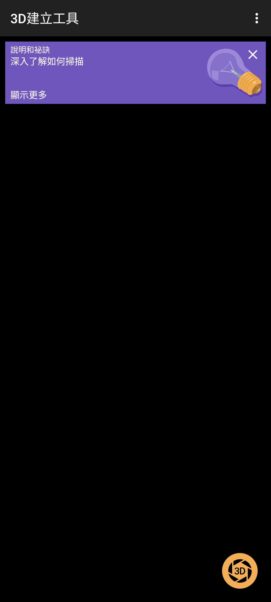
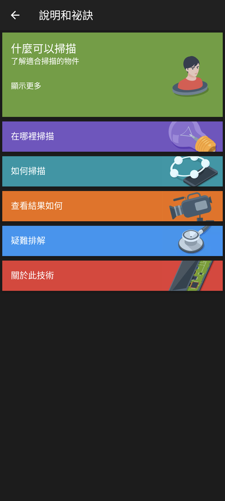
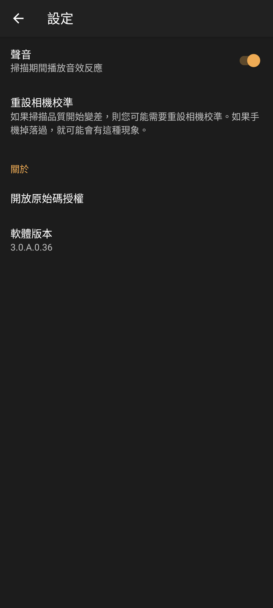
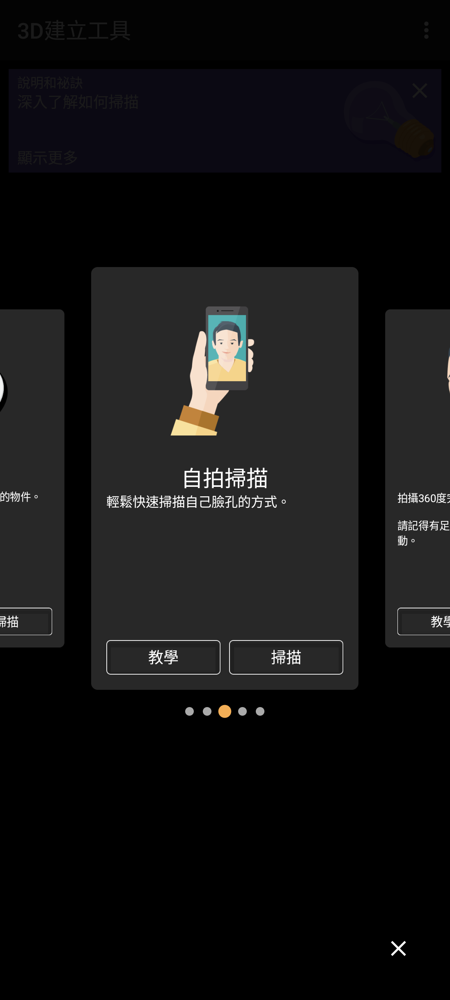

# Sony 3D Creator 3.0.A.0.36 compat v4

> 本項版本查核、反編譯分析、最小修復、實機測試及文件由專案擁有者
> 指導，OpenAI Codex 完成。這是獨立保存研究，與 Sony、HTC 或
> APKMirror 無隸屬、贊助或背書關係。

## 狀態

**部分通過（partial）**。最終 compat v4 能在 Sony Xperia 1 III／Android
13 以一般 APK 方式安裝，進入真正的 `3D建立工具` 主頁，使用說明、設定、
五種模式選擇，以及前後 Camera2 串流。後鏡頭工作流程已由「框住」進入
「校準」，掃描模式選單開啟時反覆旋轉也不再閃退。

尚未由實體操作完成一個完整 360 度模型，因此不宣稱成模、編輯、動畫、AR、
分享、列印或雲端備份已完整通過。HTC One M8／Android 6.0.1 因 API 低於
上游最低需求而無法安裝。

GitHub 採 `evidence_only`：本 repository **不提供 Sony 原始 APK、重簽 APK、
完整反編譯程式碼、Sony 圖像資產或簽署材料**。

## 身分

| 欄位 | 內容 |
| --- | --- |
| Catalog index | `510` |
| App | Sony 3D Creator |
| Package | `com.sonymobile.scan3d` |
| 上游版本 | `3.0.A.0.36`（versionCode `6291492`） |
| 最終修復 | `compat-v4-bc-j82-lifecycle` |
| 最低 Android | Android 8.0／API 26 |
| ABI | `arm64-v8a`、`armeabi-v7a`、`x86`、`x86_64`；掃描核心含 arm64 |
| Sony 執行所需 Root／Magisk | 不需要 |

## 歷史

Sony 3D Creator 用手機相機建立人物與物件的 3D 模型。Sony 提供臉部、食物、
自拍、頭部及自由造型五種掃描模式，並以逐步指引協助使用者繞著主體移動完成
掃描。歷史版本也曾提供模型編輯、動畫、AR、分享、列印、動態桌布及線上備份。

## 用途

使用者可以選擇五種掃描模式，依畫面引導框住、校準並繞著人物或物件移動，
建立可供後續檢視與編輯的 3D 模型。

## 版本選擇

APKMirror 目前把 [3.0.A.0.36](https://www.apkmirror.com/apk/sony-mobile-communications/3d-creator/)
列為此目錄最新的 universal Android 8.0+ 版本。Sony 的
[3D Creator 使用說明](https://www.sony.com/electronics/support/articles/SX606201)
亦說明校準及繞著主體移動的實體掃描方式。

## 修復內容

1. **退役下載狀態**：Google Play expansion 下載失敗後，原版會留下不可取消的
   `請稍候` 對話框。v1 只讓終止失敗狀態關閉既有對話框，沒有偽造購買、授權、
   下載成功或 OBB 內容。
2. **Xperia 1 III 相機表**：原生 `libScan3D.so` 不認得產品代碼 `BC`，會在
   `GetBackCamera` assertion 中中止。比較兩組既有 Sony 映射後，v3/v4 使用
   J82 的 `rose` 前鏡頭與 `vulture` 後鏡頭設定；只替換一個裝置表代碼，native
   binary 長度不變。
3. **Android 13 lifecycle**：掃描模式對話框開啟時旋轉，舊版會在 Activity
   重建期間對已清空的 `mFab` 呼叫 `show()`。v4 加入局部 null guard。
4. **介面保持原樣**：沒有重畫 Sony UI、沒有加入固定 Xperia 1 III 尺寸，也
   沒有修改原本直向主頁與橫向掃描器的契約。

完整版本比較、失敗證據與可回溯方式見 [REPAIR_NOTES.md](REPAIR_NOTES.md)。

## 截圖

以下公開副本已裁掉狀態列與導覽列，未包含相機預覽、人物、通知、帳號、位置或
裝置識別資訊。

| Sony Android 13 主頁 | 說明和祕訣 |
| --- | --- |
|  |  |

| 設定 | 掃描模式 |
| --- | --- |
|  |  |

## 測試平台

| 裝置 | OS／API | 同一最終 APK | 結果 |
| --- | --- | --- | --- |
| Sony Xperia 1 III XQ-BC72 | Android 13／API 33 | SHA-256 完全一致 | 主頁、版面、前後相機串流、校準入口及 lifecycle 修復通過 |
| HTC One M8 | Android 6.0.1／API 23 | 同一輸入檔 | `INSTALL_FAILED_OLDER_SDK`，未安裝 |

## 驗證結果

- Sony 冷啟動約 `319 ms`，兩張間隔 2 秒的 App-only settled frame 完全一致。
- 前鏡頭 ID 1 在約 10 秒內輸出 156 frames；後鏡頭 ID 0 輸出 277 frames。
- v4 後鏡頭按下開始後，畫面狀態由「框住」進入「校準」。
- 掃描模式選單開啟時連續 5 次直橫屏往返，零 attributable fatal／ANR。
- v3 回退、主頁啟動及 v4 恢復均已實測，最終安裝雜湊重新吻合。
- 32 個控制合約已閉合：29 個通過，3 個因完整實體成模或退役服務而阻擋。

更完整矩陣見 [TEST_RESULT.md](TEST_RESULT.md)。

## 已知限制

- ADB 截圖中的相機預覽區域呈黑色；CameraService 能證明相機開啟、解析度、
  frame production 與流程狀態，但不能替代真人目視預覽驗收。
- 尚未完成一個完整 360 度模型；因此模型編輯、動畫、face blend、AR、動態
  桌布及模型匯出未被宣告為通過。
- Play expansion 範例掃描內容不存在，沒有重建或偽造。
- Sony 線上備份、分享及第三方列印服務未恢復。
- native scanner 仍會查詢 Xperia 1 III 不提供的舊 Sony metadata tag；目前
  屬非致命警告，前後相機皆持續輸出 frames。
- HTC 測試是明確失敗結果，不代表跨品牌可用，更不推論所有 Xperia 均相容。

## 檔案與完整性

| 項目 | SHA-256／簽署 |
| --- | --- |
| APKMirror 原始 APK | `cd96f8bd067b5d0d36ec970fe5e41e1d653671f101e6188d2df611f47ff2f6a8` |
| 原始 Sony signer certificate | `bc01a8cd9e5d87854f6dc4c84aed49edc34ac196c00b89623cea6ccbbdea627b` |
| 最終 compat v4 APK | `2bf3121a3bd8456e59fce955fe60a5803acd22dbd2a4f4c050a1c525e06cd8ef` |
| 最終本地測試 signer | `982bb9a5d74a6ba9bd4589ed498062b903f6f29aa75537770a5dacf6d494584c` |
| v3 回溯 APK | `331acd94de5fb5a79702c2e274494968d3e98a8f940ebbf6458704ef66f87adf` |

最終 APK 是本地研究憑證重新簽署，不是 Sony production signer。公開雜湊只供
核對私人自用檔，不能用來表示 Sony 認可此修復。

## 安裝與回溯

私人自用 APK 由專案擁有者登入私人 App Store 取得。若裝置已有 Sony production
signature 版本，Android 不允許不同 signer 直接覆蓋；應先備份 App 資料及原始
APK，再依一般 Android 流程移除舊 signer lineage、安裝研究版。Root 並非執行
需求。

回溯演練採同一研究 signer：v4 降回 v3、確認真正主頁，再重新安裝 v4 並核對
安裝檔 SHA-256。完整離開研究版時可解除安裝 package，再還原原始 Sony 版本；
解除安裝會刪除本機模型與設定，必須先備份。

## 發布與法律聲明

GitHub 僅發布研究文件、雜湊與去識別化畫面。MIT License 只涵蓋本專案原創的
文件與工具，不授權 Sony APK、程式碼、名稱、商標、圖像或其他第三方內容。
相關權利仍屬原權利人。

私人 App Store 的 APK 僅供專案擁有者登入、自用，不是公開 repository 的一部
分，也不改變 GitHub 的 `evidence_only` 模式。

## 研究與作者分工

- 專案方向、實機監督、隱私與發布決策：專案擁有者。
- 版本查核、反編譯分析、修復、測試、證據整理及文件：OpenAI Codex。
- Sony 3D Creator 原始程式、名稱及圖像：原權利人。
