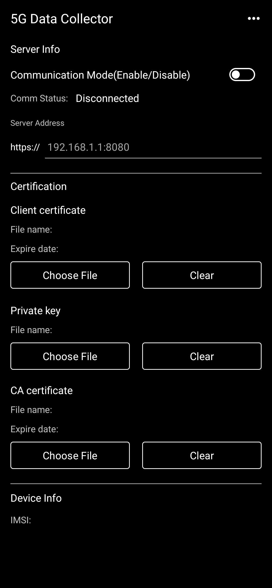
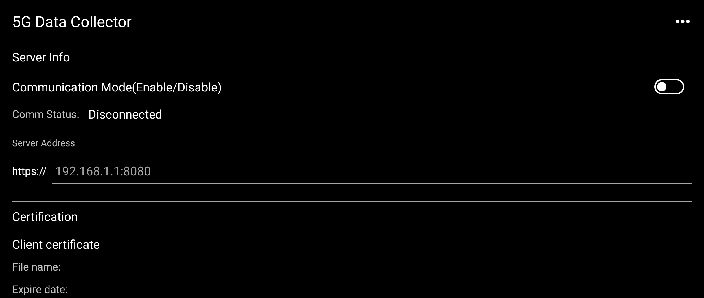
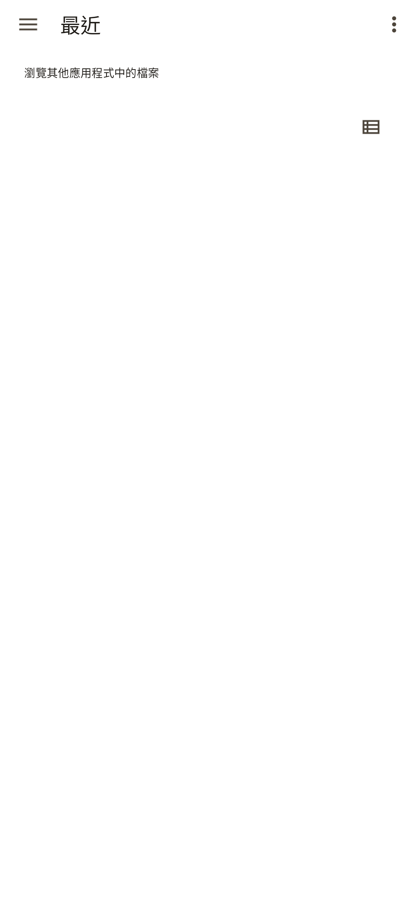

# Sony 5G Data Collector 1.0.9 保存研究

> 本項保存研究、版本整理、實機測試與文件由專案擁有者指導，OpenAI Codex 完成。這是獨立研究，與 Sony、HTC 或 APKMirror 無隸屬、贊助或背書關係。

## 狀態

Sony `5G Data Collector 1.0.9` 的 Android 13 原版可在 Sony Xperia 1 III Android 13 普通安裝並進入真正設定主頁，不需要修改 APK、Root 或重新開機。直向、橫向、130% 字級、資訊與授權對話框、三組檔案選擇器及生命週期測試均通過。

這是 Sony 工程用途的 5G 資料收集設定工具，不是一般消費者網路測速 App。驗收全程保持 Communication Mode 關閉，沒有選擇憑證、私鑰或 CA，也沒有啟動資料傳輸。

HTC One M8 Android 6.0.1 低於本版要求的 API 33，精確 APK 安裝失敗，因此本項結果是 `accepted_sony_only`，不宣稱跨品牌通用。

## 身分

| 欄位 | 結果 |
|---|---|
| 目錄索引 | supplemental `448` |
| Package | `jp.co.sony.mc.datacollectorui` |
| 版本 | `1.0.9` (`versionCode 10`) |
| Variant | Android 13+、`noarch`、`nodpi` |
| Sony 測試平台 | Xperia 1 III `XQ-BC72`，Android 13 / API 33 |
| HTC 測試平台 | One M8，Android 6.0.1 / API 23 |
| Root／Magisk／重新開機 | 不需要 |

## 歷史

`5G Data Collector` 是 Sony 後期 Xperia 工程套件，用來設定資料收集伺服器、通訊狀態、用戶端憑證、私鑰與 CA 憑證，並顯示裝置識別資訊。它依賴獲授權的收集端與憑證才具有完整業務功能。

## 用途

本研究只保存與驗證 App 本身可安全開啟的設定介面，不架設或模擬 Sony 收集服務，也不傳送實機資料。

## 版本選擇

APKMirror 目前列出同一版號 `1.0.9` 的兩個 variant：Android 13+ 與 Android 14+。Xperia 1 III 使用 Android 13，因此選擇 minimum API 33、6,023,485 bytes 的 Android 13 variant；Android 14 variant 無法在此測試平台普通安裝。

來源：[APKMirror 5G Data Collector 1.0.9 Android 13 variant](https://www.apkmirror.com/apk/sony-mobile-communications-inc/5g-data-collector/5g-data-collector-1-0-9-release/5g-data-collector-1-0-9-android-apk-download/)

## 修復內容

沒有修改 APK、Manifest、資源、程式碼、權限、端點或簽章。最終成品就是 Sony 簽署的 Android 13 原版。

公開截圖的 IMSI 數值已從公開副本遮除；未遮蔽的原始實機證據只保留在私人 NAS 研究封存中。

## 驗證結果

- 冷啟動可進入真正的 `SettingsActivity` 主頁。
- 直向與橫向填滿預期 App 區域，沒有 App 產生的黑邊、裁切或控制重疊。
- 130% 字級仍可閱讀並可透過捲動到達所有設定。
- App info 正確顯示 `1.0.9` 與 Sony 版權資訊。
- Software license 可顯示並捲動第三方授權內容。
- Client certificate、Private key 與 CA certificate 的 Choose File 均可呼叫 Android 文件選擇器並安全返回。
- 三個 Clear 在空狀態都能安全執行。
- Home、返回、重新進入與 30 秒穩定觀察沒有可歸責 fatal 或 ANR。
- Communication Mode 刻意不啟用；驗收沒有傳送任何資料。
- HTC 精確 APK 安裝失敗：`INSTALL_FAILED_OLDER_SDK`。

## 測試平台

| 裝置 | 系統 | 結果 |
|---|---|---|
| Sony Xperia 1 III `XQ-BC72` | Android 13 / API 33 | `accepted_sony_only`；安全本機控制與版面通過 |
| HTC One M8 | Android 6.0.1 / API 23 | 精確 APK 安裝失敗：`INSTALL_FAILED_OLDER_SDK` |

## 已知限制

- 完整資料收集需要獲授權的伺服器、用戶端憑證、私鑰及 CA；本研究沒有這些外部資源。
- 通訊開關沒有在真實收集環境中驗證，不宣稱上傳、TLS 或後端相容性通過。
- App 會顯示 IMSI 等敏感裝置資料，不應在未遮蔽的截圖、log 或公開 issue 中分享。
- Android 13 是最低要求，HTC Android 6 無法安裝。
- 只驗證上述 Sony 與 HTC，不推論所有 Xperia、Android 或 OEM。

## 截圖

公開副本已檢查像素、文字、中繼資料與尾端資料。主頁中的 IMSI 值已遮除；橫屏截圖停留在不顯示裝置資訊的區域；文件選擇器沒有私人檔名。

| 遮蔽 IMSI 的主頁 | 橫屏設定頁 | 系統文件選擇器 |
|---|---|---|
|  |  |  |

## 檔案與完整性

| 項目 | SHA-256 |
|---|---|
| 私人保存的 Sony 原始 APK | `f730591aef0bd60844b4ed4e99a65bdfb0af99c8e16c69d6d63ecb8387194ab3` |
| Sony 簽署憑證 | `6339375ac295cb0cd22811b97accd40104bd4a0185d4dd2289b81860c15d623c` |
| 遮蔽後主頁截圖 | `3a0e25fe34a47e6e568591b4ffeb235c124fae801cf3a04e1e889fa302e18d20` |
| 橫屏截圖 | `715e04723d39aa30900c70f151d29cd84b189ede9398128fbd291be2217ad051` |
| 文件選擇器截圖 | `b3013b10ab7565c1c9fe1b1fcf964428394a68454a62a9b2598256471d8434a5` |

公開 repository 不提供 Sony 原始 APK。公開模式為 `evidence_only`；精確原版只保留於專案擁有者的私人 App Store 與 NAS。

## 安裝與回溯

私人原版可使用一般 Android Package Manager 安裝：

```bash
adb install 5G-Data-Collector-1.0.9-vc10-api33-original.apk
adb shell am start -n jp.co.sony.mc.datacollectorui/.SettingsActivity
```

回溯時解除安裝 `jp.co.sony.mc.datacollectorui`。解除安裝會移除 App 本機設定；本驗收沒有匯入任何憑證或建立通訊工作。

## 發布與法律聲明

公開 repository 只發布專案撰寫的文件、雜湊、測試結論與去識別化截圖。Sony、Xperia、App 名稱、程式、介面、圖示、商標與其他資產仍屬原權利人，MIT License 不涵蓋 OEM APK 或資產。

## 研究與作者分工

- 方向、實機操作監督、隱私與發布決策：專案擁有者。
- 版本研究、驗收自動化、證據整理與文件：OpenAI Codex。
- App 原始程式與 Sony 發布資產：原權利人。
