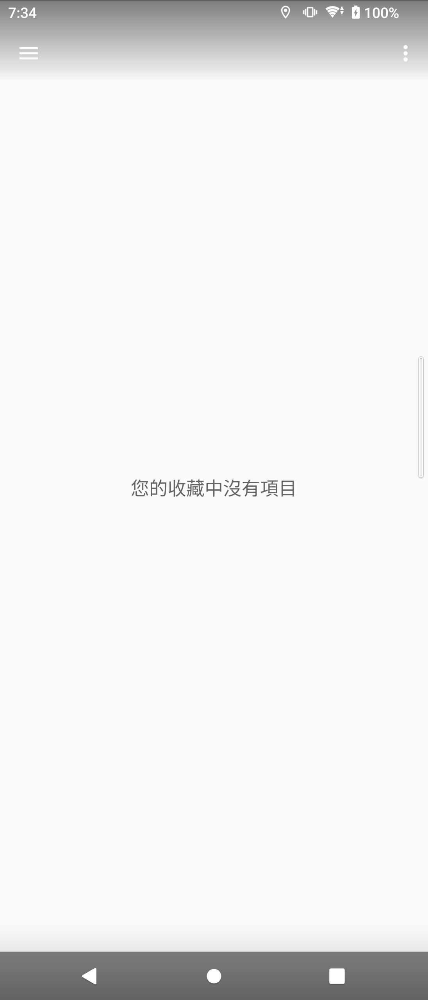
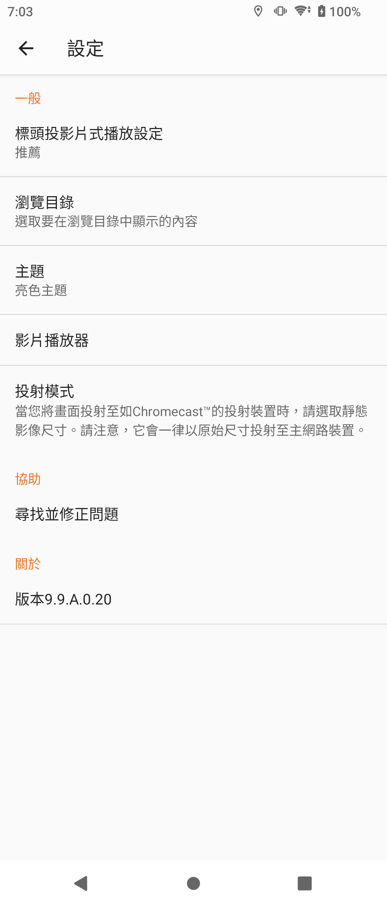

# Sony Album 9.9.A.0.20

> 本項研究、實機測試、驗收自動化與文件由專案擁有者指導 OpenAI Codex
> 完成；實體手機操作由使用者監督。這是獨立保存研究，未受 Sony、HTC、
> Google 或 APKMirror 贊助、認可或背書。

## 狀態

未修改的 Sony 正式簽章 APK 已在 Sony Xperia 1 III Android 13 通過主頁、
版面、媒體管理、離線、生命週期及深度控制驗收。HTC Android 6.0.1 因缺少
必要的 `com.sony.device` shared library，Package Manager 拒絕安裝原版。

## 身分

| 欄位 | 值 |
| --- | --- |
| 目錄索引 | `Z3M-A277` |
| Package | `com.sonyericsson.album` |
| 最終版本 | `9.9.A.0.20` (`versionCode 20054036`) |
| SDK / ABI | minimum API 19; target API 29; arm64-v8a + armeabi-v7a |
| Launcher | `.MainActivity` |
| 執行時 Root/Magisk | 不需要 |
| 公開模式 | `evidence_only` |

## 歷史

Xperia Z3 韌體基準是 `7.4.A.0.24`。Album 延續同一 package 至 9.9 分支；
本研究依完整版本矩陣選出 `9.9.A.0.20`。

## 用途

Album 是 Xperia 的相片與影片媒體庫，包含資料夾、最愛、隱藏項目、投影片、
檢視、分享、列印、移動、刪除及播放偏好。

## 版本選擇

`9.9.A.0.20` 是保留目錄中最新且符合 Xperia 1 III API/ABI 條件的候選；
精確原版的 package、版本、ABI、雜湊與正式簽章均已核對。

## 修復內容

沒有修改 APK。測試用媒體、資料夾、權限與設定均在驗收後清除或復原。

## 測試平台

| 裝置 | 系統 | 結果 |
| --- | --- | --- |
| Sony Xperia 1 III XQ-BC72 | Android 13 / API 33 | 通過 |
| HTC One M8 | Android 6.0.1 / API 23 | 安裝失敗：缺少 `com.sony.device` |

## 截圖

公開圖只顯示空白媒體頁與一般設定，不含私人相片、影片或檔名。

| 空白媒體頁 | 設定 |
| --- | --- |
|  |  |

## 驗證結果

- 18 個畫面、84 個控制：83 通過、0 失敗、1 個外部整合受阻。
- 合成媒體的檢視、最愛、分享路由、資料夾、移動、隱藏、取消隱藏與刪除通過。
- 直屏、橫屏、邊緣觸控、冷啟動、離線啟動及設定保存通過。
- 沒有歸因於 Album 的 fatal exception、ANR、security 或 linkage 錯誤。

## 已知限制

- 隔離測試使用者缺少 Cinema Pro 的完整外部 Sony companion 環境，該抽屜
  整合不能完成；Album 本身保持穩定。
- HTC 缺少 Sony shared library，不能據此宣稱跨品牌可用。
- 未執行完整 TalkBack 手勢稽核。

## 檔案與完整性

| 項目 | SHA-256 |
| --- | --- |
| Sony original APK | `b6c8bdf0754b8921410ea7d9aaef4e9038d5813cf491c3a1130805ee34963fe6` |
| Sony certificate | `6339375ac295cb0cd22811b97accd40104bd4a0185d4dd2289b81860c15d623c` |
| 空白媒體頁截圖 | `5119e4691e268c87e81c2a38f0d77e328183690e6b5b11cfcee9b0ef69b097d5` |
| 設定截圖 | `a4fcefa51b2bfb5ff22f4f632cd1ed7d773c7e5575d9b00144837f492861d841` |

## 安裝與回溯

```bash
shasum -a 256 Sony-Album-9.9.A.0.20-original.apk
adb install Sony-Album-9.9.A.0.20-original.apk
adb shell am start -n com.sonyericsson.album/.MainActivity
adb uninstall com.sonyericsson.album
```

清除資料或卸載前應先備份尚未另存的本機媒體與 Album 專屬狀態。

## 發布與法律聲明

公開 repository 只包含本專案撰寫的文件、測試摘要與經隱私驗收的截圖，
不包含 Sony APK、反編譯程式碼、圖示或其他 OEM binary。MIT License
不涵蓋 Sony 程式、名稱、商標與資產。

## 研究與作者分工

- 專案方向、實機操作監督與發布決策：專案擁有者。
- 測試自動化、證據驗收與文件：OpenAI Codex，依擁有者指示完成。
- Album 原始程式與 Sony 發布資產：原權利人。
