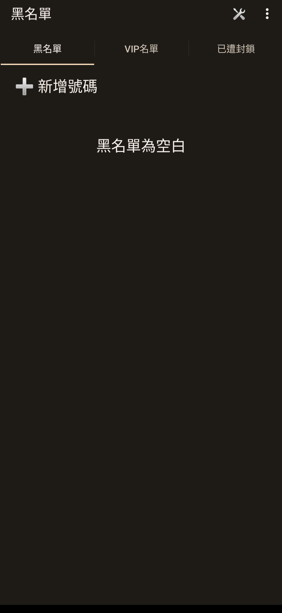
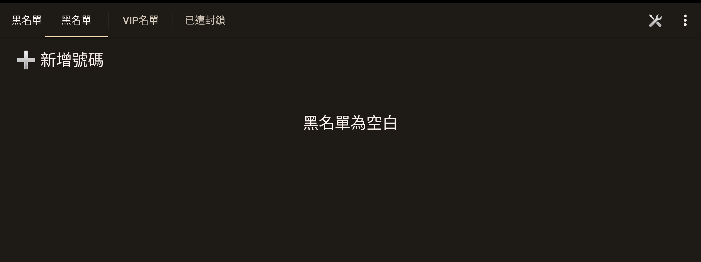

# Sony Blacklist 7.1.A.0.8 保存與相容性紀錄

> 本研究的版本盤點、APK 分析、相容性修復、實機驗證與文件整理，
> 由專案擁有者指導 OpenAI Codex 完成。這是獨立保存研究，與 Sony、
> HTC 或 APKMirror 無隸屬、贊助或背書關係。

## 狀態

本頁標示為 **PARTIAL / 核心通訊功能未驗證**。

`7.1.A.0.8` 是 APKMirror 目前列出的唯一及最新版本。修復版可在 Sony
Xperia 1 III／Android 13 與 HTC One M8／Android 6.0.1 進入真正主畫面，
完成繁體中文介面、直橫屏、32 個可見控制及可回復測試。安裝與執行不需要
Root，也不需要重新開機。

本研究沒有用真實來電與簡訊驗證攔截效果。為避免 Android 13 啟動崩潰，
修復版停用了舊版 `BlockService` 使用的內部電話 listener，因此**不宣稱此
版本已恢復實際來電或簡訊封鎖能力**。

公開 repository 僅提供研究紀錄與去識別化截圖，不提供 Sony 原始 APK 或
本地重簽 APK。

## 身分

| 欄位 | 內容 |
| --- | --- |
| 840 筆總目錄索引 | 56 |
| Package | `com.sonymobile.blacklist` |
| 版本 | `7.1.A.0.8`（`versionCode 14811144`） |
| SDK／ABI | minimum API 13、target API 15、無 native ABI |
| 原始 APK SHA-256 | `bfdb725ffe7f1c42419173d5ca7e74e4015bacb50bb0b07488df5ba2346d4562` |
| Sony 原始簽章 SHA-256 | `144e795012dc9dbaf229efa262d11b8481e02ef54136afcb786fbadc25130eb5` |
| 最終修復 APK SHA-256 | `d29809c05928b6b7e1f0f155dfc52425ad0ae0920d54101f420afb032d5eec44` |
| 本地相容性簽章 SHA-256 | `c8995d8defe8e6b0eda53ac730f4241d0d2cb1d363603be88341d9708388a09d` |
| 執行時 Root／重新開機 | 均不需要 |

## 用途與歷史

Blacklist 是 Sony Mobile 的舊式電話與簡訊黑名單工具。介面提供黑名單、
VIP 名單、已封鎖項目、手動新增號碼及封鎖模式設定。

APKMirror 目前只保存 `7.1.A.0.8` 一個 release，因此本研究沒有回退到較舊
版本。

來源：

- [APKMirror Blacklist releases](https://www.apkmirror.com/apk/sony-mobile-communications/blacklist/)
- [Blacklist 7.1.A.0.8](https://www.apkmirror.com/apk/sony-mobile-communications/blacklist/blacklist-7-1-a-0-8-release/blacklist-7-1-a-0-8-android-apk-download/)

## 修復內容

1. 將 `BlockService.onStartCommand` 內已被現代 Android 移除的內部電話
   listener 註冊改為安全的 no-op，避免 Android 13 啟動崩潰。
2. 在 manifest 加入 `android:maxAspectRatio="3.0"`。
3. 在 manifest 加入 `android:resizeableActivity="true"`，修復橫屏右側黑邊。

最終版本保留第一版修復的 `classes.dex` 與 `resources.arsc`；第三步只替換
必要的 binary manifest。APK 因修改而改用本地相容性簽章，不能冒充 Sony
原始簽章，也不宣稱可使用 Sony signature-level 整合。

## 測試平台

| 裝置 | 結果 |
| --- | --- |
| Sony Xperia 1 III／Android 13 | 真正主頁、繁中介面、直橫屏與 32 個可見控制通過 |
| HTC One M8／Android 6.0.1 | 同一最終 APK 普通安裝、真正主頁、分頁及直橫屏通過 |

兩台裝置測試後都移除合成號碼並還原設定。測試記錄沒有發現可歸因於本 App
的 Fatal、ANR、SecurityException 或 linkage error。

## 驗證結果

- 冷啟動可到達 `com.sonymobile.blacklist/.BlacklistActivity` 真正主畫面。
- 黑名單、VIP 名單、已封鎖、手動新增、設定、刪除與清單模式均可操作。
- 32／32 個有限可見控制通過；合成測試資料已刪除。
- 直屏與橫屏都填滿 App 可用範圍，沒有 App 造成的黑邊、裁切或重疊。
- 來電模式及簡訊模式的有限 UI 選項均完成切換、取消及還原。

## 截圖



*Sony Xperia 1 III／Android 13：去識別化後的空白黑名單主畫面。*



*Sony Xperia 1 III／Android 13：修復後的橫向畫面，右側不再出現黑邊。*

## 已知限制

- 沒有以真實來電或簡訊完成端到端攔截驗證。
- 舊版內部電話 listener 已為穩定性停用；實際封鎖能力不列為通過。
- 沒有完成 TalkBack 語意與完整權限允許／拒絕矩陣。
- 本地重簽版本不具 Sony 原始 signature-level 權限或整合保證。
- 測試只涵蓋上述兩台裝置，不推論其他 Android 裝置必然相容。

## 安裝與回溯

私人自用修復 APK 可透過一般 Package Manager 安裝：

```bash
adb install Sony-Blacklist-7.1.A.0.8-PARTIAL-Compat-v3.apk
adb shell am start -n com.sonymobile.blacklist/.BlacklistActivity
```

回溯可用一般 Package Manager 卸載，不會替換系統核心元件：

```bash
adb uninstall com.sonymobile.blacklist
```

## 發布與法律聲明

Sony APK、程式碼、圖示、名稱、商標及其他 OEM 資產仍屬原權利人。
Repository 的授權只涵蓋本專案自行撰寫的文件與工具，不涵蓋 Sony 二進位檔。

## 研究與作者分工

- 專案方向、實機操作監督與發布決策：專案擁有者。
- 盤點、分析、修復、驗證、隱私檢視與文件：OpenAI Codex。
- App 原始程式與 Sony 發布資產：原權利人。
