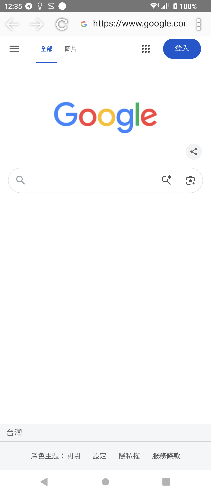
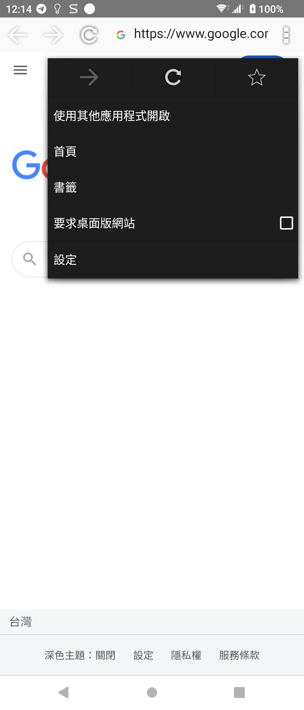
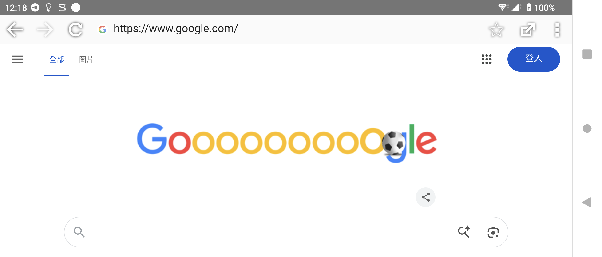
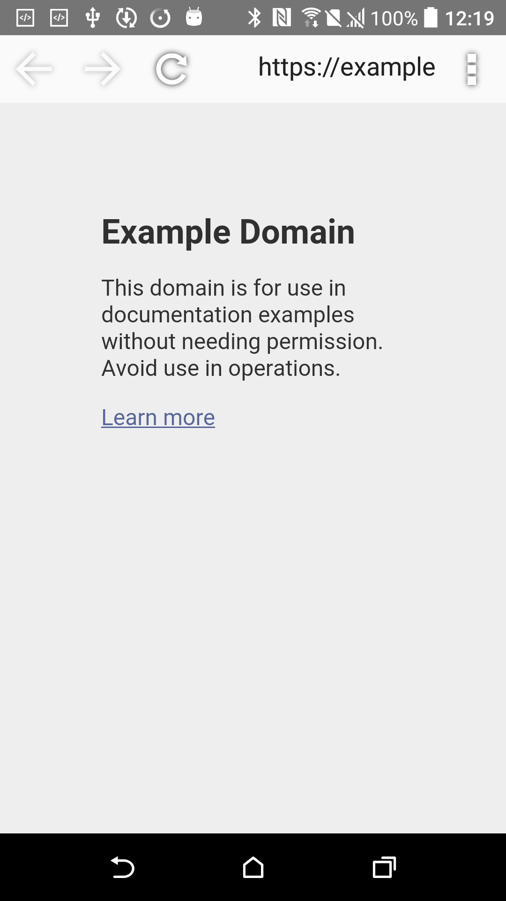
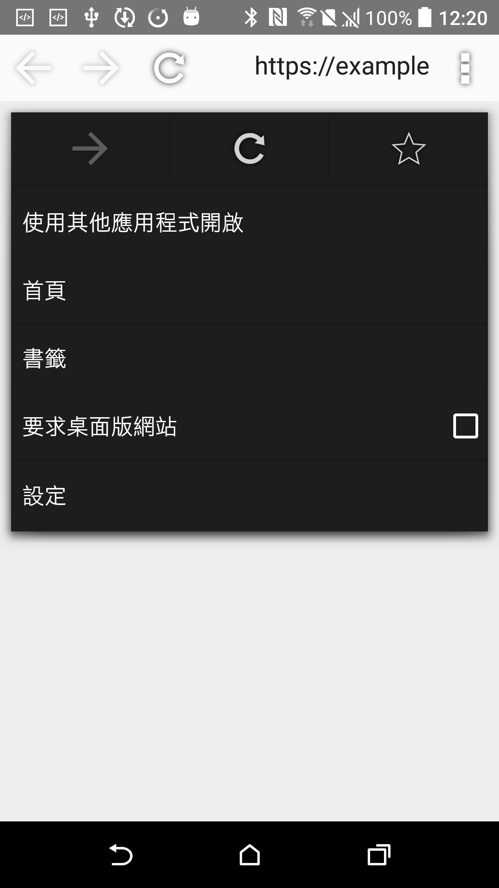

# Browser (small app) 3.2.3 保存與相容性修復

> 本項研究、反編譯協助、修復實作、測試自動化與文件整理，皆由專案
> 擁有者指導 OpenAI Codex 完成；Sony 與 HTC 實體手機測試由使用者監督。
> 本項是獨立保存研究，與 Sony、HTC、Google 或 APKMirror 無隸屬、贊助
> 或背書關係。

## Status

最終 `v3c` 修復版在 Sony Xperia 1 III Android 13 與 HTC One M8
Android 6.0.1 均可透過一般 APK 安裝，不需要 Root、Magisk、系統 overlay
或重新開機。兩台裝置都能進入真正的 Sony 瀏覽器主頁、載入 HTTPS 網頁，
並通過直屏與橫屏驗證。

技術判定為 `accepted` / `universal_no_root`。階段 7 的 46 項可見控制清單
已關閉：45 項通過，1 項因沒有網站權限紀錄而由原程式停用，列為有證據的
`not_applicable`；沒有失敗或阻塞項目。

## Identity

| 欄位 | 值 |
| --- | --- |
| 840-App catalog index | 67 |
| APKMirror 名稱 | Browser (small app) |
| Catalog slug | `browser-small-app` |
| 發布品牌 | Sony |
| Package | `com.sonymobile.smallbrowser` |
| 最終版本 | `3.2.3` (`versionCode 30203`) |
| SDK / Variant | minimum API 16；target API 23；noarch；nodpi |
| 元件 | 原始 Small Apps service；修復後新增 `.FullBrowserActivity` launcher |
| Runtime Root / Magisk | 不需要 |

這是 Xperia Small Apps 時期的迷你瀏覽器，不是完整尺寸的 `Sony Browser`，
也不是 Android 系統瀏覽器的另一個 catalog row。

## History

[APKMirror 的 Browser (small app) 目錄](https://www.apkmirror.com/apk/sony-mobile-communications/browser-small-app/)
與完整年代頁共保存十個版本：`2.0.9`、`2.0.11`、`2.1.1`、`3.0.4`、
`3.1.5`、`3.1.6`、`3.1.8`、`3.1.9`、`3.2.1` 與 `3.2.3`。

這類 App 原本在 Xperia 的 Small Apps 浮動視窗框架內執行。新系統已移除
必要的 `com.sony.smallapp.framework`，所以原版即使保存完整，也不能作為
一般 launcher App 直接使用。

## Purpose

- 在 Xperia 浮動小工具中瀏覽網頁。
- 輸入網址或關鍵字搜尋。
- 上一頁、下一頁、停止與重新整理。
- 首頁、書籤、桌面版網站與外部瀏覽器開啟。
- JavaScript、Cookie、字級、編碼、定位與頻寬設定。

## Version decision

選用 `3.2.3`，因為完整發佈年代紀錄確認它是最後一版；原始 APK 的 package、
版本碼、minimum SDK、SHA-256 與簽章均已核對。根目錄頁曾顯示較舊的
`3.1.8` 摘要，但同一目錄的 release/variant 紀錄與實際檔案都證明
`3.2.3` 才是最終候選。

沒有比 `3.2.3` 更新而被拒絕的版本。原封不動版本先行測試後，確認缺少
Small Apps framework 與一般 launcher，才進入最小相容性修復。

## Repairs

1. 移除已不存在的必要 library `com.sony.smallapp.framework`。
2. 新增一般 Android `FullBrowserActivity`，但沿用原始 `plusone_main_sys`、
   `plusone_menu`、圖示、繁中資源、WebView、provider 與設定頁。
3. 在建立原始網址輸入元件前初始化 `SonyCustomizedConfig`，修正搜尋建議的
   null configuration 崩潰。
4. 加入 `resizeableActivity` 與 `android.max_aspect=3.0`，移除 Xperia 1 III
   底部的舊比例相容性黑邊。
5. 窄螢幕將書籤與外部開啟保留在原始更多選單，橫屏顯示完整工具列。
6. 修正原始深色選單在新系統上的文字與 checkbox 對比。
7. 接回上一頁、下一頁、重整、搜尋、首頁、書籤、桌面模式、外部開啟及
   原始設定頁。

精確 manifest 差異與新增程式位於 [patches](patches/)，完整說明見
[PATCH_NOTES.md](PATCH_NOTES.md)。

### Deliberately unrestored features

舊 Xperia Small Apps 的浮動、貼合與取消貼合視窗控制沒有復原，因為現代
Android 已不存在對應 host contract。本修復把瀏覽器保存為一般可調整尺寸的
App，沒有偽造 Small Apps framework、Sony 系統服務或不存在的視窗能力。

## Tested platforms

| 裝置 | OS / API | Runtime Root | 結果 |
| --- | --- | --- | --- |
| Sony Xperia 1 III XQ-BC72 | Android 13 / API 33 | 不需要 | 真實主頁、HTTPS、46 項控制、直橫屏與 130% 字級通過 |
| HTC One M8 | Android 6.0.1 / API 23 | 無 Root 裝置 | 同一 APK 安裝、主頁、選單、設定與直橫屏通過 |

## Screenshots

所有圖片都來自最終 `v3c`，公開副本已逐像素、metadata 與 PNG 結尾資料
檢查。畫面只包含公開測試頁、App UI 與一般狀態列。

| Sony Android 13 主頁（直屏） | Sony Android 13 功能選單（直屏） |
| --- | --- |
|  |  |

| Sony Android 13 主頁（橫屏） |
| --- |
|  |

| HTC Android 6 HTTPS 主頁（直屏） | HTC Android 6 功能選單（直屏） |
| --- | --- |
|  |  |

## Verification

- 冷啟動進入原始 Sony 工具列並載入 Google；Example Domain 的 HTTPS
  內容可正常顯示。
- 網址搜尋、上一頁、下一頁、重新整理、首頁、書籤新增與讀回均通過。
- 桌面版 user-agent 切換與持久化、外部瀏覽器交接、原始設定頁均通過。
- 隱私、協助工具、進階、頻寬與開放原始碼授權頁的可見控制逐項測試。
- 網路錯誤頁能以繁中顯示並恢復；Home、背景與 resume 保留目前網址。
- Sony 直屏、橫屏及 130% 系統字級沒有 App 建立的黑邊、黑畫面、重疊
  或不可讀文字。
- 最終 Sony 與 HTC pullback APK 的 SHA-256 都與候選檔相同；兩端最終
  log 沒有可歸因於本 App 的 fatal exception 或 ANR。
- 測試書籤、偏好、字級與旋轉已還原；HTC 測試套件已卸載。

逐項結果見 [deep-control-ledger.tsv](evidence/records/deep-control-ledger.tsv)。

## Known limitations

- 只對上述 Sony Android 13 與 HTC Android 6 提出實測聲明，不推論所有
  Android 版本與 WebView 實作都相容。
- 舊 Small Apps 浮動視窗模式未復原。
- 修復版使用自行簽章，不能直接覆蓋 Sony 原簽章安裝；既有資料需先備份。
- 歷史 target API 23 的安全模型與現代瀏覽器不同，不建議拿它處理敏感帳號、
  金融資料或不受信任下載。
- 公開 repository 不提供 Sony 原始或重簽 APK。

## Artifacts and integrity

| Artifact | SHA-256 / 簽章 |
| --- | --- |
| Sony 原始 APK `3.2.3` | `dbac9c685f3d5072413d037ffa7de12f7617015dd20ace236802ddd2ea707551` |
| Sony 原始 certificate | SHA-256 `156352019a4cbb756e52f3fad32e7441c143ef7d65f03598bcc0e1846d2e2cfb` |
| 最終私用 `v3c` APK | `e47df44964f80a33bbefe5e91dc464ae368475a544ab71fe124e53a8b3490610` |
| 測試用本機 certificate | SHA-256 `b5e26a13f091dd593e8f8024e7de21cc0426d0d383feae3300035b84def9d618` |

公開的 [build-and-sign.sh](scripts/build-and-sign.sh) 只接受上述原始 SHA-256，
套用 [AndroidManifest.patch](patches/AndroidManifest.patch)，把專案撰寫的
`FullBrowserActivity.java` 編譯為第二個 dex，再以使用者自己的金鑰簽署。
為重現實機版本的資源布局，腳本明確要求 apktool 3.0.2 的兩階段正規化、
Android platform 35 與 build-tools 35.0.0。除 APK 簽章 metadata 外，公開
重建與實機最終版的 275 個 ZIP entries 已逐一比對，新增、移除與變更皆為 0。
重建與邏輯 payload 驗證見
[reproducible-build.md](evidence/records/reproducible-build.md)。

## Installation and rollback

使用者須自行合法取得原始 APK，先驗證輸入，再以自己的 keystore 重建：

```bash
./scripts/verify-input.sh Browser-small-app-3.2.3.apk
APKTOOL_JAR=/path/to/apktool_3.0.2.jar \
KEYSTORE_PASSWORD='...' KEY_PASSWORD='...' \
  ./scripts/build-and-sign.sh Browser-small-app-3.2.3.apk \
  Browser-small-app-3.2.3-v3c.apk own.keystore alias
adb install Browser-small-app-3.2.3-v3c.apk
```

啟動與基本回溯：

```bash
adb shell am start -n com.sonymobile.smallbrowser/.FullBrowserActivity
adb uninstall com.sonymobile.smallbrowser
```

若手機已安裝同 package，先保存 `pm path` 指向的 APK 與必要 App data；不同
簽章版本必須先卸載才能安裝。回溯時移除修復版，再安裝先前保存且雜湊已核對
的 APK，必要時還原其資料。

## Distribution and legal notice

公開模式為 `patchset_only`。Repository 僅包含本專案撰寫的文件、測試台帳、
相容性 Activity、manifest patch、重建腳本與通過隱私驗收的圖片，不包含
Sony 原始或重簽 APK。自用最終 APK 只會在專案擁有者明確授權後放入私人
App Store。

MIT License 只涵蓋本專案有權授權的內容。Sony、Xperia、原始 App、程式、
圖示、字串、名稱與商標仍屬各自權利人；本研究不授予任何 OEM 資產授權。

## Research and authorship

- 專案方向、實體手機操作監督與發布決策：專案擁有者。
- 版本整理、反編譯協助、修復程式、測試自動化、證據與文件：OpenAI Codex，
  依專案擁有者指示完成。
- Sony Browser (small app) 原始程式與資產：原權利人。
- 版本來源：[APKMirror Browser (small app) releases](https://www.apkmirror.com/apk/sony-mobile-communications/browser-small-app/)。
