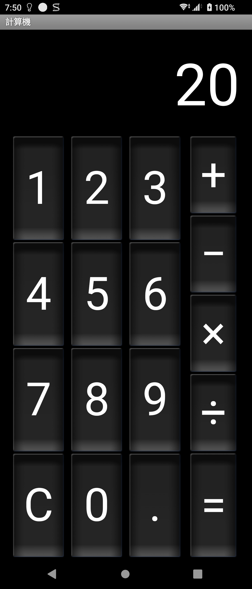
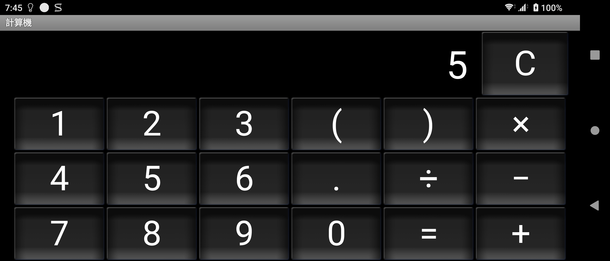
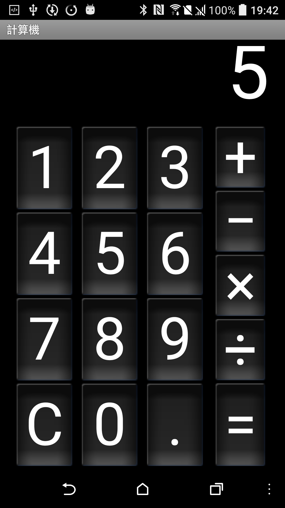
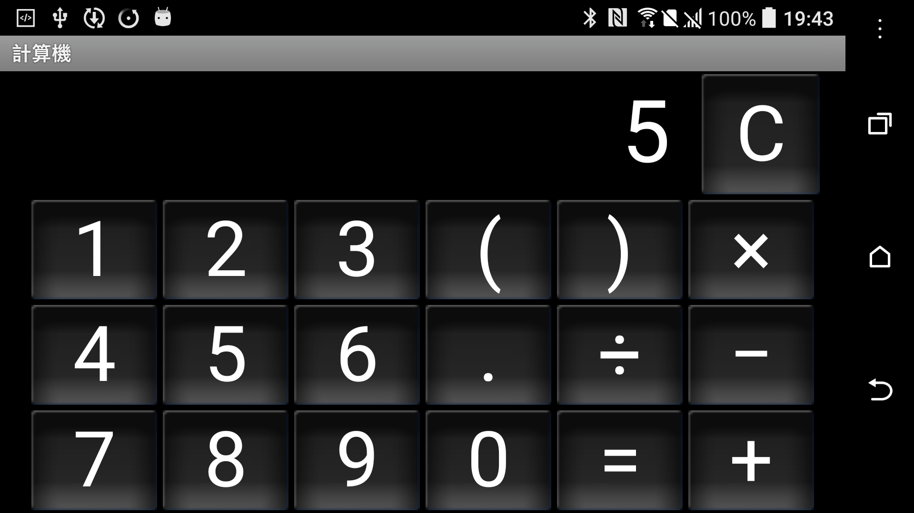

# Sony Calculator 2.1-update1 portable responsive v4

> 本項研究、反編譯分析、最小修復、實機測試及文件由專案擁有者指導
> OpenAI Codex 完成。Sony 與 HTC 實體手機結果由使用者監督。這是獨立
> 保存研究，與 Sony、HTC、Google 或 APKMirror 無隸屬、贊助或背書關係。

## 狀態

技術驗證完成。最終 v4 在 Sony Android 13 與 HTC Android 6 使用一般 APK
安裝即可進入真實主頁，直屏與橫屏均可操作，沒有舊版長寬比限制造成的大面積
黑邊。公開模式為 `patchset_only`，本 repository 不提供 Sony 原始 APK、
重簽 APK、反編譯完整程式碼或 Sony 圖示。

## 身分

| 欄位 | 內容 |
| --- | --- |
| 840-app catalog index | 72 的歷史版本，不另增一筆 |
| APKMirror catalog name | Calculator |
| Catalog slug | `calculator-sony` |
| 發布分類 | Sony |
| 原始 package | `com.android.calculator2` |
| 可攜 package | `com.android.calculator2.preserved` |
| 最終版本 | `2.1-update1`（versionCode 7） |
| 最終修復 | portable responsive v4 |
| 元件類型 | App 抽屜可見 Launcher App |
| 執行所需 Root/Magisk | 不需要 |

這是 Calculator 同一目錄的早期歷史版本，不是
`com.sonymobile.exactcalculator` 的 Sony Calculator 1.0.B.1.0。

## 歷史

[APKMirror 的 Calculator 目錄](https://www.apkmirror.com/apk/sony-mobile-communications/calculator-sony/)
保留 `2.1-update1`、`2.3.4`、`4.0.4-tL1_3w`、
`4.4.4-Android.1064`、`7.1.1` 與 `8.0.0`。本頁保存最早的
`2.1-update1` 使用體驗；同目錄的最新保存候選另見
[Calculator 8.0.0](../calculator-8.0.0/)。

## 用途

這是一款可離線使用的基本與科學計算機。直屏提供數字、四則運算、小數、
清除與等號；橫屏可顯示括號及科學運算面板，包含三角函數、對數、常數、
平方根、冪次與階乘。App 不需要帳號、網路或雲端服務。

## 版本選擇

`2.1-update1` 不是同目錄的最新版，而是使用者指定保存及推廣的歷史分支。
最新版選擇仍是 8.0.0；本頁不以 2.1-update1 取代它。原始候選在新款 Xperia
可執行，但有直屏底部相容模式黑邊，橫屏則出現左右黑邊與嚴重文字裁切。

## 修復內容

修復歷經四個可回溯版本，最終 v4 的公開補丁只做以下變更：

1. 宣告 small 至 xlarge、any-density、可調整 Activity 與 3.0 最大長寬比；
2. package 改為 `com.android.calculator2.preserved`，可與系統計算機共存；
3. Activity 名稱改成完整類別名稱，維持原有程式入口；
4. 新增直屏與橫屏專用 style，以 `sp` 設定適合各方向的按鍵與顯示字級。

沒有修改計算邏輯、加入權限、網路、追蹤、native library、帳號或服務依賴。
完整變更位於
[calculator-2.1-update1-portable-responsive-v4.patch](patches/calculator-2.1-update1-portable-responsive-v4.patch)。

### 各修復版差異

| 修復版 | 內容 | 結果 |
| --- | --- | --- |
| v1 | 解除舊長寬比限制 | 直屏改善，橫屏字級仍過大 |
| v2 | 增加橫屏 responsive style | 橫屏改善，但仍使用原 package |
| v3 | 改成可共存 package | Sony 與 HTC 可並存安裝 |
| v4 | 增加直屏專用 responsive style | 最終候選 |

## 測試平台

| 裝置 | OS/API | 執行時 Root | 結果 |
| --- | --- | --- | --- |
| Sony Xperia 1 III XQ-BC72 | Android 13/API 33 | 不需要 | 主頁、直橫屏、基本與科學功能通過 |
| HTC One M8 | Android 6.0.1/API 23 | 無 Root | 同一最終 APK 安裝、主頁、直橫屏與 2 + 3 通過 |

## 截圖

以下皆為最終 v4 在實體裝置的實際畫面。公開副本已檢查畫面內容並移除 PNG
metadata，未包含帳號、通知內容、裝置序號或私人行程。

| Sony Android 13 直屏 | Sony Android 13 橫屏 |
| --- | --- |
|  |  |

| HTC Android 6 直屏 | HTC Android 6 橫屏 |
| --- | --- |
|  |  |

## 驗證結果

- Sony 與 HTC 均使用同一 v4，兩台手機拉回 APK 的 SHA-256 與凍結候選一致。
- 冷啟動可進入真實計算機主頁；`2 + 3 = 5` 通過。
- 直屏、橫屏皆填滿 App 可用區域，沒有 App 自己造成的大面積黑邊或文字裁切。
- 所有數字鍵、四則運算、刪除、長按清除、括號與科學面板均已操作。
- `sin(0)`、`cos(0)`、`tan(0)`、`ln(1)`、`log(100)`、
  `5!`、`2^3`、`sqrt(9)` 與括號運算結果正確。
- 小數鍵會以 `0.` 顯示；pi 與 e 依螢幕寬度截短顯示，原始自動比對曾因
  預期字串不同標記失敗，人工核對功能與數值後判定通過。
- Home/resume、Back 重開、force-stop 重開、除以零與歷史操作未出現 App
  所屬 fatal exception 或 ANR。
- Sony simple/advanced 與 HTC simple 的可點擊按鍵均有文字標籤、enabled、
  focusable，觀察到的最小控制尺寸大於 48dp。

細節見 [technical-test-summary.md](evidence/records/technical-test-summary.md)。

## 已知限制

- 這是早期 Android 介面風格，不會變成現代 Material Design。
- pi 與 e 會依舊版顯示邏輯及可用寬度截短，不代表常數計算失效。
- 未使用 TalkBack 執行完整朗讀流程；目前只完成控制語意、標籤、焦點與尺寸檢查。
- 可攜版使用本地簽章，不能以更新方式覆蓋 Sony 正式簽章的系統 App。
- 本研究只對上述兩台實體裝置提出結果，不推論所有 Android/OEM 均相容。

## 檔案與完整性

| 檔案 | SHA-256 / 簽署 |
| --- | --- |
| 研究時保留的 2.1-update1 基準 APK | `76826e20297f97e31bf0fe381ab69590839d64f0bd943d07641551cf8a033b20` |
| 內部最終 v4、Sony 拉回檔、HTC 拉回檔 | `cee7ff5b1b9c417c0385674ccd7af64fbda67e54a8ec4cb276201450e138a725` |
| 測試簽章 | 本地研究憑證，不是 Sony production signer |

公開使用者以自己的 keystore 簽署時，APK SHA-256 必然不同；公開 patch 才是
變更內容的可重建定義。封存研究資料位於 NAS：
`/volume1/software-library/sony-calculators-postarchive-current-v2-20260720`。

## 安裝與回溯

先自行合法取得與指定 SHA-256 相符的基準 APK，再執行：

```bash
scripts/verify-input.sh ORIGINAL.apk
KEYSTORE_PASSWORD='...' KEY_PASSWORD='...' \
  scripts/build-and-sign.sh ORIGINAL.apk OUTPUT.apk KEYSTORE ALIAS
adb install OUTPUT.apk
```

啟動 Activity：

```bash
adb shell am start -n \
  com.android.calculator2.preserved/com.android.calculator2.Calculator
```

回溯只需移除獨立 package，不會刪除手機的系統計算機：

```bash
adb uninstall com.android.calculator2.preserved
```

HTC 已實測卸載、重裝與系統計算機共存。建立工具需要 Apktool 3.0.2、可執行
JDK、Android SDK `zipalign`／`apksigner` 與標準 `patch`。

## 發布與法律聲明

發布模式為 `patchset_only`。本 repository 不含 Sony APK、反編譯完整
程式碼、圖示或其他 OEM binary。使用者必須自行合法取得原始檔。MIT License
只涵蓋本專案撰寫的文件、測試紀錄、腳本與補丁表達，不授權 Sony 程式、
名稱、商標、圖示或其他第三方內容；所有權仍屬原權利人。

私人 App Store 的 APK 僅供專案擁有者本人登入使用，不是本公開 repository
的一部分。

## 研究與作者分工

- 專案方向、實機操作監督與發布決策：專案擁有者。
- 目錄整理、反編譯分析、修復、測試自動化、證據整理與文件：OpenAI Codex，
  依專案擁有者指示執行。
- Android Calculator 原始程式與 Sony 發布資產：原權利人。
- 測試結果來自 2026-07-18 的 Sony 與 HTC 實體裝置，由使用者監督。
