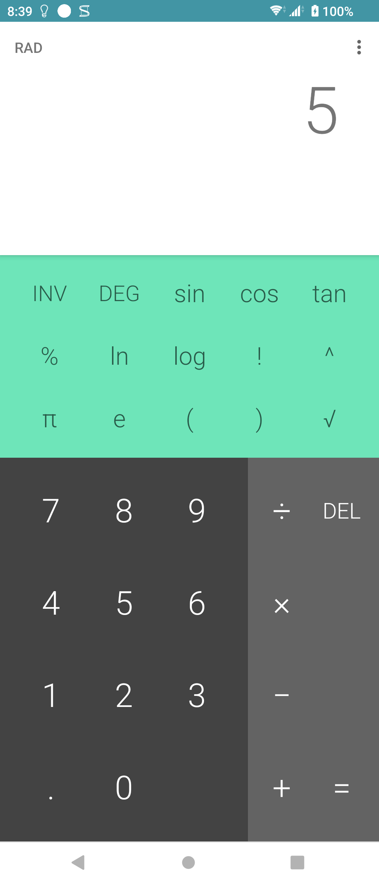
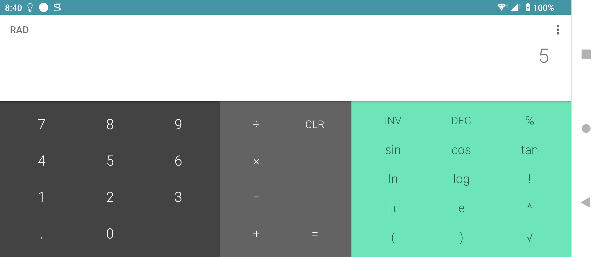
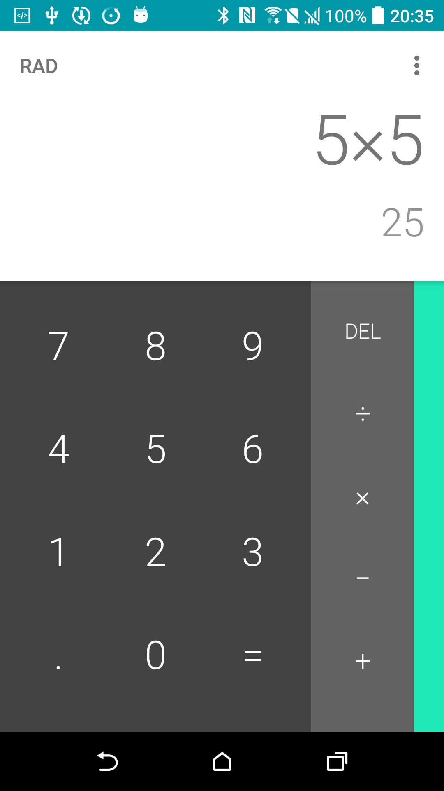
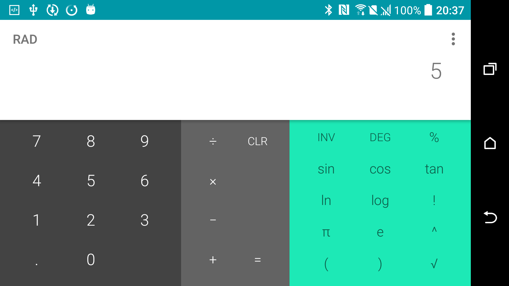

# Sony Calculator 8.0.0 portable repair v1

> 本項研究、反編譯分析、最小修復、實機測試及文件由專案擁有者指導
> OpenAI Codex 完成。Sony 與 HTC 實體手機結果由使用者監督。這是獨立
> 保存研究，與 Sony、HTC、Google 或 APKMirror 無隸屬、贊助或背書關係。

## Status

技術驗證完成：49/49 個控制或狀態通過；同一個最終 APK 在 Sony Android 13
與 HTC Android 6 上通過。公開模式為 `patchset_only`，本 repository 不提供
Sony 原始 APK 或重簽後 APK。

## Identity

| Field | Value |
| --- | --- |
| 840-app catalog index | 72 |
| APKMirror catalog name | Calculator |
| Catalog slug | `calculator-sony` |
| Publication brand | Sony |
| Original package | `com.android.calculator2` |
| Portable package | `com.android.calculator2.preserved8` |
| Final version | `8.0.0` (`versionCode 26`) |
| Component | Launcher app |
| Runtime Root/Magisk | Not required |

8.0.0 於 2017 年由 Sony Mobile Communications 發布，因此歸入 Sony
repository；原始憑證仍沿用 Sony Ericsson 名稱不會改變發布年代分類。
這一列與 `com.sonymobile.exactcalculator` 的「Sony Calculator」以及 Sony
Calculator Small App 是不同目錄項目，不因名稱相近而合併。

## History

[APKMirror 的 Calculator 目錄](https://www.apkmirror.com/apk/sony-mobile-communications/calculator-sony/)
保留了 `2.1-update1`、`2.3.4`、`4.0.4-tL1_3w`、
`4.4.4-Android.1064`、`7.1.1` 與 `8.0.0` 六個歷史分支。此項目跨越
Sony Ericsson 早期 Android 到 Android 8 時代；日期與最低 Android 要求以
該鏡像各 release 頁為來源。

## Purpose

這是一個可離線使用的基本與科學計算機，提供四則運算、百分比、括號、
平方根、冪次、階乘、三角函數、反函數、常數、角度/弧度模式、精確值、
分數顯示與複製貼上。它沒有網路服務或帳號依賴。

## Version decision

`8.0.0` 是同一 `calculator-sony` 目錄中時間與平台世代最新的候選版本，
原版最低需求為 Android 8/API 26。它在 Xperia 1 III Android 13 原封不動
安裝並執行；HTC Android 6/API 23 的原版安裝則明確回報
`INSTALL_FAILED_OLDER_SDK`。沒有發現同一目錄中比 8.0.0 更新的候選版。

`Sony Calculator 1.0.B.1.0` 屬於另一 package 與另一 catalog row，不是本列
8.0.0 的替代或更新版。`2.1-update1` 會作為已驗證歷史版本另行記錄與推廣。

## Repairs

原版在 Sony Android 13 的計算功能正常，但長按結果或公式時，API 23+
浮動 ActionMode 未顯示 Copy/Paste。最小修復只做四類變更：

1. package 改為 `com.android.calculator2.preserved8`，讓它可與系統計算機共存；
2. 兩個 Activity 改成完整類別名稱，以配合新的 manifest package；
3. 宣告最低 API 由 26 調為 23；
4. 兩個文字元件改走原程式已存在的 legacy context menu 路徑。

沒有新增權限、網路、native library、追蹤、版面、字串、圖示或計算邏輯。
完整修改位於 [patches/calculator-8.0.0-portable-api23-context.patch](patches/calculator-8.0.0-portable-api23-context.patch)。

### Deliberately unrestored features

沒有嘗試還原 Sony 正式簽章、以原 package 覆蓋系統 App、系統級整合或任何
未在原程式中的功能。這些不屬於可攜修復的必要範圍。

## Tested platforms

| Device | OS/API | Root during runtime | Result |
| --- | --- | --- | --- |
| Sony Xperia 1 III XQ-BC72 | Android 13/API 33 | Not required | Full 49-control deep test passed |
| HTC One M8 | Android 6.0.1/API 23 | Non-root device | Main, calculation, Copy/Paste and both orientations passed |

## Screenshots

以下皆為本次實體裝置驗證的原始 App 畫面，不是示意圖。公開副本已檢查
畫面內容與 PNG metadata，未包含通知內容、帳號或裝置識別資訊。

| Sony Xperia 1 III - Android 13 portrait | Sony Xperia 1 III - Android 13 landscape |
| --- | --- |
|  |  |

| HTC One M8 - Android 6 portrait | HTC One M8 - Android 6 landscape |
| --- | --- |
|  |  |

## Verification

- Sony 冷啟動 227 ms，進入真實 Calculator 主頁。
- Sony 直屏、橫屏皆填滿 App 可用區域，沒有 App 自己造成的底部黑邊。
- 左右邊緣控制在橫屏仍可正確觸控。
- `2 + 3 = 5`、小數、刪除/清除、除零錯誤、所有科學與反函數均通過。
- 三個 overflow 項目、兩個對話框、授權頁、Copy 與 Paste 均通過。
- Home/resume 保留結果；Back 與 force-stop 後可乾淨重啟。
- 33 個可點擊主畫面控制均有標籤、enabled 且 focusable。
- Sony 與 HTC 拉回的 installed APK 均與本地 final artifact 同 SHA-256。
- 捕捉的測試 log 沒有此 App 的 fatal exception 或 ANR。
- 公開檔案、文字、截圖像素與 PNG metadata 已完成去識別化檢查；一筆 HTC
  實機序號已在公開副本中改成匿名代號。

逐控制結果見 [deep-control-ledger.tsv](evidence/records/deep-control-ledger.tsv)，
技術摘要見 [technical-test-summary.md](evidence/records/technical-test-summary.md)。
公開隱私驗收見
[publication-privacy-review.md](evidence/records/publication-privacy-review.md)。

## Known limitations

- 可攜版必須重新簽章，不能以更新方式覆蓋 Sony 正式簽章的系統 package。
- 公開補丁要求使用者自行取得符合指定 SHA-256 的合法原始 APK。
- 本研究只對上述兩台實體裝置提出通過聲明，不推論所有 Android/OEM 都相容。
- HTC 的測試套件在驗證後已卸載；Sony 保留原版與可攜版共存。

## Artifacts and integrity

| Artifact | SHA-256 / signer |
| --- | --- |
| User-supplied Sony original 8.0.0 | `90e13103c10c9f092f8ff587250dd02fe0c1b4aee010300ae4d4573035f254c2` |
| Sony original certificate | SHA-256 `bc01a8cd9e5d87854f6dc4c84aed49edc34ac196c00b89623cea6ccbbdea627b` |
| Internally tested repaired APK | `5414327493a0f24d1e36f9b613fa512c8575605bf6bd4b35ad634a98c0bd8542` |
| Test signer | Local Android debug certificate, not Sony production signer |

因為使用者自行簽署時憑證不同，公開腳本產物的 APK SHA-256 會與內部測試檔
不同；程式修改內容由 patch SHA-256 與 decoded-tree diff 定義。執行
`scripts/verify-input.sh ORIGINAL.apk` 可先驗證來源，接著使用
`scripts/build-and-sign.sh` 重建並以自己的 keystore 簽署。建置環境需要
Apktool 3.0.2、可執行的 JDK 17+、Android SDK `zipalign`/`apksigner` 與
標準 `patch`；若系統找不到 Java，先將 `JAVA_HOME` 指向 JDK。獨立乾淨重建
結果與四個核心 payload 雜湊比對見
[reproducible-build.txt](evidence/records/reproducible-build.txt)。

## Installation and rollback

建置後以一般 ADB 安裝，不需要 Root：

```bash
adb install calculator-8.0.0-portable-api23-signed.apk
```

啟動 Activity：

```bash
adb shell am start -n \
  com.android.calculator2.preserved8/com.android.calculator2.Calculator
```

回溯只需移除獨立 package，不會刪除系統計算機：

```bash
adb uninstall com.android.calculator2.preserved8
```

HTC 實測卸載後，原生 `com.android.calculator2` 6.0.1 與歷史版
`com.android.calculator2.preserved` 2.1-update1 都仍能進入主頁。

## Distribution and legal notice

發佈模式為 `patchset_only`。本 repository 不含 Sony APK、反編譯完整程式碼、
圖示或其他 OEM binary。使用者必須自行合法取得原始檔。MIT License 僅涵蓋
本專案撰寫的文件、測試台帳、腳本與補丁表達，不授權 Sony 程式、名稱、
商標、圖示或其他第三方內容。所有權仍屬原權利人。

## Research and authorship

- 專案方向、實機操作監督與發布決策：專案擁有者。
- 目錄整理、反編譯分析、修復、測試自動化、證據台帳與文件：OpenAI Codex，
  依專案擁有者指示執行。
- Android Calculator 原始程式與 Sony 發佈資產：原權利人。
- 版本目錄來源：[APKMirror Calculator releases](https://www.apkmirror.com/apk/sony-mobile-communications/calculator-sony/)。
- 測試結果來自 2026-07-18 的 Sony 與 HTC 實體裝置，由使用者監督。
