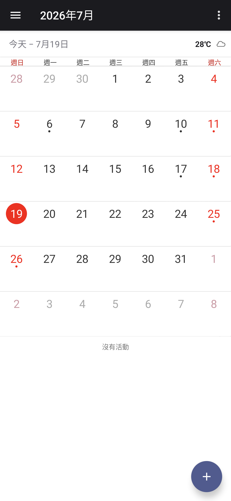
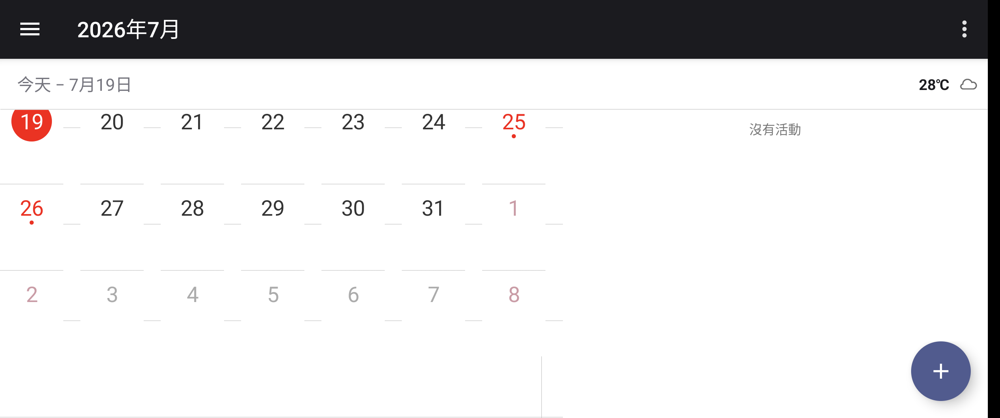
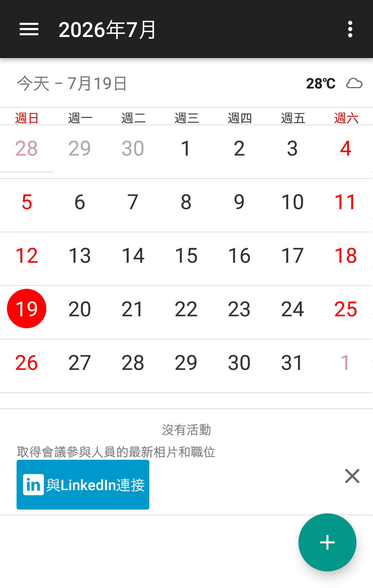
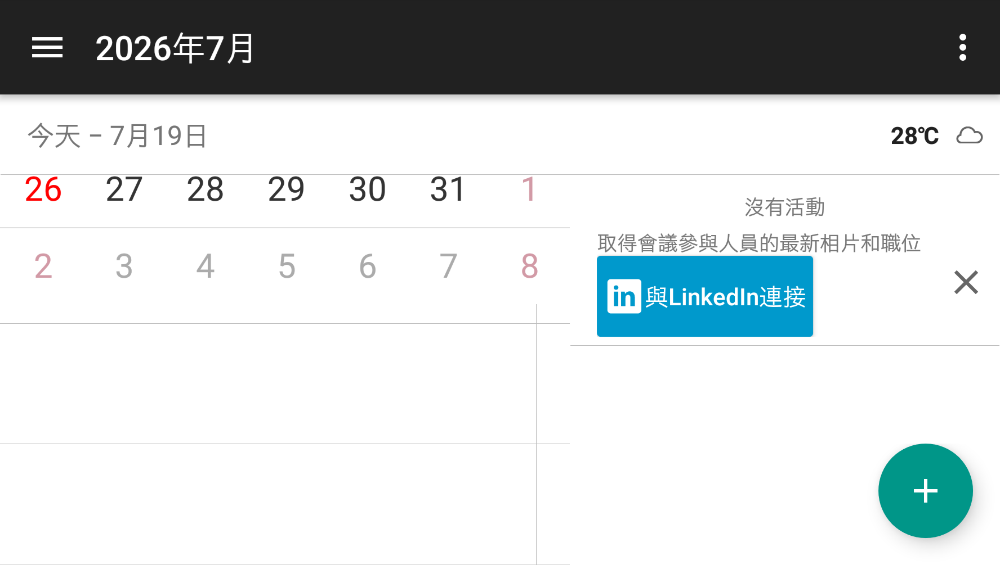

# Sony Calendar 20.0.A.4.22 可攜式修復 v3

> 本項研究、反編譯分析、最小修復、測試自動化與文件整理，由專案擁有者
> 指導 OpenAI Codex 完成；Sony 與 HTC 實體手機測試由使用者監督。本項是
> 獨立保存研究，與 Sony、HTC、Google 或 APKMirror 無隸屬、贊助或背書關係。

## 狀態

同一份 v3 APK 不需 Root，在 Sony Android 13 與 HTC Android 6 安裝並進入
真正的月曆主頁。Sony 端完成 75 項深度控制測試、事件 CRUD、直橫屏、
TalkBack 與 130% 字級驗證。HTC 端主頁與直橫屏通過，但裝置沒有可處理
`geo:` 的地圖 App，第一次 OEM 權限流程也曾出現一次可恢復 ANR，因此跨
品牌等級誠實標示為 `universal_no_root_partial`。

公開模式是 `patchset_only`；本 repository 不提供 Sony 原始或重簽 APK。

## 身分

| 欄位 | 內容 |
| --- | --- |
| 840 筆總目錄索引 | 74 |
| APKMirror 目錄名稱 | Calendar |
| 目錄 slug | `calendar-sony` |
| 發布品牌 | Sony |
| Package | `com.android.calendar` |
| 最終版本 | `20.0.A.4.22`（`versionCode 41947158`） |
| SDK / ABI | minimum API 21, target API 21, no native ABI payload |
| 入口 component | `com.android.calendar/.LaunchActivity` |
| 執行時 Root/Magisk | 不需要 |

本列與其他年代或 package 的「行事曆」分開保存；APKMirror 此目錄雖包含
部分名稱帶 `sonyericsson` 的歷史版本，最終 2018 年版本仍歸入 Sony 時期。

## 歷史

[APKMirror Calendar 目錄](https://www.apkmirror.com/apk/sony-mobile-communications/calendar-sony/)
保存 17 筆版本，跨越 `2.3.3`、`6.x`、`9.x`、`10.x`、`11.x`、`12.x`、
`15.x` 到 `20.0.A.4.22`。本研究選擇 2018 年的 `20.0.A.4.22`，因為它是
目錄最新版本，Sony Android 13 可執行，且修復後也能在 HTC API 23 安裝。

## 用途

Sony Calendar 提供月、週、日、年與議程檢視，支援搜尋、事件 CRUD、重複
規則、提醒、出席者、時區、天氣、假日、Exchange/Google 同步及外部地圖
交接。離線本機行事曆可使用；同步、天氣、LinkedIn 與地圖內容依賴對應的
帳號、網路服務或外部 App。

## 版本選擇

`20.0.A.4.22`（`versionCode 41947158`）是 APKMirror `calendar-sony`
目錄中時間與平台世代最新的候選版本。原始 APK 可在 Sony Android 13 啟動，
但 Xperia 21:9 畫面有相容性黑邊，內嵌地圖受舊憑證限制；在非 Sony 裝置上
則受必要 Sony framework library 阻擋。沒有發現同一目錄中比它更新的候選版，
因此保留最新版身分並以最小 v3 修復處理上述問題，而不是回退較舊版本。

## 修復內容

最終 v3 保留原 package 與版本身分，做三組最小修改：

1. 放寬舊式長寬比限制並允許 resize，修復 Xperia 21:9 的底部黑邊；
2. 將憑證綁定的內嵌 Google Maps 頁改為標準 `geo:` 外部交接；
3. 將 Sony Tasks 與 UX framework library 改為 optional，使非 Sony 系統可安裝。

沒有加入權限、追蹤、帳號、網路 endpoint、廣告、native library 或背景
服務。完整差異見
[calendar-20.0.A.4.22-portable-v3.patch](patches/calendar-20.0.A.4.22-portable-v3.patch)。

### 刻意未恢復的功能

- 外部地圖 App 必須由裝置另行提供；HTC 測試機沒有 `geo:` handler。
- 地圖不會把使用者選取的地址回填 Calendar；位置欄仍可直接編輯。
- 沒有嘗試恢復 Sony 正式簽章、已退休雲端服務或 OEM 私有 framework 行為。

## 測試平台

| 裝置 | OS/API | 執行時 Root | 結果 |
| --- | --- | --- | --- |
| Sony Xperia 1 III XQ-BC72 | Android 13/API 33 | 不需要 | 主頁、75 個控制項、CRUD、地圖交接及直橫屏通過 |
| HTC One M8 | Android 6.0.1/API 23 | 不需要 | 主頁與直橫屏通過；缺少 `geo:` handler；已揭露首次啟動 ANR |

## 截圖

以下是同一份 v3 APK 的實機畫面。公開副本裁除系統狀態列與導覽列，並
逐張檢查像素及移除非必要 PNG metadata；不含帳號、通知、裝置序號或事件內容。

| Sony Android 13 直屏 | Sony Android 13 橫屏 |
| --- | --- |
|  |  |

| HTC Android 6 直屏 | HTC Android 6 橫屏 |
| --- | --- |
|  |  |

## 驗證結果

- Sony 冷啟動 454 ms，進入真正的月曆主頁。
- 75/75 項控制都有結案狀態；安全的事件建立、讀取、修改與刪除已通過。
- Sony 直橫屏填滿 App 可用區域，沒有 App 造成的底部黑邊或觸控錯位。
- 空白位置按鈕可開啟 Google Maps；舊版憑證/API key 錯誤不再出現。
- 130% 系統字級沒有造成裁切；TalkBack 成功綁定並聚焦主頁選單。
- Sony 測試前後的事件 ID 完全一致，輸入法、旋轉與輔助服務均已恢復。
- HTC 拉回的 APK 與本地/Sony 最終 APK SHA-256 完全一致。
- HTC 第二次冷啟動沒有重現首次權限流程 ANR；測試後已卸載並恢復設定。

技術摘要見 [technical-test-summary.md](evidence/records/technical-test-summary.md)，
跨品牌限制見 [cross-oem-summary.md](evidence/records/cross-oem-summary.md)，
無障礙結果見 [accessibility-summary.md](evidence/records/accessibility-summary.md)。
公開腳本的獨立重建結果見
[reproducible-build.md](evidence/records/reproducible-build.md)。

## 已知限制

- 最終 APK 是本地重簽版本，不能直接更新 Sony 正式簽章版本。
- HTC 沒有地圖 handler；其他非 Sony 裝置也必須自行提供相容地圖 App。
- HTC OEM 權限頁第一次阻擋背景查詢時曾造成一次 ANR，授權後未重現。
- TalkBack 主頁焦點與字級通過基本驗證，但未宣稱完整 WCAG conformance。
- 實測僅涵蓋上述兩台裝置，不推論所有 Android/OEM 都相容。

## 檔案與完整性

| 成品 | SHA-256／簽署者 |
| --- | --- |
| 使用者提供的 Sony 原始 APK | `32bee2fab611f71914c2eed421630f2db9eae182476a07ae1cc2aa5ca0c61ae4` |
| Sony 原始憑證 | SHA-256 `bc01a8cd9e5d87854f6dc4c84aed49edc34ac196c00b89623cea6ccbbdea627b` |
| 內部實測 v3 APK | `43f34604aa287d6a84b2d44057cd58433ca9b93591735c6544b9e14a4b4d6473` |
| 內部測試憑證 | SHA-256 `b5e26a13f091dd593e8f8024e7de21cc0426d0d383feae3300035b84def9d618` |

使用者自行簽署時，輸出 APK 的雜湊與內部測試檔不同；公開 patch 定義程式
修改內容。重建還需要使用者合法取得相符原始 APK、Sony 韌體的
`framework-res.apk` 與 UX framework APK。

## 安裝與回溯

先驗證來源，再用自己的 keystore 重建：

```bash
scripts/verify-input.sh ORIGINAL.apk
KEYSTORE_PASSWORD='...' KEY_PASSWORD='...' \
  scripts/build-and-sign.sh ORIGINAL.apk FRAMEWORK_RES.apk \
  UXPRES_FRAMEWORK.apk OUTPUT.apk KEYSTORE ALIAS
```

建置需要 Apktool 3.0.2、JDK 17+、Android SDK `zipalign`/`apksigner` 與
標準 `patch`。一般安裝不需要 Root：

```bash
adb install calendar-20.0.A.4.22-portable-v3-signed.apk
adb shell am start -n com.android.calendar/.LaunchActivity
```

此版本保留原 package。覆蓋前必須備份既有 Calendar APK 與資料；回溯時
卸載本地簽章版本，再安裝已驗證的原始 APK 並視需要還原資料。不要在沒有
備份與簽章核對的情況下直接取代系統行事曆。

## 發布與法律聲明

發佈模式為 `patchset_only`。Repository 不含 Sony APK、完整反編譯程式碼、
圖示、API key、正式簽章或其他 OEM binary。使用者必須自行合法取得輸入檔。
MIT License 只涵蓋本專案撰寫的文件、腳本與補丁表達，不授權 Sony 程式、
名稱、商標、圖示或其他第三方內容；相關權利仍屬原權利人。

## 研究與作者分工

- 專案方向、實機操作監督與發布決策：專案擁有者。
- 目錄整理、反編譯分析、修復、測試自動化、隱私驗收與文件：OpenAI Codex。
- Sony Calendar 原始程式與 Sony 發佈資產：原權利人。
- 版本來源：[APKMirror Calendar releases](https://www.apkmirror.com/apk/sony-mobile-communications/calendar-sony/)。
