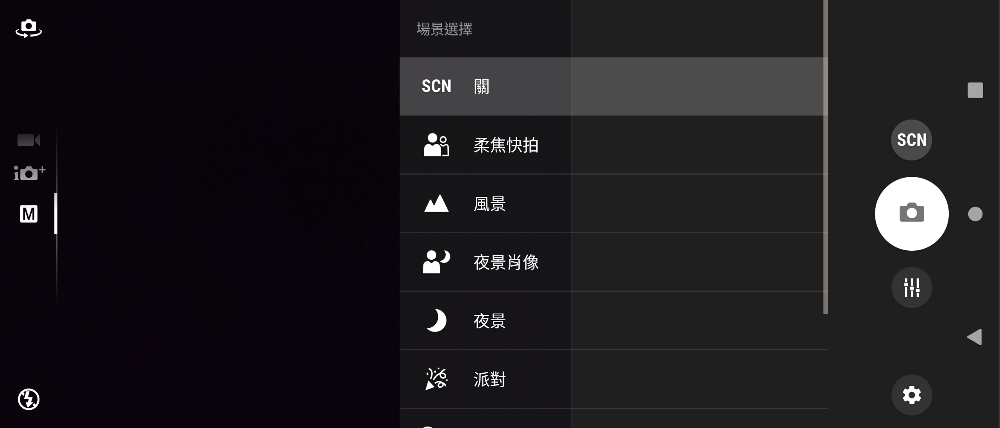

# Sony Camera 1.0.B.1.10 保存研究

> 本項保存研究、版本整理、修復實作、實機測試與文件由專案擁有者指導
> OpenAI Codex 完成。這是獨立研究，與 Sony、HTC 或 APKMirror 無隸屬、
> 贊助或背書關係。

## 狀態

Xperia Z3 Android 6.0.1 時期的 Camera `1.0.B.1.10` 已修復為可獨立安裝
的相容版本，在 Sony Xperia 1 III Android 13 通過真正主頁、版面、拍照、
錄影、前後鏡頭、觸控對焦、設定與生命週期測試。執行不需要 Root 或重開機。

HTC One M8 缺少 Sony 私有共享程式庫，無法安裝同一成品，因此本項只接受
為 `Sony-only`，不宣稱跨品牌通用。

## 身分

| 欄位 | 結果 |
|---|---|
| Z3 目錄索引 | `Z3M-A226` |
| Package | `com.sonyericsson.android.camera` |
| 版本 | `1.0.B.1.10` |
| Version code | `2098186` |
| Sony 測試平台 | Xperia 1 III `XQ-BC72`，Android 13 |
| HTC 測試平台 | One M8，Android 6.0.1 |
| Root／Magisk | 不需要 |

## 歷史

此 Camera 來自 Xperia Z3 韌體，原本依賴同一套 Sony 系統框架，並不是為
一般使用者獨立安裝而設計。

## 用途

它保存 Xperia Z3 的拍照與錄影介面，包含手動拍照、場景、曝光與白平衡、
閃光燈、觸控對焦、前後鏡頭及錄影。

## 版本選擇

較新的 `2.9` 系列雖然版本號較高，但屬於不同 Xperia 相機世代與感光元件
對應，無法代表 Xperia Z3 體驗，因此本項保留並修復 Z3 原版。

## 修復內容

- 補入獨立執行需要的 Z3 framework 與 Camera Add-on 類別。
- 保護新手機不存在的選用 Sony 服務與原生延伸路徑。
- 使用 Xperia 1 III 支援的 Camera1 預覽尺寸。
- 調整舊版取景器與控制區域，使其適應 21:9 畫面。
- 將失效的 Sony 專用 MediaStore 查詢改為標準 Android 查詢。
- 修復觸控對焦座標與可見對焦框，使左右點擊能落在不同位置。
- 保留本機拍照與錄影，不依賴遠端服務。

修復版使用本地保存測試簽章，不能直接覆蓋 Sony 原始簽章版本。

## 未恢復功能

- 沒有仿造 Xperia Z3 相機 HAL 的自動場景辨識能力。
- 沒有替換 Xperia 1 III 的系統相機框架或 Photography Pro。
- 沒有加入雲端服務、帳號繞過、付費功能或額外遙測。

## 測試平台

| 裝置 | 系統 | 結果 |
|---|---|---|
| Sony Xperia 1 III `XQ-BC72` | Android 13 / API 33 | Sony-only 技術驗收通過 |
| HTC One M8 | Android 6.0.1 / API 23 | 同一 APK 安裝失敗，缺少 Sony 私有共享程式庫 |

## 驗證結果

- 冷啟動可進入真正即時相機主畫面。
- 沒有 App 自身造成的黑邊、裁切、重疊或黑畫面。
- 拍照產生有效 JPEG。
- 錄影產生有效 H.264 影像與 AAC 聲音 MP4。
- 前後鏡頭切換後都能恢復即時預覽。
- 左右觸控對焦位置與對焦框確實不同。
- 16 個控制項中 15 個通過、0 個失敗、1 個硬體能力受阻。
- HTC 普通安裝失敗：缺少 `com.sonyericsson.privateapis_1p`。

## 已知限制

- Xperia 1 III HAL 回報 `sony-scene-detect-supported=false`，因此 Superior
  Auto 介面可開啟，但 Xperia Z3 的自動場景辨識後端無法套用。
- 舊 Camera1 預覽在室內低光源下不如 Photography Pro 流暢。
- 實測只涵蓋上述 Sony 與 HTC，不推論所有 Xperia、Android 或 OEM。
- 尚未進行完整 TalkBack 操作流程，不提出完整無障礙相容聲明。

## 截圖

公開副本只包含 Camera 介面與無法辨識環境的暗色測試畫面，已完成 OCR、
原始像素、中繼資料與尾端資料檢查。

| Sony Xperia 1 III Android 13 橫向場景選擇 | Sony Xperia 1 III Android 13 橫向手動設定 |
|---|---|
|  |  |

## 檔案與完整性

| 項目 | SHA-256 |
|---|---|
| 私人相容 APK | `70a58a67732224588aa2953cd2486c7894c122579e9d116a2abaec239ca08000` |
| 本地測試簽章憑證 | `b5e26a13f091dd593e8f8024e7de21cc0426d0d383feae3300035b84def9d618` |
| 場景選擇截圖 | `419cf0417938deff408ae79b888e57260c06e776c1f39a50d2a4ca680157fd2c` |
| 手動設定截圖 | `02b9b5e07daa372701fb0081c1c91d62dfed1b87df5fee921cb3b753bb873603` |

公開 repository 不包含 Sony 原始或重簽 APK。雜湊只用來辨認專案擁有者
私人 App Store 與 NAS 保存的精確測試成品。

保存研究所使用的重建流程為：合法持有的 Z3 原檔經固定工具版本解碼，
套用文件記載的最小相容修改，再重建、對齊、本地簽章及核對 SHA-256。
公開 evidence-only 紀錄不提供 Sony 程式碼或可直接重建 OEM APK 的補丁。

## 安裝與回溯

私人相容 APK 使用一般 Android Package Manager 安裝，不需要 Root 或重開機。
由於簽章與 Sony 原版不同，若已有同 package 原版，必須先備份資料並解除
安裝衝突版本。回溯時解除安裝相容版，再安裝合法保存且簽章相符的原版；
解除安裝會移除 App 本機資料。

## 發布與法律聲明

公開模式為 `evidence_only`：只發布本專案撰寫的文件、測試結果、雜湊及
去識別化截圖。Sony、Xperia、App 名稱、程式、介面、圖示、商標與其他
資產仍屬原權利人。

## 研究與作者分工

- 方向、實機操作監督、隱私與發布決策：專案擁有者。
- 版本研究、修復、驗收自動化、證據整理與文件：OpenAI Codex。
- Xperia Z3 Camera 原始程式與 Sony 發布資產：原權利人。
