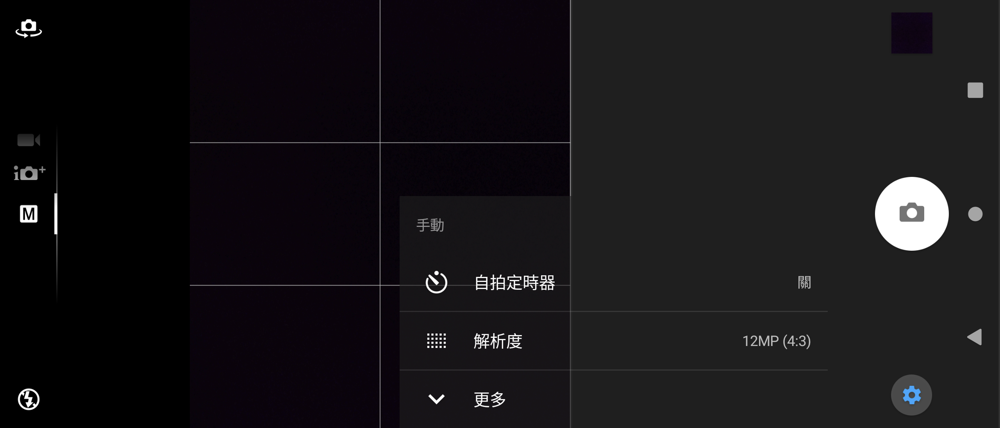
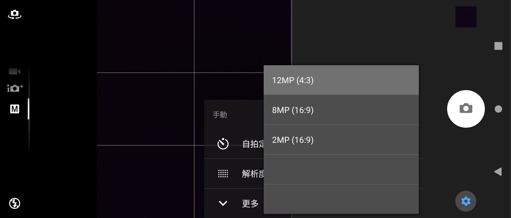

# Sony Camera 1.0.B.1.10 保存研究

> 本項保存研究、版本整理、修復實作、實機測試與文件由專案擁有者指導，OpenAI Codex 完成。這是獨立研究，與 Sony、HTC 或 APKMirror 無隸屬、贊助或背書關係。

## 狀態

Xperia Z3 Android 6.0.1 時期的 Camera `1.0.B.1.10` 已修復為可在 Sony Xperia 1 III Android 13 普通安裝的 v48 相容版本。它可進入真正相機主畫面，使用前後鏡頭拍照與錄影，執行不需要 Root 或重新開機。

HTC One M8 缺少 Sony 私有共享程式庫，無法安裝同一成品，因此本項結果為 `Sony-only`，不宣稱跨品牌通用。

## 身分

| 欄位 | 結果 |
|---|---|
| Z3 目錄索引 | `Z3M-A226` |
| Package | `com.sonyericsson.android.camera` |
| 版本 | `1.0.B.1.10` (`2098186`) |
| Sony 測試平台 | Xperia 1 III `XQ-BC72`，Android 13 |
| HTC 測試平台 | One M8，Android 6.0.1 |
| Root／Magisk／重新開機 | 不需要 |

## 歷史

此 Camera 來自 Xperia Z3 韌體，原本依賴同一套 Sony 系統框架，並不是為一般使用者獨立安裝而設計。

## 用途

它保存該世代的手動拍照、場景、曝光、白平衡、閃光燈、觸控對焦、前後鏡頭與錄影介面。

## 版本選擇

APKMirror 上同 package 較新的 `2.9.2.A.0.10` 要求 Android 14 以上，且屬不同 Xperia 相機世代；本項目以保存 Z3 介面與 Xperia 1 III 相容為目的，因此選擇並修復 `1.0.B.1.10`。

## 修復內容

- 補入獨立執行所需的 Z3 framework／Camera Add-on 類別，並保護新手機不存在的選用 Sony 服務。
- 將失效的 Sony 專用 MediaStore 查詢改為標準 Android 查詢。
- 依 Xperia 1 III Camera1 能力選用前後鏡頭的相容預覽、拍照與錄影尺寸。
- 後鏡頭拍照提升至 `4032 x 3024`（12 MP），前鏡頭提升至 `3264 x 2448`（8 MP）。
- 後鏡頭錄影提升至 `3840 x 2160` HEVC，前鏡頭為 `1920 x 1080` H.264。
- 修正 21:9 螢幕上的取景器置中與控制區域，並補回繁體中文 `12MP (4:3)` 標籤。
- Xperia 1 III Camera1 HAL 無法可靠完成暫停後的錄影，因此隱藏不支援的暫停鍵，保留穩定的開始與停止錄影。
- 修正停止錄影後立即重開 App 時，Camera HAL 偶發回傳空參數並造成閃退的問題；v48 會進行短暫、有上限的參數重試，不變更鏡頭能力或媒體規格。

修復版使用本地保存測試簽章，不能直接覆蓋 Sony 原始簽章版本。

## 驗證結果

- 後鏡頭 JPEG：`4032 x 3024`。
- 前鏡頭 JPEG：`3264 x 2448`。
- 後鏡頭 MP4：HEVC Main、`3840 x 2160`、約 29.97 fps、AMR-WB 音訊。
- 前鏡頭 MP4：H.264 High、`1920 x 1080`、約 29.97 fps、AMR-WB 音訊。
- 停止前鏡頭錄影後連續冷啟動 5 次：全部進入真正取景畫面，未出現 Camera fatal、ANR 或空參數閃退。
- 12 個深度控制契約：11 個通過；1 個受舊版觸控層範圍限制。
- HTC 普通安裝失敗：缺少 `com.sonyericsson.privateapis_1p`。

## 測試平台

| 裝置 | 系統 | 結果 |
|---|---|---|
| Sony Xperia 1 III `XQ-BC72` | Android 13 / API 33 | `accepted_sony_only` |
| HTC One M8 | Android 6.0.1 / API 23 | 同一 v48 APK 安裝失敗，缺少 Sony 私有共享程式庫 |

## 已知限制

- 遠右側取景畫面的觸控對焦落在舊版觸控層之外；左側與中央觸控對焦可用。本輪沒有採用會破壞版面的高風險擴張修補。
- 錄影暫停／繼續已停用；開始與停止錄影正常。
- Xperia 1 III HAL 不提供 Z3 Superior Auto 所需的完整 Sony 場景偵測後端。
- 相機固定橫向是原始設計；舊 Camera1 預覽在室內低光源下不如現代 Photography Pro 流暢。
- 尚未完成完整 TalkBack 流程，不提出完整無障礙相容聲明。
- 只驗證上述 Sony 與 HTC，不推論所有 Xperia、Android 或 OEM。

## 截圖

公開副本只包含 Camera 介面與無法辨識環境的暗色取景背景，已完成原始像素、OCR、檔案中繼資料、尾端資料與關聯風險檢查。v48 未修改介面像素，因此沿用同一代已驗證的介面參考圖。

| 手動設定與 12MP 標籤 | 解析度選項 |
|---|---|
|  |  |

## 檔案與完整性

| 項目 | SHA-256 |
|---|---|
| 私人 v48 相容 APK | `86a22d5853f6cbf9216c688d17b81a13044690969e5ccc176acaded99924b40d` |
| 本地測試簽章憑證 | `b5e26a13f091dd593e8f8024e7de21cc0426d0d383feae3300035b84def9d618` |
| 手動設定截圖 | `4f2ea674dd1ce92dd97756b63c937e8ede26523486b8c6b11edae075c6d81490` |
| 解析度選項截圖 | `0de151f20ac4879e8ceadf8dab8952d5e793fda10e412ece8a613e1927541e16` |

公開 repository 不包含 Sony 原始 APK、重簽 APK、Sony 程式碼或可直接重建 OEM APK 的補丁。雜湊用來辨認專案擁有者私人 App Store 與 NAS 保存的精確測試成品。

## 安裝與回溯

私人相容 APK 使用一般 Android Package Manager 安裝。由於簽章與 Sony 原版不同，若已有同 package 原版，必須先備份資料並解除安裝衝突版本。回溯時解除安裝相容版，再安裝合法保存且簽章相符的原版；解除安裝會移除 App 本機資料。

## 發布與法律聲明

公開模式為 `evidence_only`：只發布本專案撰寫的文件、測試結果、雜湊及去識別化截圖。Sony、Xperia、App 名稱、程式、介面、圖示、商標與其他資產仍屬原權利人。

## 研究與作者分工

- 方向、實機操作監督、隱私與發布決策：專案擁有者。
- 版本研究、修復、驗收自動化、證據整理與文件：OpenAI Codex。
- Xperia Z3 Camera 原始程式與 Sony 發布資產：原權利人。
