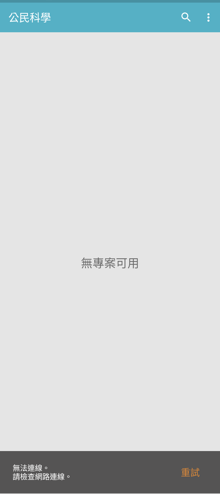
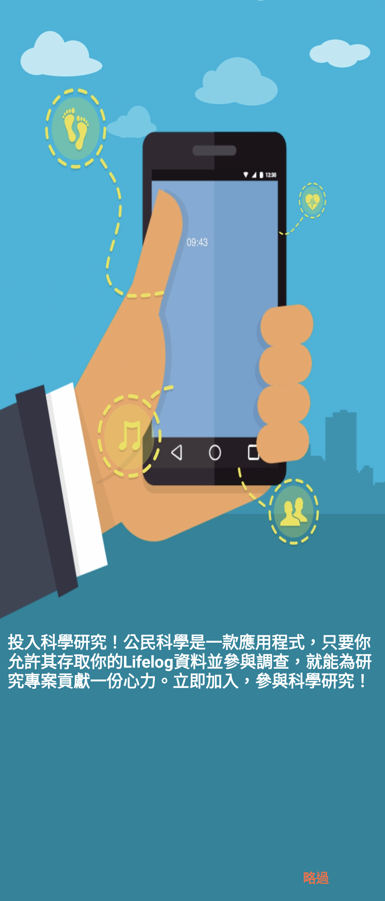

# Citizen Science 1.00.05 保存與相容性紀錄

> 本項版本研究、修復、實機測試、驗收與文件由專案擁有者指導 OpenAI
> Codex 完成；Sony 與 HTC 實體裝置由使用者監督。這是獨立保存研究，
> 與 Sony、HTC、Google 或 APKMirror 無隸屬、贊助或背書關係。

## 狀態

`1.00.05` 是 APKMirror 保存的最後版本。經最小修復後，它能在 Xperia 1 III
Android 13 進入真正的「無專案可用」主頁，搜尋、教學、法律資訊與重試控制
均可操作，且直向、橫向與 `1.3` 字體縮放沒有黑邊、裁切或重疊。

Sony 的 Citizen Science 專案與 Firebase 後端已停止服務，因此本頁標示為
**PARTIAL / retired backend**。本修復不建立替代專案、不偽造線上資料，也不
宣稱恢復 Lifelog 調查、同步或推播。

## 身分

| 欄位 | 內容 |
| --- | --- |
| 840 筆總目錄索引 | `104` |
| Package | `com.sonymobile.activityathome` |
| 最終版本 | `1.00.05`（`versionCode 10005`） |
| SDK | minimum API 19；target API 25 |
| ABI／密度 | Universal；單一 APK |
| Launcher | `com.sonymobile.activityathome.activity.MainActivity` |
| 執行時 Root／Magisk | 不需要 |

## 歷史

Citizen Science 於 2017 年初出現在 Sony Mobile 發布序列。

版本來源：

- [APKMirror Citizen Science releases](https://www.apkmirror.com/apk/sony-mobile-communications/citizen-science/)
- [Citizen Science 1.00.05](https://www.apkmirror.com/apk/sony-mobile-communications/citizen-science/citizen-science-1-00-05-release/)

## 用途

它讓使用者同意將部分 Lifelog 資料提供給研究專案並參與問卷，以協助群眾科學
研究。App 依賴 Sony 帳號、Lifelog API、Firebase 與遠端專案清單；服務停止後，
本機介面仍在，但無法再取得研究專案。

## 版本選擇

APKMirror 保存 `1.00.03` 與 `1.00.05`；`1.00.05` 是最後版本。原始 APK 的
SHA-256 與 APKMirror 公布值完全一致，因此沒有回退到舊版。

## 修復內容

修復只處理現代 Android 相容性：

1. 停用已退休服務的啟動條款閘門，但不寫入「已接受」狀態。
2. 將 App 與主要 Activity 標記為可調整尺寸，移除舊式長寬比限制。
3. Android 13 將舊 `GET_ACCOUNTS` 歸為未定義權限群組時，改用系統原生、
   已本地化的「聯絡人」群組標籤，避免權限說明頁出錯。

沒有新增伺服器、帳號、專案、端點或授權繞過。重建版使用本地保存測試簽章，
不能直接覆蓋 Sony 原始簽章版本。完整界線見 [PATCH_NOTES.md](PATCH_NOTES.md)。

## 刻意未恢復的功能

本研究沒有偽造或替代 Sony 帳號、Lifelog API、Firebase、專案清單、問卷、同步
與推播服務，也沒有繞過任何仍有效的授權。這些遠端功能維持不可用並如實列為
限制。

## 測試平台

| 裝置 | 結果 |
| --- | --- |
| Sony Xperia 1 III／Android 13 | 主頁、直橫屏、字體縮放、11 個控制與生命週期通過 |
| HTC One M8／Android 6.0.1 | 同一 APK 可安裝並進入主頁；教學頁「略過」按鈕只剩約 6 px 可點，故跨品牌結果為 partial |

## 截圖

公開圖片已移除狀態列與導覽列、清除檔案 metadata，並完成 OCR、原始像素與
內容檢查；沒有帳號、聯絡人、通知、位置、裝置識別碼或私人資料。

| Sony Android 13 主頁 | 內建教學 |
| --- | --- |
|  |  |

## 驗證結果

- 搜尋開啟、輸入、清除與返回正常。
- 溢位選單、教學、略過、法律資訊捲動與確定正常。
- 「重試」會重新嘗試原始網路流程並留在可用主頁，不會崩潰。
- Sony 上 3 次冷啟動、背景返回、熄屏喚醒及 3 組旋轉循環無 fatal 或 ANR。
- HTC 上 2 次冷啟動、背景返回、熄屏喚醒及旋轉循環無 fatal 或 ANR。
- HTC 安裝後拉回的 `base.apk` 與 Sony 使用的最終 APK 位元完全相同。

## 已知限制

- Sony Citizen Science、Lifelog API 與 Firebase 專案後端已不可用；沒有線上
  專案、問卷、同步或推播可供驗證。
- HTC 的沉浸式教學頁把底部「略過」按鈕壓到導覽列保留區，只留下約 6 px
  的可點範圍；主頁及一般控制仍可使用。
- 修復版為本地重簽 APK；安裝前須先備份並移除簽章不同的既有版本。
- 實測只涵蓋上述 Sony 與 HTC，不推論所有 Android 版本或 OEM。

## 檔案與完整性

| 項目 | SHA-256 |
| --- | --- |
| Sony 原始 APK `1.00.05` | `1b088329394a9f4e72fc3693f77d57fca06328d8e23663bc30c5f69411fda1a3` |
| 最終修復 APK | `702085b33dda9d9e7a4de43a0f27b111767edc859cb89e73f6b44a7c83baa6ed` |
| 本地測試簽章憑證 | `b5e26a13f091dd593e8f8024e7de21cc0426d0d383feae3300035b84def9d618` |
| Sony 主頁截圖 | `7554519caaf69665574d29093ac1cca3731277f38fba00f25e63ebba663b99b1` |
| Sony 教學截圖 | `b38e63faccdeeecc365a3a2c57b86779b65a08ad315677da8cd206de1cdcd9c0` |

公開 repository 不提供 Sony 原始 APK、重簽 APK、反編譯程式碼或 Sony
圖像資產。雜湊只供合法持有者辨認研究所使用的精確檔案。

## 安裝與回溯

合法取得修復檔後，先核對 SHA-256。若已有不同簽章版本，先備份資料再移除：

```bash
shasum -a 256 Citizen-Science-1.00.05-compat.apk
adb install Citizen-Science-1.00.05-compat.apk
adb shell am start -n com.sonymobile.activityathome/.activity.MainActivity
```

回溯時解除安裝修復版，再安裝合法保存且雜湊相符的 Sony 原版。解除安裝會
移除 App 本機資料：

```bash
adb uninstall com.sonymobile.activityathome
adb install Citizen-Science-1.00.05-original.apk
```

## 發布與法律聲明

公開模式為 `evidence_only`。Repository 只包含本專案撰寫的文件、雜湊、
測試結果與去識別化截圖；修復 APK 僅放在專案擁有者的私人 App Store。

Sony、Xperia、Citizen Science、程式、介面、圖像、商標及其他資產仍屬其
各自權利人。Repository 授權只涵蓋本專案有權授權的文件與工具。

## 研究與作者分工

- 專案方向、實機監督、隱私授權與發布決策：專案擁有者。
- 版本研究、修復、測試、證據驗收與文件：OpenAI Codex。
- 原始 App 與 Sony 發布資產：原權利人。
