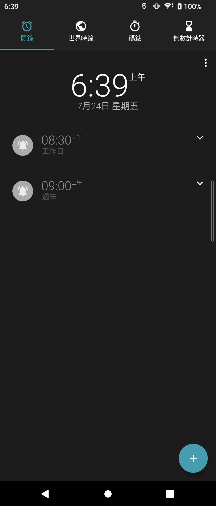
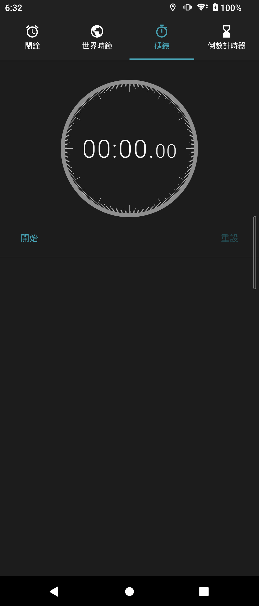

# Sony Clock 20.2.A.2.49

> 本項研究、實機測試、驗收自動化與文件由專案擁有者指導 OpenAI Codex
> 完成；實體手機操作由使用者監督。這是獨立保存研究，未受 Sony、HTC、
> Google 或 APKMirror 贊助、認可或背書。

## 狀態

未修改的 Sony 正式簽章 APK 已在 Sony Xperia 1 III Android 13 通過主頁、
版面、離線、生命週期及深度控制驗收。HTC Android 6.0.1 因缺少必要的
`com.sony.device` shared library，Package Manager 在安裝階段拒絕此原版。

## 身分

| 欄位 | 值 |
| --- | --- |
| 目錄索引 | `Z3M-A227` |
| Package | `com.sonyericsson.organizer` |
| 最終版本 | `20.2.A.2.49` (`versionCode 42207281`) |
| SDK | minimum API 21; target API 28 |
| Launcher | `.Organizer` |
| 執行時 Root/Magisk | 不需要 |
| 公開模式 | `evidence_only` |

## 歷史

Xperia Z3 韌體基準是同 package 的 `20.1.A.0.16`。完整版本盤點依 Sony
Clock 產品線排序後，選出同一代 package 中較新的 `20.2.A.2.49`，並以
manifest、版本碼、檔案雜湊及 Sony 正式簽章鎖定身分。

## 用途

Clock 整合鬧鐘、世界時鐘、碼錶、倒數計時器、桌面時鐘與提示音設定。

## 版本選擇

`20.2.A.2.49` 是保留目錄與版本矩陣中最新且符合 Xperia 1 III API 條件的
候選；它是 nodpi、無 native ABI payload 的單一 APK，實機直接安裝成功。

## 修復內容

沒有修改 APK。package、manifest、資源、程式碼、簽章與版本皆維持原樣。

## 測試平台

| 裝置 | 系統 | 結果 |
| --- | --- | --- |
| Sony Xperia 1 III XQ-BC72 | Android 13 / API 33 | 通過 |
| HTC One M8 | Android 6.0.1 / API 23 | 安裝失敗：缺少 `com.sony.device` |

## 截圖

公開圖來自無私人資料的拋棄式測試使用者，已檢查像素、OCR、metadata 與
狀態列。

| 鬧鐘主頁 | 碼錶歸零 |
| --- | --- |
|  |  |

## 驗證結果

- 12 個畫面、65 個控制：64 通過、0 失敗、1 個外部資料依賴受阻。
- 鬧鐘建立、編輯、刪除，碼錶與倒數計時器流程均通過。
- 直屏、橫屏、邊緣觸控、冷啟動、離線啟動與狀態復原通過。
- 沒有歸因於 Clock 的 fatal exception、ANR、security 或 linkage 錯誤。

## 已知限制

- Android 13 上舊版世界時鐘城市 provider 對 Taipei、London 均回傳空結果，
  因此不宣稱新增城市可用。
- HTC 缺少 Sony shared library，不能據此宣稱跨品牌可用。
- 未執行完整 TalkBack 手勢稽核。

## 檔案與完整性

| 項目 | SHA-256 |
| --- | --- |
| Sony original APK | `319258a6de1539f8ef342dccb1cc50d416e79a1a86b0764afa71741cb8ece552` |
| Sony certificate | `bc01a8cd9e5d87854f6dc4c84aed49edc34ac196c00b89623cea6ccbbdea627b` |
| 鬧鐘截圖 | `2cc6fe5734ab8b78560f5da229f3b3329ea1b269a29f7bed17d3f4c49582066b` |
| 碼錶截圖 | `110ea4262fbf19f670959860119e299404cb5a214dc7bcc800b313b79a756424` |

## 安裝與回溯

```bash
shasum -a 256 Sony-Clock-20.2.A.2.49-original.apk
adb install Sony-Clock-20.2.A.2.49-original.apk
adb shell am start -n com.sonyericsson.organizer/.Organizer
adb uninstall com.sonyericsson.organizer
```

若裝置已有同 package 的系統版、不同簽章版或重要鬧鐘資料，先備份並核對，
不要直接覆蓋或清除資料。

## 發布與法律聲明

公開 repository 只包含本專案撰寫的文件、測試摘要與經隱私驗收的截圖，
不包含 Sony APK、反編譯程式碼、圖示或其他 OEM binary。MIT License
不涵蓋 Sony 程式、名稱、商標與資產。

## 研究與作者分工

- 專案方向、實機操作監督與發布決策：專案擁有者。
- 測試自動化、證據驗收與文件：OpenAI Codex，依擁有者指示完成。
- Clock 原始程式與 Sony 發布資產：原權利人。
