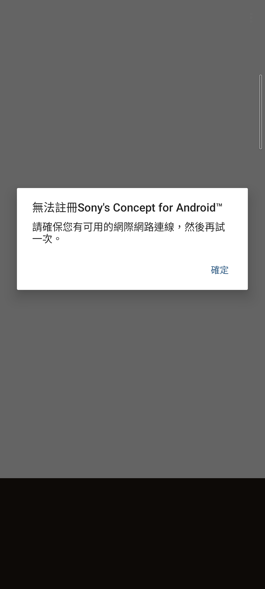
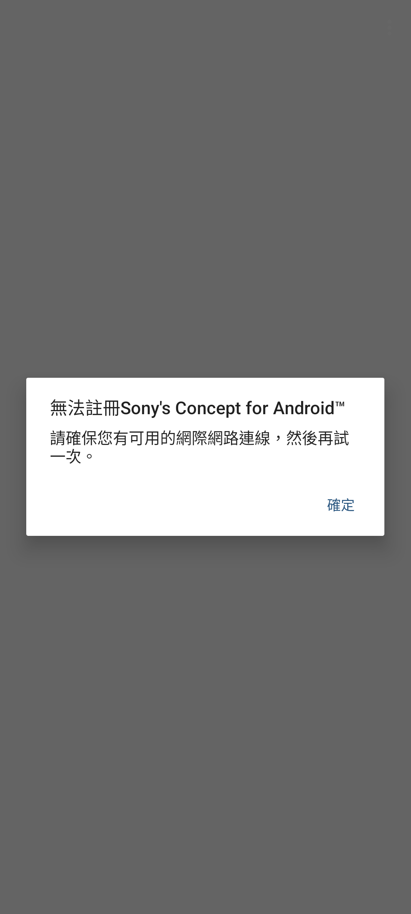

# Sony Concept Installer 1.3.0 full-aspect v1

> 本項版本查核、反編譯分析、最小修復、實機測試及文件由專案擁有者
> 指導，OpenAI Codex 完成。這是獨立保存研究，與 Sony、HTC 或
> APKMirror 無隸屬、贊助或背書關係。

## 狀態

**部分完成（partial）**。最終 `full-aspect-v1` 能在 Sony Xperia 1 III／
Android 13 以一般 APK 安裝並穩定顯示原本的繁體中文註冊結果；舊版在 21:9
螢幕底部留下的大面積黑邊已移除，唯一的「確定」按鈕連續五輪冷啟動皆可正常
關閉並返回 Xperia 主畫面。

這不是仍可使用的韌體下載工具。Sony 已結束 Concept for Android 計畫，App
依賴的裝置資格、註冊與韌體交付後端已不可用，因此目前只能誠實保存其終止狀態，
不能完成註冊或取得 Concept 韌體。

GitHub 採 `evidence_only`：本 repository **不提供 Sony 原始 APK、重簽 APK、
反編譯程式碼、Sony 圖像資產或簽署材料**。

## 身分

| 欄位 | 內容 |
| --- | --- |
| Catalog index | `164` |
| App | Sony Concept Installer |
| Package | `com.sonymobile.intouchsignup` |
| 上游版本 | `1.3.0`（versionCode `10300`） |
| 最終修復 | `full-aspect-v1` |
| 最低 Android | Android 6.0／API 23 |
| 必要 Sony library | `com.sony.device` |
| Sony 執行所需 Root／Magisk | 不需要 |

## 歷史

Concept Installer 是 Sony Xperia X 的 Concept for Android 實驗韌體入口。
Sony 在 2017 年 5 月發布最後一輪 Xperia X Concept 更新後結束此計畫。

## 用途

App 會驗證裝置與資格、向 Sony 後端註冊，並配合後續的韌體與備份流程。

## 版本選擇

APKMirror 的 [Concept Installer 產品頁](https://www.apkmirror.com/apk/sony-mobile-communications/concept-installer/)
目前把 `1.3.0` 列為最新版本；`1.1.0` 是同一產品線較舊版本。

## 修復內容

原始 `targetSdk 25` APK 沒有宣告 `maxAspectRatio`，Android 13 因而套用舊式
長寬比限制，在 Xperia 1 III 底部留下大面積黑邊。v1 僅在原有
`application` 加入：

```xml
android:maxAspectRatio="3.0"
```

沒有修改註冊、裝置驗證、帳號、AWS、Firebase、備份或韌體下載流程；也沒有
把失敗結果偽造成成功。完整改動邏輯見 [REPAIR_NOTES.md](REPAIR_NOTES.md)。

## 截圖

公開副本已裁掉狀態列與導覽列，畫面只含 App 內建的通用終止訊息。

| Sony 原版 | full-aspect v1 |
| --- | --- |
|  |  |

## 測試平台

| 裝置 | OS／API | 同一最終 APK | 結果 |
| --- | --- | --- | --- |
| Sony Xperia 1 III XQ-BC72 | Android 13／API 33 | 安裝後 SHA-256 完全一致 | 介面、繁中訊息、固定直向、1.3 倍字體、五輪關閉操作通過；註冊後端已退役 |
| HTC One M8 | Android 6.0.1／API 23 | 同一輸入檔 | `INSTALL_FAILED_MISSING_SHARED_LIBRARY`，缺少 `com.sony.device` |

## 驗證結果

- 冷啟動約 `699 ms`。
- 兩張穩定 App-only 畫面相隔 2 秒，pixels 與 UI hierarchy 完全一致。
- 原版與 v1 回復演練均從裝置拉回核對精確 SHA-256，最後恢復 v1。
- 「確定」按鈕連續 5 次冷啟動皆取得焦點、正確返回 Xperia Home。
- 五輪測試沒有 attributable fatal exception 或 ANR。
- 1 個可見控制已通過；韌體註冊與交付工作流程因退役後端而 blocked。

詳細矩陣見 [TEST_RESULT.md](TEST_RESULT.md)。

## 已知限制

- 無法註冊 Sony Concept for Android，也無法取得或安裝 Concept 韌體。
- 沒有重建 Sony 的裝置資格、帳號、註冊、AWS 或韌體交付服務。
- App 主 Activity 原生固定直向；橫向版面不適用。
- HTC 缺少必要 Sony framework，並非跨品牌可用版本。
- App 仍是 2017 年的舊 target SDK，僅適合受控保存研究，不應視為現代安全的
  韌體更新工具。

## 檔案與完整性

| 項目 | SHA-256／簽署 |
| --- | --- |
| APKMirror 原始 APK | `0b3fa49abc17f29838fb5e3c0b6f6732d78b64cafefef6ec77d6c24ca61dd514` |
| 原始 Sony signer certificate | `bc01a8cd9e5d87854f6dc4c84aed49edc34ac196c00b89623cea6ccbbdea627b` |
| 最終 full-aspect v1 APK | `03e4a22a6d980b7a9e8d70ed37428de7daeb05c4908aeaf0f416e6950a429512` |
| 最終本地測試 signer | `982bb9a5d74a6ba9bd4589ed498062b903f6f29aa75537770a5dacf6d494584c` |

最終 APK 是本地研究憑證重新簽署，不是 Sony production signer。公開雜湊只供
核對私人自用檔，不能用來表示 Sony 認可此修復。

## 安裝與回溯

私人自用 APK 由專案擁有者登入私人 App Store 取得。若裝置已有 Sony production
signature 版本，Android 不允許不同 signer 直接覆蓋；解除安裝前應先備份原始
APK 與資料。此 App 本身不需要 Root 或重新開機。

完整離開研究版時可解除安裝 package，再安裝保留的 Sony 原版。Google Play
安全防護可能因舊 target SDK 顯示警告；是否繼續安裝應由裝置擁有者自行決定。

## 發布與法律聲明

GitHub 僅發布研究文件、雜湊與去識別化畫面。MIT License 只涵蓋本專案原創的
文件與工具，不授權 Sony APK、程式碼、名稱、商標、圖像或其他第三方內容。
相關權利仍屬原權利人。

私人 App Store 的 APK 僅供專案擁有者登入、自用，不是公開 repository 的一部
分，也不改變 GitHub 的 `evidence_only` 模式。

## 研究與作者分工

- 專案方向、實機監督、隱私與發布決策：專案擁有者。
- 版本查核、反編譯分析、修復、測試、證據整理及文件：OpenAI Codex。
- Sony Concept Installer 原始程式、名稱及圖像：原權利人。
