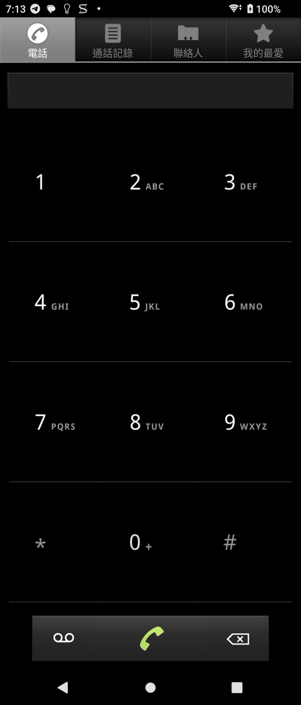

# Android Contacts 2.3.3 保存與相容性修復

> 本項研究、反編譯協助、修復實作、測試自動化與文件整理，皆由專案
> 擁有者指導 OpenAI Codex 完成；Sony 與 HTC 實體手機測試由使用者監督。
> 本項是獨立保存研究，與 Sony、HTC、Google 或 APKMirror 無隸屬、贊助
> 或背書關係。

## 狀態

最終 `compat-v20` 在 Sony Xperia 1 III Android 13 與 HTC One M8 Android
6.0.1 均可透過一般 APK 安裝，不需要 Root、Magisk、系統 overlay 或重新
開機。兩台裝置皆能進入真正的四分頁通訊錄主頁，撥號盤可使用完整寬度，
Sony 端的安全控制、QuickContact 與 TalkBack 驗證均已通過。

技術判定為 `accepted` / `universal_no_root`。公開模式為
`patch_specification_only`：本頁提供修復規格與證據，不提供原始、重簽或
反編譯後的完整 APK。

## 身分

| 欄位 | 內容 |
| --- | --- |
| 840-App catalog index | 169 |
| APKMirror 名稱 | Contacts |
| Catalog slug | `contacts-21` |
| 發布品牌 | Sony Mobile Communications |
| Package | `com.android.contacts` |
| 最終版本 | `2.3.3`（versionCode 10） |
| SDK / Variant | minimum API 10；target API 10；nodpi |
| 元件類型 | App 抽屜可見 Launcher App |
| 執行所需 Root / Magisk | 不需要 |

這是 Android platform namespace 的早期通訊錄，不是
`com.sonyericsson.android.socialphonebook`、
`com.sonyericsson.contacts` 或 `com.sonymobile.android.contacts`。
它依 Sony Mobile Communications 的歷史目錄歸入 Sony repository；package
前綴本身不作為品牌年代的唯一依據。

## 歷史

[APKMirror 的 Contacts 2.3.3 頁面](https://www.apkmirror.com/apk/sony-mobile-communications/contacts-21/contacts-21-2-3-3-release/)
保存此目錄唯一一筆可核對的版本。APKMirror 的保存日期是 2017 年 1 月 13
日，但介面與 API 契約屬 Android 2.3 時期；保存日期不等於原始設計年份。

## 用途

- 電話撥號盤與通話記錄。
- 聯絡人與我的最愛清單。
- 搜尋、新增、編輯、分享及刪除聯絡人入口。
- 顯示選項、帳戶與匯入／匯出入口。
- 聯絡人詳細頁與 QuickContact 快速操作。

## 版本選擇

`2.3.3` 是此 APKMirror catalog row 的最新且唯一保存版本，因此沒有更新版
候選需要回退。原始 APK 先行測試，確認舊簽章、shared UID/process、已移除
framework API、舊長寬比與固定撥號盤幾何均會阻止現代系統正常使用後，才
建立最小相容性修復。

## 修復內容

最終 v20 累積以下可回溯修復：

1. 移除舊版畫面比例限制，讓主介面使用完整可用寬度與高度。
2. 將撥號盤改為三欄等寬響應式排列，修正數字集中與觸控區偏移。
3. 補回舊聯絡人標頭需要的相容 ABI，改用公開 Contacts API。
4. Contacts Provider 沒有 `is_restricted` 欄位時採用安全預設值。
5. 以公開的 `TelecomManager.isInCall()` 取代已移除的內部電話 API。
6. 將所有使用者可觸發的 `CALL_PRIVILEGED` 改為 `ACTION_DIAL`，避免自動
   撥出並由系統電話 App 讓使用者確認。
7. 補回 QuickContact 所需的 window factory 相容層。
8. 頭像按鈕明確開啟本 App 的 QuickContact，並依實際頭像建立 anchor
   bounds，避免多個通訊錄 handler 造成錯誤交接。

沒有加入帳號、追蹤、網路服務或 Root 依賴。逐輪原因與最終差異規格見
[COMPATIBILITY_PATCH.md](patches/COMPATIBILITY_PATCH.md)。

## 測試平台

| 裝置 | OS / API | 執行時 Root | 結果 |
| --- | --- | --- | --- |
| Sony Xperia 1 III XQ-BC72 | Android 13 / API 33 | 不需要 | 主頁、版面、安全控制、QuickContact、TalkBack 通過 |
| HTC One M8 | Android 6.0.1 / API 23 | 無 Root | 同一 APK 安裝、主頁、全寬版面與代表操作通過 |

## 截圖

公開圖片來自最終 v20，已檢查畫面像素、metadata 與內容。它只包含空白撥號
盤與一般狀態列，不含聯絡人、電話號碼、帳號、通話記錄、通知內容或裝置
識別碼。

| Sony Android 13 撥號盤（直屏） |
| --- |
|  |

## 驗證結果

- 冷啟動可進入電話、通話記錄、聯絡人與我的最愛四個真實分頁。
- `1-9`、`*`、`0`、`#`、連續 `1234567890` 與長按刪除均通過。
- 左、中、右三欄觸控區與畫面數字一致，沒有 App 造成的四周黑邊。
- 搜尋、顯示選項、帳戶、匯入／匯出、詳細頁、編輯、分享、鈴聲、
  語音信箱、刪除及 QuickContact 控制已逐項關閉。
- 通話、簡訊、Email 與分享只驗證安全交接，沒有真的撥號、傳送或分享。
- TalkBack 服務綁定、觸控探索焦點、主要標籤與安全數字輸入通過，測試後
  服務、權限與音量均還原。
- Sony 端測試用本機合成聯絡人已刪除，provider 筆數回到基線且掃描不到
  合成值。
- HTC 使用與 Sony 相同 SHA-256 的 v20；主頁、全寬版面、數字輸入／刪除
  與聯絡人分頁通過，測試後已卸載。

完整公開摘要見 [TESTING.md](evidence/records/TESTING.md)。

## 已知限制

- 原始主 Activity 明確使用 `screenOrientation=nosensor`，所以橫屏不適用；
  本修復沒有改寫歷史互動方向。
- HTC 首次進入通話記錄與聯絡人時，會顯示 HTC Security Assistant 的舊式
  權限提示；這是系統 overlay，不是 App 崩潰或錯誤頁。
- 修復版使用本地研究簽章，不能直接覆蓋不同簽章的系統 App；安裝前須先
  保存既有 APK 與必要資料。
- 本研究只對上述兩台實體裝置提出結果，不推論所有 Android/OEM 均相容。

## 檔案與完整性

| Artifact | SHA-256 / 簽章 |
| --- | --- |
| 原始 APK | `b79e48c1f39d706e33e398d35a776d65afad9377f2732422caa5a832f4069a82` |
| 最終私用 `compat-v20` APK | `b9ccf50144f3873b3110236bd57ef304600db9810b1d6ba00851fe05e3efdce1` |
| 公開撥號盤 PNG | `b464a3866988b8ae8dd47fc81098583d33130408d89a252d191a021185e0a59a` |
| 測試簽章 | 本地研究憑證，不是 Sony production signer |

可機讀的公開檔案雜湊見 [SHA256SUMS](SHA256SUMS)。完整中間版、私人 logs、
UI hierarchy、provider backup 與 APK 只保存在私人 NAS 研究封存。

## 安裝與回溯

GitHub 不提供 APK。專案擁有者可由私人 App Store 取得精確 v20，核對
SHA-256 後以一般 Package Manager 安裝：

```bash
sha256sum contacts-2.3.3-compat-v20-signed.apk
adb install contacts-2.3.3-compat-v20-signed.apk
adb shell am start -n \
  com.android.contacts/.DialtactsContactsEntryActivity
```

回溯前先保存需要的聯絡人資料；移除修復版會同時清除該 package 的私有資料：

```bash
adb uninstall com.android.contacts
```

若裝置已存在同 package 或不同簽章版本，必須先備份並規劃資料還原，不能用
強制覆蓋取代回溯流程。

## 發布與法律聲明

公開模式為 `patch_specification_only`。Repository 只包含本專案撰寫的文件、
修復規格、測試摘要與通過隱私驗收的圖片，不包含 Sony／Android 原始或重簽
APK、完整反編譯程式、圖示或其他 OEM binary。自用最終 APK 只會放在專案
擁有者登入保護的私人 App Store。

MIT License 只涵蓋本專案有權授權的文件與補丁表達，不授權 Sony、Google、
Android 或其他第三方的程式、名稱、商標、圖示與資產；所有權仍屬各權利人。

## 研究與作者分工

- 專案方向、實體手機操作監督與發布決策：專案擁有者。
- 版本整理、反編譯協助、修復實作、測試自動化、證據與文件：OpenAI
  Codex，依專案擁有者指示完成。
- 原始 App 與 OEM 資產：原權利人。
- 版本來源：[APKMirror Contacts 2.3.3](https://www.apkmirror.com/apk/sony-mobile-communications/contacts-21/contacts-21-2-3-3-release/)。
