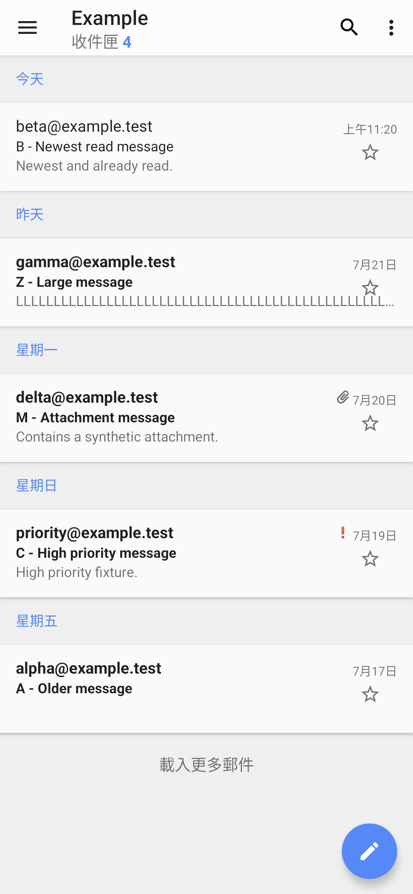
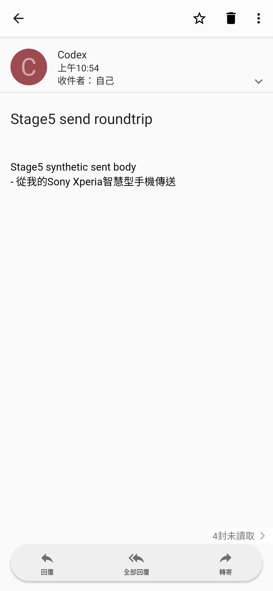

# Sony Email 17.0.A.0.12

> 本項保存研究、版本整理、修復實作、實機測試、驗收自動化與文件由專案
> 擁有者指導 OpenAI Codex 完成；Sony 與 HTC 實體手機操作由使用者監督。
> 本項是獨立研究，與 Sony、HTC、Google 或 APKMirror 無隸屬、贊助或背書關係。

## Status

最新版 `17.0.A.0.12` 經一項實用版面修復後，在 Sony Android 13 通過收信、
寄信、草稿、附件、回覆、轉寄、排序、移動、排程、離線快取與 171 個控制
驗收。執行不需要 Root 或 Magisk。HTC Android 6 無法安裝同一份最終 APK，
原因是系統 API 23 低於 APK 的最低 API 30；此結果如實保留。

公開 repository 不提供 Sony 原始或重簽 APK，只提供研究文件、去識別化
截圖及要求使用者自備正確原版的重現修補工具。

## Identity

| Field | Value |
| --- | --- |
| Z3 Android 6 catalog index | `Z3M-A084` |
| App | Sony Email / 電子郵件 |
| Package | `com.sonymobile.email` |
| Final version | `17.0.A.0.12` (`versionCode 35651596`) |
| SDK | minimum API 30; target API 28; compiled with API 30 |
| ABI / density | no native ABI; `nodpi`; single APK |
| Launcher | `.activity.Welcome` |
| Runtime Root/Magisk | Not required |

本頁研究的是 `com.sonymobile.email` 的 Sony Mobile Email 12–17 世代；較早的
`com.android.email` 即使顯示名稱相似，也屬於另一個產品世代，不合併排序。

## History

Xperia Z3 最終官方韌體內建 `12.0.A.0.13`，作為本研究的歷史與繁體中文
基準。APKMirror 的 `sony-email-2` 集合保存 28 個版本頁，從
`12.0.A.0.36.3` 延伸至 `17.0.A.0.12`。主要平台分支如下：

| Branch | Latest version | Minimum Android |
| --- | --- | --- |
| 17 | `17.0.A.0.12` | Android 11 / API 30 |
| 16 | `16.0.A.0.18` | Android 10 / API 29 |
| 15 | `15.0.A.1.26` | Android 6 / API 23 |

分支 15 的上傳日期較晚不代表語意版本高於 17；上傳日期只作來源證據。

## Purpose

Sony Email 是通用電子郵件客戶端，可設定 IMAP/SMTP 等帳號，瀏覽與搜尋
郵件、管理資料夾、附件、已讀與星號狀態，撰寫、回覆、全部回覆、轉寄、
保存草稿、排程郵件，並設定同步頻率、尖峰時段、通知與顯示方式。

## Version decision

`17.0.A.0.12` 是同一 package 世代中最高的語意版本。Sony Android 13 原本
安裝的 APK 與 APKMirror 公布的原版 SHA-256 完全相符，因此沒有回退至
`17.0.A.0.10`、`16.0.A.0.18` 或 Android 6 分支。HTC 的平台失敗是同一最終
APK 的真實跨品牌結果，沒有偷偷改用較舊分支代替測試。

## Repairs

原版能安裝、進入真實收件匣並完成大部分功能，但收件匣右側星號過度靠近
新手機的系統邊緣互動區。附件郵件列的星號中心與右半部會被攔截，使用者
按下後沒有切換正確郵件的星號。

Practical repair v1 做了三項限定修改：

1. 新增 `list_item_action_edge_margin = 40dp`。
2. 只把郵件列的星號／旗標容器及對話串數量容器向內移。
3. 保留日期、寄件者、主題、摘要、帳號、IMAP/SMTP、權限與網路邏輯不變。

附件列星號由 `[1017,1156][1074,1213]` 移至
`[954,1156][1011,1213]`，五封不同結構的合成郵件均能一次切換並還原。
修補會使 APK 必須由使用者自行重新簽署，不能直接覆蓋 Sony 簽章版本。

重現規格與工具見 [PRACTICAL_REPAIR.md](patches/PRACTICAL_REPAIR.md) 與
[`apply_practical_repair.py`](patches/apply_practical_repair.py)。

### Deliberately unrestored features

- 沒有繞過郵件帳號認證、TLS、伺服器授權或 Android 權限。
- 沒有替代 Google 帳號、行事曆、列印或第三方選擇器服務。
- 沒有宣稱 API 30 APK 可在 Android 6 安裝。
- 沒有把私人測試帳號、郵件、憑證或伺服器設定放入公開資料。

## Tested platforms

| Device | OS/API | Root during runtime | Result |
| --- | --- | --- | --- |
| Sony Xperia 1 III XQ-BC72 | Android 13/API 33 | Not required | 主頁、版面、171 控制、寄收信、附件、離線與生命週期通過 |
| HTC One M8 | Android 6.0.1/API 23 | Not used | 安裝失敗：`INSTALL_FAILED_OLDER_SDK`，最低 API 30 |

## Screenshots

兩張公開圖只包含 `.test` 保留網域與明示的合成測試內容；狀態列、導覽列與
PNG metadata 已移除，沒有真實帳號、通知、裝置 ID、位置或私人郵件。

| Sony Xperia 1 III / Android 13 / 直屏：合成收件匣 | Sony Xperia 1 III / Android 13 / 直屏：合成郵件 |
| --- | --- |
|  |  |

## Verification

- 真實主頁是已設定合成 IMAP 帳號後的收件匣，不是歡迎頁或啟動畫面。
- 12 個畫面、171 個控制全部通過，0 失敗、0 阻塞、0 跳過。
- 寄送一封合成郵件後，伺服器 INBOX 與 Sent 均收到，App 可開啟內文，並
  在驗收後清除所有測試副本。
- 草稿保存、冷啟動重開與捨棄通過；附件下載／開啟、回覆、全部回覆、轉寄、
  移動、排程、排序與同步頻率設定均通過並恢復。
- 日曆權限的允許與拒絕分支均通過，最終恢復為功能關閉且權限未授予。
- 只封鎖 App 對測試伺服器的網路時，仍可開啟快取收件匣與已下載內文。
- 直屏與橫屏沒有黑邊、裁切、重疊或觸控偏移；可重複郵件列的邊緣觸控通過。
- 歸因於本 App 的 fatal、ANR、security 與 linkage 錯誤皆為 0。

公開摘要見 [technical-test-summary.md](evidence/records/technical-test-summary.md)，
去識別化結果見 [publication-privacy-review.md](evidence/records/publication-privacy-review.md)。

## Known limitations

- 最終 APK 最低 API 30，不能在指定的 HTC Android 6 裝置安裝。
- 修補版使用使用者自己的簽章，與 Sony 原版簽章不相容；安裝前必須備份，
  並經過解除安裝／重新安裝邊界。
- 實測使用私有網路內、不向外轉送的合成郵件伺服器，不推論所有郵件服務商。
- Google 行事曆、列印、系統通知與外部檔案選擇器只驗證安全路由，不宣稱
  每個第三方後端都已完整測試。
- 實測只涵蓋上述 Sony 與 HTC，不推論所有 Android 版本或 OEM。

## Artifacts and integrity

| Artifact | SHA-256 / signer |
| --- | --- |
| Sony original APK | `de9d4f5a0fb4cb5abfe38ac522acc6bd92dd05a3ebcaa42eed2763e17730da3f` |
| Sony original certificate | `bc01a8cd9e5d87854f6dc4c84aed49edc34ac196c00b89623cea6ccbbdea627b` |
| Tested practical repair v1 APK | `6a809ce243009d8d46d35f9fe5a0767d181ae5f9881836c6a7bc466096350c42` |
| Local test signer | `b5e26a13f091dd593e8f8024e7de21cc0426d0d383feae3300035b84def9d618` |
| Synthetic inbox screenshot | `ba74709cceca3e0778859d4535c930dcf4eb6d29c9a5f66cf98ea4f1e32305ad` |
| Synthetic message screenshot | `b0ee92c31f192772d141b4bd2cc5ab4db18d87aee4b5dde7cdafb7e8a102a520` |

Repository 內的 `SHA256SUMS` 只涵蓋公開文件、截圖與本專案修補工具；不包含
或暗示提供 Sony APK。

## Installation and rollback

先合法取得原版並核對 SHA-256。重現流程需要 apktool、zipalign、apksigner
及使用者自己的簽署金鑰：

```bash
shasum -a 256 Sony-Email-17.0.A.0.12-original.apk
apktool d -f Sony-Email-17.0.A.0.12-original.apk -o decoded
python3 patches/apply_practical_repair.py \
  --original-apk Sony-Email-17.0.A.0.12-original.apk \
  --decoded-dir decoded
apktool b decoded -o email-unsigned.apk
zipalign -f -p 4 email-unsigned.apk email-aligned.apk
apksigner sign --ks YOUR_KEYSTORE --out email-repaired.apk email-aligned.apk
apksigner verify --verbose --print-certs email-repaired.apk
```

因簽章不同，不可用 `adb install -r` 覆蓋 Sony 原版。先備份郵件帳號、草稿、
附件與 App 資料，再執行解除安裝與安裝。回溯時解除安裝修補版，核對上表
原版雜湊後重新安裝原版，再依自己的合法備份程序恢復資料。

## Distribution and legal notice

公開模式為 `patchset_only`。Repository 不包含 Sony APK、反編譯程式碼、
圖示、簽章、金鑰或私人 App Store 檔案。MIT License 只涵蓋本專案撰寫的
文件與修補工具；Sony 程式、名稱、商標、圖示及其他資產仍屬原權利人。
私人自用 APK 的存在不構成公開再散布授權。

## Research and authorship

- 專案方向、實體手機操作監督與發布決策：專案擁有者。
- 版本整理、APK 分析、修復設計、測試自動化、證據驗收與文件：OpenAI Codex。
- Sony Email 原始程式與 Sony 發布資產：原權利人。
- 版本來源：[APKMirror Sony Email releases](https://www.apkmirror.com/apk/sony-mobile-communications/sony-email-2/)。
