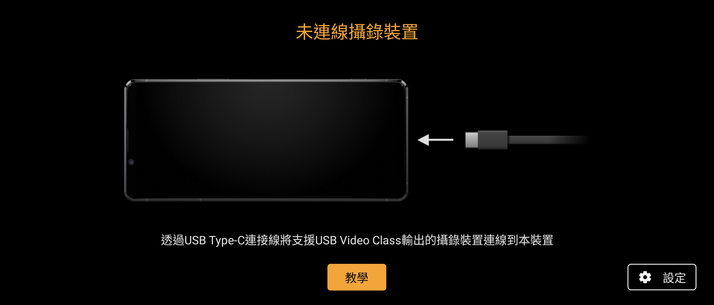
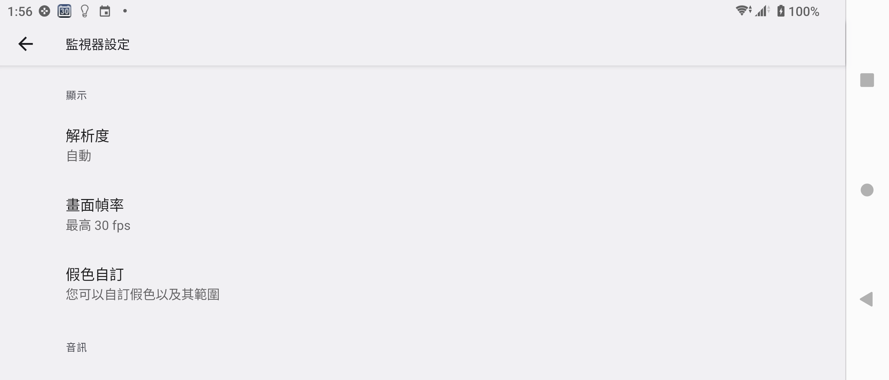
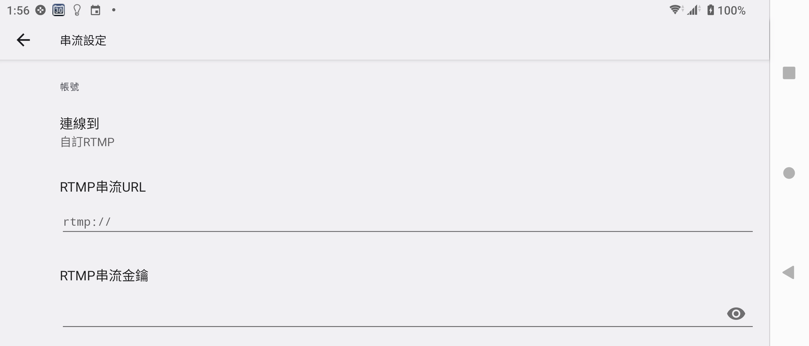

# Sony External monitor 8.0.A.0.6 保存與相容性紀錄

> 本研究的版本盤點、實機驗證、相容性分析與文件整理，由專案擁有者
> 指導 OpenAI Codex 完成。這是獨立保存研究，與 Sony、HTC 或 APKMirror
> 無隸屬、贊助或背書關係。

## 狀態

`8.0.A.0.6` 是盤點到的 20 個版本中最新版本。原始 Sony APK 在 Xperia
1 III Android 13 上可進入繁體中文主頁、完成內建教學並瀏覽監視器、錄製及
串流設定，但系統會在這個機型上停用 Launcher Activity，需 Root 執行
`pm enable` 才能從 App 抽屜啟動。

本頁標示為 **PARTIAL / Sony Root**。本輪沒有把 UVC 相機接到手機，因此
不宣稱即時監看、錄影或 RTMP 發布已完成硬體端驗收。

公開 repository 僅提供研究紀錄與截圖，不提供 Sony 原始 APK。

## 身分

| 欄位 | 內容 |
| --- | --- |
| 840 筆總目錄索引 | 223 |
| Package | `com.sonymobile.extmonitorapp` |
| 版本 | `8.0.A.0.6`（`versionCode 16777222`） |
| SDK／ABI | minimum API 31、target API 35、`arm64-v8a` |
| 最終 APK SHA-256 | `4edcdc0f968b0eb41c5b9dd7fdd6b7c6d5255e2ff250d76ee1843ef26f466d0c` |
| Sony 憑證 SHA-256 | `bc01a8cd9e5d87854f6dc4c84aed49edc34ac196c00b89623cea6ccbbdea627b` |
| 執行時 Root | 需要，用於重新啟用 Launcher Activity |

## 用途

External monitor 讓支援 USB Video Class 的相機或擷取裝置透過 USB Type-C
把影像送到 Xperia。App 也包含監視器顯示、錄製與自訂 RTMP 串流設定。

## 歷史

APKMirror 保存的版本序列從 `1.1.A.0.6` 延伸到 `8.0.A.0.6`。本研究選擇
最新版本，沒有回退。

## 版本選擇

`8.0.A.0.6` 是本次 20 個已盤點版本中的最新候選；其 minimum API 31、
target API 35 與 `arm64-v8a` 架構可由 Xperia 1 III Android 13 滿足。

來源：[APKMirror External monitor releases](https://www.apkmirror.com/apk/sony-mobile-communications/external-monitor/)。

## 修復內容

本研究沒有修改 APK、程式碼、資源、簽章、權限或網路端點。

相容處理只有可回復的 package state：

```bash
su -c 'pm enable com.sonymobile.extmonitorapp/.MonitorProActivity'
```

回溯時可停用該入口，或卸載更新以回到 Xperia 1 III 內建的
`4.0.A.0.12` 系統版本。

## 測試平台

| 裝置 | 結果 |
| --- | --- |
| Sony Xperia 1 III／Android 13 | 原始 APK 主頁、完整教學、監視器／錄製／串流設定通過；需 Root 啟用入口 |
| HTC One M8／Android 6.0.1 | 安裝失敗：裝置僅 32 位元且 API 23，APK 為 arm64-only 且 minimum API 31 |

## 驗證結果

Sony 端冷啟動進入真正的 `NoConnectionActivity`，固定橫向畫面填滿 App
範圍，沒有 App 產生的黑邊、裁切、重疊、fatal 或 ANR。設定測試沒有填入
帳號、RTMP URL、金鑰，也沒有開始錄影或網路發布。

## 截圖







## 已知限制

- 本輪沒有 UVC 硬體輸入，因此即時影像、錄製與串流功能仍待硬體驗證。
- Launcher Activity 在 Xperia 1 III 上會被 Sony 啟動接收器停用，需 Root
  重新啟用；APK 本身保持原始 Sony 簽章。
- HTC 的 Android API 與 CPU ABI 都不相容，因此不宣稱跨品牌可攜。
- 測試只涵蓋上述兩台裝置，不推論其他 Xperia 或 Android 裝置必然相容。

## 檔案與完整性

最終私人自用檔案為未修改的 Sony 原始 APK，SHA-256 是
`4edcdc0f968b0eb41c5b9dd7fdd6b7c6d5255e2ff250d76ee1843ef26f466d0c`；
Sony 簽章憑證 SHA-256 是
`bc01a8cd9e5d87854f6dc4c84aed49edc34ac196c00b89623cea6ccbbdea627b`。
GitHub 僅保存文件、驗證結果與隱私檢視通過的截圖。

## 安裝與回溯

私人自用 APK 可用一般 Package Manager 安裝，但在本測試機上仍需 Root
啟用入口：

```bash
adb install ExternalMonitor_8.0.A.0.6.apk
adb shell su -c 'pm enable com.sonymobile.extmonitorapp/.MonitorProActivity'
adb shell am start -n com.sonymobile.extmonitorapp/.MonitorProActivity
```

覆蓋前應保留既有 package、資料與系統 APK 證據。回溯可卸載更新，恢復內建
版本及先前 package enabled state。

## 發布與法律聲明

Sony APK、程式碼、圖示、名稱、商標及其他 OEM 資產仍屬原權利人。
Repository 的授權只涵蓋本專案自行撰寫的文件與工具，不涵蓋 Sony 二進位檔。

## 研究與作者分工

- 專案方向、實機操作監督與發布決策：專案擁有者。
- 盤點、分析、驗證、隱私檢視與文件：OpenAI Codex。
- App 原始程式與 Sony 發布資產：原權利人。
