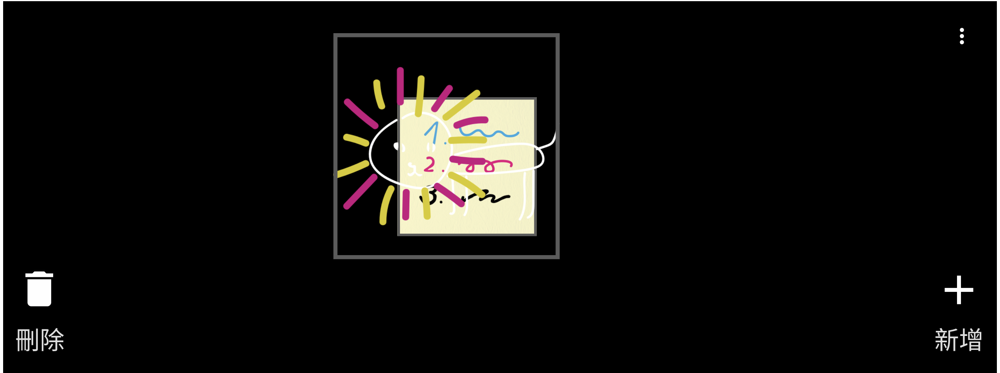
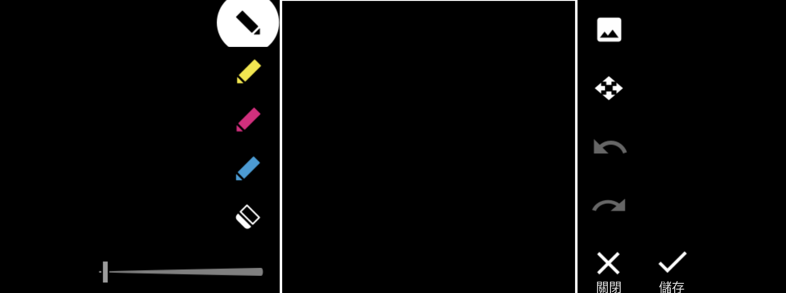

# Sony Family Board 2.0.A.0.4 保存研究

> 本項版本分析、現代 Xperia 版面修復、實機驗證、隱私驗收與文件由專案
> 擁有者指導，OpenAI Codex 完成。這是獨立保存研究，與 Sony、HTC 或
> APKMirror 無隸屬、贊助或背書關係。

## 狀態

Sony Family Board `2.0.A.0.4` 經 responsive v4 最小修復後，可在 Xperia 1 III
Android 13 以完整橫向畫面使用。看板、手寫便條、四種筆色、粗細、橡皮擦、
復原／重做、圖片選擇、Sony 一次性錄影、影片縮圖、刪除、本機備份與還原均
已實測。

本項依專案擁有者指定，以這支 Xperia 1 III 的本機可用性為驗收目標。沒有把
HTC 或其他 OEM 當成發布門檻，也不宣稱它們相容。

## 身分

| 欄位 | 結果 |
|---|---|
| 全域目錄索引 | `533` |
| Package | `com.sonymobile.familyboard` |
| 原始版本 | `2.0.A.0.4` (`versionCode 4194308`) |
| 最終版本 | `2.0.A.0.4-responsive-v4` (`versionCode 4194312`) |
| SDK／Variant | Android 6.0+、min API 23、target API 25、noarch、nodpi |
| 測試平台 | Sony Xperia 1 III `XQ-BC72`，Android 13，`61.2.A.0.472A` |
| 日常執行 | 不需 Root；還原原始 App 資料的研究備份使用過 Root |
| 驗收 | `accepted_sony_local` |

## 歷史與用途

Family Board 原本是 2017 年 Xperia Touch `G1109` 的 Board App。Sony 的
[Xperia Touch 說明頁](https://www.sony.jp/xperia/support/use_support/manual/html/g1109/contents/TP1776253.html)
描述了在投影觸控畫面上新增手寫備忘錄、影片及操作看板的流程；APKMirror 的
[2.0.A.0.4 版本頁](https://www.apkmirror.com/apk/sony-mobile-communications/family-board/family-board-2-0-a-0-4-release/)
也將此檔標示為取自 Xperia Touch 系統映像。

本研究把同一套家庭看板體驗保存到狹長的 Xperia 1 III 螢幕，並保留 Sony
一次性影片錄製與 Android 外部圖片／影片處理契約。

## 修復內容

1. 將歷史固定尺寸看板改為適應 Xperia 1 III 的完整 21:9 橫向畫面。
2. 啟用 `resizeableActivity`、提高長寬比上限，並補上現代橫向尺寸資源。
3. 補齊手寫工具列缺少的 `note_slide_bar_width`／`height`，修復進入編輯器
   時的資源崩潰。
4. 將已不存在的 `/system/fonts/Roboto-Light.ttf` 改為目標韌體存在的
   `Roboto-Regular.ttf`。
5. 將歷史 SD 卡根目錄備份改為 App 專屬手機儲存空間，並把繁體中文提示同步
   改成「手機儲存空間」。

精確範圍與回溯資料記錄於 [PATCH_NOTES.md](PATCH_NOTES.md)。

## 驗證結果

- 真正 Launcher `.activity.FamilyBoardActivity` 可連續冷啟動；三次為
  `160 ms`、`135 ms`、`137 ms`。
- 舊版左右窄框已移除，主畫面、看板項目、刪除、新增及選單均完整顯示。
- 手寫編輯器可繪製白／黃／粉紅／藍線條，粗細滑桿、橡皮擦、復原、重做、
  儲存與捨棄均正常。
- 圖片按鈕可開啟 Android 選擇器並安全返回。
- 影片按鈕可呼叫 Sony Photography Pro 的 `OneshotVideoActivity`；短錄後影片
  會以縮圖回到看板，點擊可交給本機影片 App。
- 刪除測試影片後，原本兩張便條完整保留。
- 本機備份與還原實際執行成功，作用中資料與備份均只有原本兩個 note ID。
- 開放原始碼授權對話框、Home／返回、外部 Activity 往返均正常。
- 最終 log 沒有 Family Board fatal、ANR 或 `SecurityException`。

完整結果見 [TEST_RESULT.md](TEST_RESULT.md)。

## 已知限制

- App 原生設計是 Xperia Touch 的橫向投影看板；本研究不宣稱直向模式。
- 錄影依賴相容的 Sony Photography Pro 一次性錄影 Activity。
- 圖片匯入與影片播放使用 Android 外部 Activity，實際選項依手機安裝的 App
  而不同。
- 最終 APK 使用本研究的本機測試憑證，沒有保留 Sony 原始簽章；相同 package
  的不同簽章版本需要先備份資料再切換。
- 只驗證指定 Xperia 1 III，不推論其他 Xperia、Android 或 OEM。

## 截圖

公開截圖已裁除狀態列與導覽列，清除 metadata，並檢查沒有帳號、通知、位置、
聯絡人、裝置識別碼或其他私人內容。





## 檔案與完整性

| 項目 | SHA-256 |
|---|---|
| Sony 原始安裝 APK | `74b5ea11ecb3b319a15bf19722875d47eca05067199933e37cbbfd5278fea7b3` |
| Sony 原始憑證 | `bc01a8cd9e5d87854f6dc4c84aed49edc34ac196c00b89623cea6ccbbdea627b` |
| responsive v4 最終 APK | `49db3ace50d67dccebeba8f6787de7c657c4a27bcfad5f01cfec34ad08eee7d7` |
| 本機研究憑證 | `b5e26a13f091dd593e8f8024e7de21cc0426d0d383feae3300035b84def9d618` |
| 主看板截圖 | `1f392e8f6216bf7f6d001b54f7c8e87d08e1614ae1009700e59fea3032daf41b` |
| 手寫編輯器截圖 | `202c6d3199d9dffb12bb1ee208a42de7ee1c1b6281e0c895d7ed92d41001e98a` |

公開 repository 採 `evidence_only`，不提供 Sony 原始或重簽 APK。最終 APK、
完整反編譯資料、簽章與回溯備份只保存在擁有者的私人 App Store 與 NAS。

## 安裝與回溯

從私人保存位置取得並核對雜湊後，可在已準備好相同 package 簽章狀態的測試機
使用 Package Manager 安裝：

```bash
adb install -r Family-Board-2.0.A.0.4-responsive-v4-preservation-signed.apk
adb shell am start -n com.sonymobile.familyboard/.activity.FamilyBoardActivity
```

若裝置已有 Sony 原始簽章的同 package App，不能用不同簽章直接覆蓋。應先備份
Family Board 資料與原始 APK，再依裝置情況移除舊版、安裝修復版。回溯時使用
原始 APK／韌體與已驗證資料備份，不要混用兩種簽章的更新路徑。

## 發布與法律聲明

公開 repository 只發布本專案撰寫的文件、雜湊、測試結論、修復說明與
去識別化截圖。Sony、Xperia、App 名稱、程式、介面、圖示、商標及其他資產仍
屬原權利人；MIT License 不涵蓋 OEM APK 或資產。

## 研究與作者分工

- 方向、實機操作監督與發布決策：專案擁有者。
- 版本分析、最小修復、測試、隱私驗收與文件：OpenAI Codex。
- App 原始程式、介面與 Sony 發布資產：原權利人。
