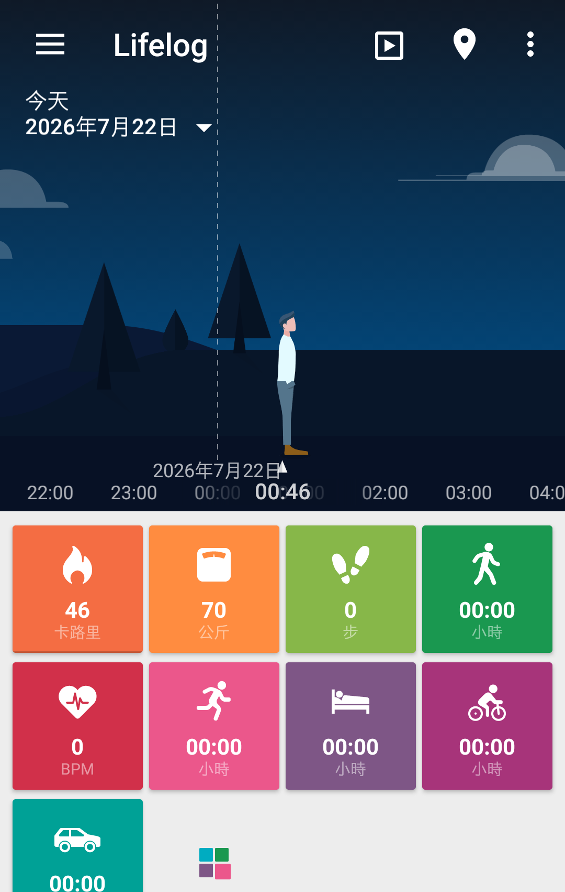
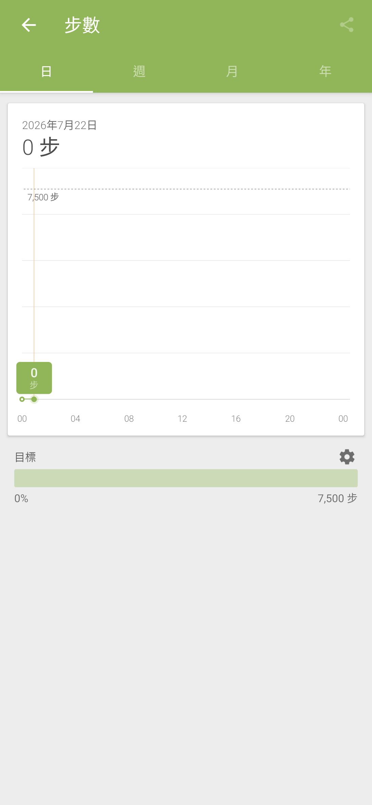

# Sony Lifelog 4.0.A.0.39

> 本項保存研究、版本整理、實機測試、驗收自動化與文件由專案擁有者指導
> OpenAI Codex 完成；Sony 與 HTC 實體手機操作由使用者監督。本項是獨立
> 研究，與 Sony、HTC、Google 或 APKMirror 無隸屬、贊助或背書關係。

## Status

目錄最新版 `4.0.A.0.39` 的 Sony 原版 APK 已在 Sony Android 13 與 HTC
Android 6.0.1 通過。App 不需要 Root、Magisk、反編譯、修補或重新簽章；
公開 repository 只提供研究文件與去識別化實機截圖，不提供 Sony APK。

## Identity

| Field | Value |
| --- | --- |
| Z3 Android 6 catalog index | `Z3M-A053` |
| App | Sony Lifelog |
| Package | `com.sonymobile.lifelog` |
| Final version | `4.0.A.0.39` (`versionCode 8388647`) |
| SDK | minimum API 19; target API 30 |
| ABI | arm64-v8a, armeabi, armeabi-v7a, x86, x86_64 |
| Launcher | `.login.StartActivity` |
| Runtime Root/Magisk | Not required |

## History

Xperia Z3 最終官方韌體 `23.5.A.1.291` 內建 Lifelog `3.0.P.1.24`，它是本
研究的歷史基準，不是目錄最新版。APKMirror 保存的 41 個單一 APK 版本從
`1.0.A.1.2` 延伸至 `4.0.A.0.39`；完整版本列舉與未猜測欄位保存在私人研究
封存。本頁只對最後一版與下列兩台實測裝置提出聲明。

## Purpose

Lifelog 是 Sony 的活動與生活紀錄 App，可在時間軸彙整步數、卡路里、睡眠、
交通、通訊與媒體等活動，並提供日、週、月、年圖表、每日目標、書籤、體重、
通知與分享編輯器。部分資料來源依賴裝置感測器、Android 權限或外部服務；
本研究不聲稱已復原已停用的 Sony 雲端服務。

## Version decision

`4.0.A.0.39` 是已列舉 41 版中的最新候選，為 universal、nodpi、單一 APK。
它以未修改位元通過安裝、主頁、版面、深度控制與跨品牌測試，因此沒有回退
至 `4.0.A.0.38`、ROM 內建 `3.0.P.1.24` 或更早版本的理由。

## Repairs

沒有修復 APK。第一次 Sony 安裝被 Play Protect 的舊 Android 警告攔住；
展開提示並針對該 App 選擇繼續安裝後，原始 APK 正常完成安裝。全域驗證
設定未被關閉，APK 位元、Sony 簽章、package、SDK 與資源均未變更。

### Deliberately unrestored features

沒有建立 Sony 帳號、雲端同步或服務端替代品。測試開啟系統相片選擇器與
分享選擇器，但未選取私人媒體、未匯出活動資料、也未向外傳送內容。零資料
狀態下停用的分享動作維持原行為。

## Tested platforms

| Device | OS/API | Root during runtime | Result |
| --- | --- | --- | --- |
| Sony Xperia 1 III XQ-BC72 | Android 13/API 33 | Not required | 主頁、版面、離線、生命週期及 132 個控制盤點通過 |
| HTC One M8 | Android 6.0.1/API 23 | Not used | 原版安裝、真實主頁、Steps 圖表與版面通過 |

## Screenshots

公開圖只顯示合成或零值測試資料，已移除狀態列、導覽列與 PNG metadata，
沒有帳號、通知、私人位置或裝置識別碼。

| HTC Android 6 main page, portrait | Sony Android 13 Steps graph, portrait |
| --- | --- |
|  |  |

## Verification

- 真實 Timeline 主頁與 Steps 代表動作在兩台裝置均通過。
- Sony 深度測試涵蓋 18 個畫面、132 個控制：122 通過、2 個敏感傳輸動作
  刻意跳過、8 個有證據不適用、0 失敗、0 阻塞。
- 書籤建立、重開、編輯、取消刪除與刪除，以及睡眠、單位、溫度與通知的
  保存及復原均通過。
- 九種活動圖均完成日、週、月、年檢視；圖示隱藏、排序與基準復原通過。
- 離線模式與 Home/resume 通過；歸因於本 App 的 fatal、ANR、security、
  linkage 錯誤皆為 0。
- 直屏填滿預期 App bounds，沒有黑邊、裁切、重疊或觸控偏移。App 原生鎖定
  直屏，因此橫屏列為有證據不適用，而不是缺測。

公開摘要見 [technical-test-summary.md](evidence/records/technical-test-summary.md)，
去識別化結果見 [publication-privacy-review.md](evidence/records/publication-privacy-review.md)。

## Known limitations

- 實測只涵蓋上述 Sony 與 HTC，不推論所有 Android 版本與 OEM 均相容。
- App 原生鎖定直屏，沒有橫屏介面。
- 已停用或需要帳號、網路、第三方資料源的歷史服務不視為已復原。
- 外部分享與匯出只驗證安全路由，沒有實際傳送私人內容。
- 公開 repository 不散布 Sony APK；讀者須自行合法取得並核對雜湊。

## Artifacts and integrity

| Artifact | SHA-256 / signer |
| --- | --- |
| Sony original APK 4.0.A.0.39 | `8a66181a9c1ab7c0f2d5a3df5fefd6a51d433a5c096f2a0c823c30e7b356051c` |
| Sony certificate | SHA-256 `bc01a8cd9e5d87854f6dc4c84aed49edc34ac196c00b89623cea6ccbbdea627b` |
| HTC main screenshot | `cb7001803b16475ffb484f1e50a63435a73491d9aa8ac6ed045a34c5e29e79b4` |
| Sony Steps screenshot | `b054b912cfe1520c62341245fa91096a69b8e52578659e7b113f4c2c97abdc84` |

## Installation and rollback

先核對合法取得檔案的 SHA-256，再以一般 Package Manager 安裝：

```bash
shasum -a 256 Lifelog-4.0.A.0.39.apk
adb install Lifelog-4.0.A.0.39.apk
```

舊 Android 警告出現時，須由裝置使用者確認是否繼續安裝。啟動與回溯：

```bash
adb shell am start -n com.sonymobile.lifelog/.login.StartActivity
adb uninstall com.sonymobile.lifelog
```

若已有同 package 的系統版、不同簽章版或重要生活資料，應先備份並核對，
不要直接覆蓋或清除資料。

## Distribution and legal notice

公開模式為 `evidence_only`。Repository 只包含本專案撰寫的文件、測試摘要與
經隱私驗收的實機證據，不包含 Sony APK、反編譯程式碼、圖示或其他 OEM
binary。MIT License 只涵蓋本專案有權授權的內容；Sony 程式、名稱、商標、
圖示與其他資產仍屬原權利人。私人 App Store 的原版 APK 不構成公開再散布
授權。

## Research and authorship

- 專案方向、實機操作監督與發布決策：專案擁有者。
- 版本整理、測試自動化、證據驗收與文件：OpenAI Codex，依擁有者指示完成。
- Lifelog 原始程式與 Sony 發佈資產：原權利人。
- 版本來源：[APKMirror Lifelog releases](https://www.apkmirror.com/apk/sony-mobile-communications-inc/lifelog/)。

