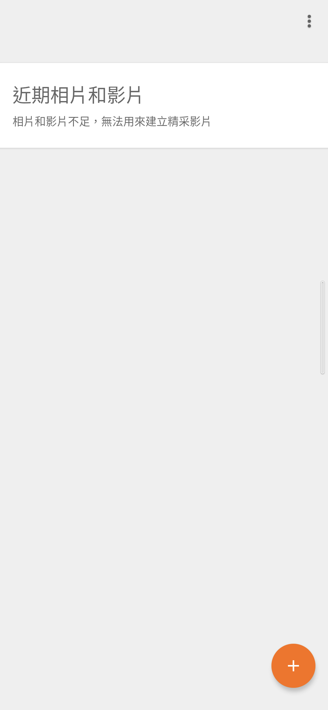
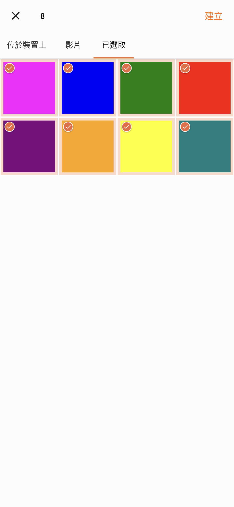
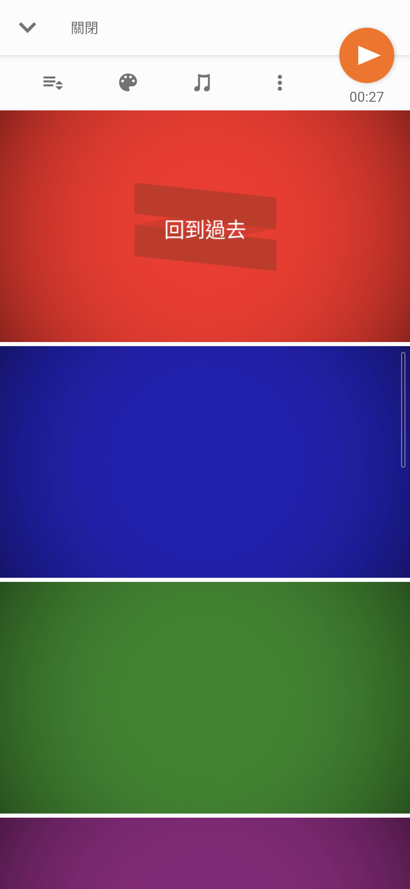

# Sony Movie Creator 5.8.A.0.1

> 本項保存研究、版本整理、實機測試、驗收自動化與文件由專案擁有者指導
> OpenAI Codex 完成；Sony 與 HTC 實體手機操作由使用者監督。本項是獨立
> 研究，與 Sony、HTC、Google 或 APKMirror 無隸屬、贊助或背書關係。

## Status

目錄最新版 `5.8.A.0.1` 的 Sony 原版 APK 已在 Sony Android 13 完成主頁、
版面、離線、實際剪輯與深度控制驗證，不需要 Root、Magisk、修補或重新
簽章。HTC Android 6.0.1 因缺少 Sony 平台共享函式庫而無法安裝，因此目前
結論是 `accepted_sony_only`。公開 repository 只提供研究文件與去識別化截圖。

## Identity

| Field | Value |
| --- | --- |
| Z3 Android 6 catalog index | `Z3M-A094` |
| App | Sony Movie Creator |
| Package | `com.sonymobile.moviecreator.rmm` |
| Final version | `5.8.A.0.1` (`versionCode 11534337`) |
| SDK | minimum API 21; target API 29; compiled API 30 |
| ABI | arm64-v8a, armeabi |
| Launcher | `.LaunchActivity` |
| Runtime Root/Magisk | Not required |

## History

Xperia Z3 最終 Android 6.0.1 韌體內建 `3.5.A.0.4`，它是歷史基準，不是
目錄最新版。APKMirror 保存的 37 個發行頁從 `2.2.A.0.8` 延伸到
`5.8.A.0.1`；完整版本順序、上傳時間與雜湊保存在私人研究封存。Movie
Creator 與 package 為 `com.sonymobile.moviecreator` 的 Sony Video Editor
是不同產品，本頁不混用兩者。

## Purpose

Movie Creator 是 Xperia 時期的自動影片製作與簡易剪輯工具。使用者可從
本機照片與影片建立專案，加入標題、音樂、效果與備註，調整內容順序，然後
預覽、分享或匯出影片。核心本機剪輯與 Full HD 匯出在測試裝置上仍可使用。

## Version decision

`5.8.A.0.1` 是 37 個已列舉版本中的最後一版，為 nodpi 單一 APK。它以
未修改位元通過 Sony 安裝、真實主頁、版面、編輯、播放、匯出與深度控制，
因此沒有回退至 `5.7.A.0.2` 或 ROM 內建 `3.5.A.0.4` 的理由。

## Repairs

沒有修改 APK。原始 Sony 簽章、Manifest、DEX、資源與 native libraries
全部保留。實作工作集中在相容性驗證、權限流程、測試資料清理與回溯；沒有
為了製造「修復版」而改動已正常的程式。

### Deliberately unrestored features

沒有偽造 `com.sony.device` 或繞過 Sony 平台契約來宣稱 HTC 相容。App 對
Sony 媒體提供者的選用中繼資料查詢在現代系統會出現已捕捉的非致命警告；
本機建立、剪輯、播放和匯出不受影響，因此沒有擴張成不必要的框架修改。

## Tested platforms

| Device | OS/API | Root during runtime | Result |
| --- | --- | --- | --- |
| Sony Xperia 1 III XQ-BC72 | Android 13/API 33 | Not required | 主頁、直橫屏、離線、剪輯、播放、分享路由、Full HD 匯出與 76 個控制項盤點通過 |
| HTC One M8 | Android 6.0.1/API 23 | Not used | 安裝失敗：缺少必要共享函式庫 `com.sony.device` |

## Screenshots

公開圖只顯示空白主頁與人工建立的純色測試素材，已移除狀態列、導覽列和
PNG metadata，沒有帳號、通知、真實相片、位置或裝置識別碼。

| Empty main page | Synthetic media selection |
| --- | --- |
|  |  |

| Synthetic project | Editor |
| --- | --- |
|  |  |

## Verification

- Sony 冷啟動到真實空專案主頁，沒有 splash 假通過、延遲崩潰或 ANR。
- 直向與橫向介面沒有 App 造成的黑邊、裁切、重疊或邊緣觸控偏移。
- 合成媒體完成素材選擇、專案建立、排序、效果、音樂、標題、備註、插入、
  刪除、復原、播放、分享路由與 Full HD 匯出。
- 深度測試涵蓋 22 個畫面、76 個控制：74 通過；2 個重複的破壞性刪除入口
  為避免重複刪除而有證據略過；0 失敗、0 阻塞。
- 離線本機播放、權限允許與拒絕、冷重開、狀態保存及測試資料清理均通過。
- 歸因於 Movie Creator 的 fatal、ANR、verification、linkage、security 或
  native crash 為 0。

公開摘要見 [technical-test-summary.md](evidence/records/technical-test-summary.md)，
去識別化結果見 [publication-privacy-review.md](evidence/records/publication-privacy-review.md)。

## Known limitations

- 原版 APK 需要 Sony 平台共享函式庫；目前不宣稱跨品牌可用。
- Sony 媒體提供者的選用簽章保護中繼資料路徑會留下非致命警告。
- 實測只涵蓋上述 Sony 與 HTC，不推論所有 Android 版本與 OEM。
- 分享只驗證 Android 路由與選擇器，沒有將內容傳送到外部帳號。
- 公開 repository 不散布 Sony APK；讀者須自行合法取得並核對雜湊。

## Artifacts and integrity

| Artifact | SHA-256 / signer |
| --- | --- |
| Sony original APK 5.8.A.0.1 | `69329916f88bc24b7830d5909a7e899a9d16dcef842b774a7a4eba7105f29f89` |
| Sony certificate | SHA-256 `bc01a8cd9e5d87854f6dc4c84aed49edc34ac196c00b89623cea6ccbbdea627b` |
| Main screenshot | `2cd41984805e53b236ddd2270bd833502dcb61c175523d9bf44b68173154b648` |
| Synthetic selection screenshot | `f8a984939afeeedf3e205f31b9e65e5729eb5dea915717d7c50ae34ecf9d68c6` |
| Synthetic project screenshot | `26663a83156d2fc0878bd4a8c1ff12d2bea76aec3e1890b921cad84542498e55` |
| Editor screenshot | `e83c9bccdc80413b7e4cdba708dc3b3d021c917ea73ada4da459e9e9a0b0370e` |

## Installation and rollback

先核對合法取得檔案的 SHA-256，再以一般 Package Manager 安裝：

```bash
shasum -a 256 Sony-Movie-Creator-5.8.A.0.1.apk
adb install Sony-Movie-Creator-5.8.A.0.1.apk
adb shell am start -n com.sonymobile.moviecreator.rmm/.LaunchActivity
```

若系統缺少 `com.sony.device`，安裝會直接失敗，不能把它視為可修復的普通
權限提示。回溯前應先備份現有專案與匯出檔案，再還原先前合法備份或解除安裝：

```bash
adb uninstall com.sonymobile.moviecreator.rmm
```

## Distribution and legal notice

公開模式為 `evidence_only`。Repository 只包含本專案撰寫的文件、測試摘要與
經隱私驗收的實機證據，不包含 Sony APK、反編譯程式碼、圖示或其他 OEM
binary。MIT License 只涵蓋本專案有權授權的內容；Sony 程式、名稱、商標、
圖示與其他資產仍屬原權利人。私人 App Store 的原版 APK 不構成公開再散布
授權。

## Research and authorship

- 專案方向、實機操作監督與發布決策：專案擁有者。
- 版本整理、測試自動化、證據驗收與文件：OpenAI Codex，依擁有者指示完成。
- Movie Creator 原始程式與 Sony 發佈資產：原權利人。
- 版本來源：[APKMirror Movie Creator releases](https://www.apkmirror.com/apk/sony-mobile-communications/movie-creator/)。
