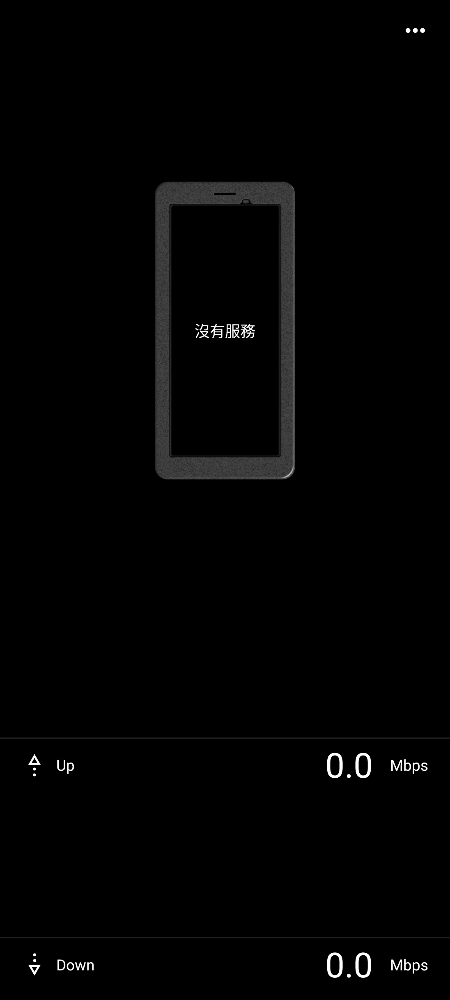
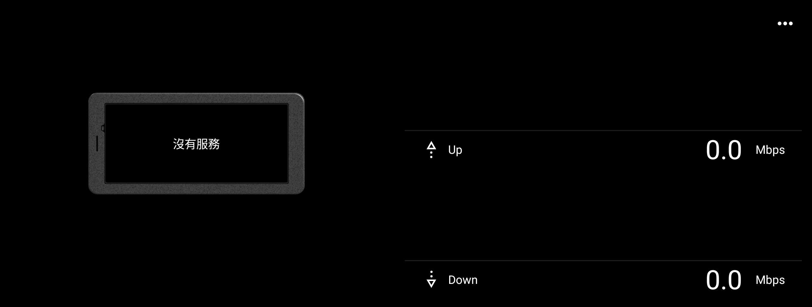

# Sony Network Visualizer 2.0.0 保存與相容性紀錄

> 本研究的版本盤點、APK 分析、相容性修復、實機驗證與文件整理，
> 由專案擁有者指導 OpenAI Codex 完成。這是獨立保存研究，與 Sony、
> HTC 或 APKMirror 無隸屬、贊助或背書關係。

## 狀態

本頁標示為 **PARTIAL / 即時 mmWDI 資料未恢復**。

最終 `2.0.0-compat-v5` 可在 Sony Xperia 1 III／Android 13 進入真正主頁，
完成直橫屏、Picture-in-Picture、選單與有限控制驗證；執行不需要 Root 或
重新開機。然而 Xperia 1 III 的 Android 13 mmWDI framework 缺少本 App
預期的新版 API，舊 callback 又限制 Sony 信任簽章，因此即時天線方向與網路
吞吐資料仍不可用。主頁顯示 `沒有服務` 與 `0.0 Mbps`，本研究不把它描述成
已完整恢復的網路量測工具。

公開 repository 僅提供研究紀錄與去識別化截圖，不提供 Sony 原始 APK 或
本地重簽 APK。

## 身分

| 欄位 | 內容 |
| --- | --- |
| 840 筆總目錄索引 | 364 |
| App | Network Visualizer |
| Package | `com.sonymobile.networkvisualizer` |
| Sony 原始版本 | `2.0.0`（`versionCode 13`） |
| 最終修復版本 | `2.0.0-compat-v5`（`versionCode 18`） |
| SDK／ABI | minimum API 33、target API 33、無 native ABI |
| Sony 原始 APK SHA-256 | `9c69bc3d2e266736644cf13e21c88b3e56f76ef7a815f16bc4ef3acd0331fad3` |
| Sony 原始 signer SHA-256 | `6339375ac295cb0cd22811b97accd40104bd4a0185d4dd2289b81860c15d623c` |
| 最終修復 APK SHA-256 | `a51da995bc1e6133ff1c17396bc2ab9d6f1539cb0f89f8ee4ff463aa8e1e0959` |
| 本地相容性 signer SHA-256 | `b5e26a13f091dd593e8f8024e7de21cc0426d0d383feae3300035b84def9d618` |
| 執行時 Root／重新開機 | 均不需要 |

## 歷史

Network Visualizer 是 Sony 為支援機型提供的 5G／mmWave 視覺化工具，將
天線方向與即時上傳、下載速度疊加在手機圖示上。不同版本跟隨 Xperia 的
Android 與 Sony framework 世代更新，因此新版 APK 不等同於舊裝置可直接
使用的通用網路監測器。

來源：[APKMirror Network Visualizer 版本目錄](https://www.apkmirror.com/apk/sony-mobile-communications/network-visualizer/)。

## 用途

原始用途是顯示支援 Xperia 的 5G/mmWave 天線方向，以及目前上傳與下載
吞吐量；選單也提供 PiP 顯示模式、隱私權政策、開放原始碼授權、應用程式
資訊與資料用量入口。

## 版本選擇

APKMirror 版本序列中，`3.0.1` 要求 Android 15+、`3.0.0` 要求 Android
14+，`2.0.0` 要求 Android 13+；`1.2.1` 則是較舊備援版本。因此在 Xperia
1 III 的 Android 13 測試環境，`2.0.0` 是發布者標示可相容的最新版本。
本研究沒有把 Android 14／15 版本降級包裝成 Android 13 相容版。

## 修復內容

未修改的 Sony APK 可以顯示繁體中文介紹頁，但進入主頁後會因 Xperia 1 III
board 不在內建圖稿表，以及較舊 mmWDI framework 缺少新方法而崩潰。最終
修復只做以下相容處理：

1. 未知 board 改用 APK 唯一內建的 `vx9571` 手機圖稿，避免解析到零資源。
2. 三個不存在的新 mmWDI 值回傳明確的中性值。
3. callback bookkeeping 留在 App 內，不轉送到舊 framework 的 Sony
   簽章白名單註冊路徑。
4. 橫屏保留真實底部 system inset，避免 Down 列被導覽區裁切。
5. 更多選項按鈕套用 App 既有的繁體中文 `更多選項` 無障礙名稱。

沒有產生虛假網路資料，也沒有繞過 Sony 私鑰或冒充 Sony 簽章。完整差異與
未恢復範圍見 [`REPAIR_NOTES.md`](REPAIR_NOTES.md)。

## 測試平台

| 裝置 | 結果 |
| --- | --- |
| Sony Xperia 1 III XQ-BC72／Android 13 | 有限制通過：主頁、直橫屏、PiP、選單與有限控制通過；即時 mmWDI 資料不可用 |
| HTC One M8／Android 6.0.1 | 安裝失敗：`INSTALL_FAILED_OLDER_SDK`，裝置 API 23 低於 App 的 API 33 |

## 驗證結果

- 安裝後反向拉回的 `base.apk` 與最終候選逐 byte 相同。
- 真正 `NetworkVisualizerActivity` 主頁在直屏與橫屏均可完整顯示。
- 五次冷啟動、五次旋轉、五次前後景切換與三次 PiP 沒有可歸因的 Fatal
  或 ANR。
- 四種有限 PiP 模式均已選取，測試後恢復原設定；實際 task 進入
  `mode=pinned`。
- 五個主選單入口均已開啟；資料用量確認可進入 Android 系統資料用量頁。
- `更多選項` 在 UI tree 中是具名、可點擊、可聚焦節點，但實體鍵盤 Tab
  沒有走到該節點，因此不宣稱鍵盤操作通過。
- 隱私同意依專案擁有者的既定授權接受；會永久抑制提示的選項未勾選。
- 完成 `compat-v5 → Sony 原版 → compat-v5` 回溯演練，兩份安裝後 APK
  均符合各自 SHA-256。

詳細結果見 [`TEST_RESULT.md`](TEST_RESULT.md)。

## 截圖



*Sony Xperia 1 III／Android 13，直向真正主頁；中性資料狀態清楚顯示為
`沒有服務` 與 `0.0 Mbps`。*



*Sony Xperia 1 III／Android 13，橫向真正主頁；Down 列完整位於系統 inset
上方。*

兩張圖已裁除系統狀態列與導覽列，並通過像素、OCR、metadata、路徑與文字
去識別化檢查；不含帳戶、通知、位置、網路名稱、裝置識別碼或私人內容。

## 已知限制

- Xperia 1 III 的 Android 13 mmWDI framework 不具備這個 release 預期的
  新 API 與信任簽章 callback contract。
- 即時天線方向、即時吞吐資料、天線選擇器與視覺鎖定功能未恢復。
- 內建手機圖是相容性 fallback，不代表 Xperia 1 III 的實際天線位置。
- 本地重簽版沒有 Sony 原始 signature-level 權限或整合保證。
- 實體鍵盤 Tab traversal 未通過；TalkBack 完整手勢矩陣未宣稱完成。
- HTC 結果只證明最低 Android 版本不相容，不推論其他品牌新手機的結果。

## 檔案與完整性

公開 repository 不含 APK、完整反編譯樹、Sony framework 或私有測試日誌。
原始 APK、最終私人候選、signer 與兩張公開截圖的 SHA-256 列於
[`SHA256SUMS`](SHA256SUMS)。修復版因內容變更使用本地相容性簽章，不可覆蓋
Sony 簽章原版。

## 安裝與回溯

私人自用修復 APK 可由一般 Package Manager 安裝，執行不需要 Root：

```bash
adb install Sony-Network-Visualizer-2.0.0-compat-v5-PARTIAL.apk
adb shell am start -n com.sonymobile.networkvisualizer/.IntroductionActivity
```

回溯時先卸載本地簽章版，再安裝保留的 Sony 原始 `2.0.0`；兩者簽章不同，
不可直接覆蓋更新。此替換流程已在 Xperia 1 III 上實際驗證。

## 發布與法律聲明

公開模式為 **`evidence_only`**。Sony APK、程式碼、圖示、名稱、商標與其他
OEM 資產仍屬原權利人；本 repository 的 MIT License 只涵蓋本專案自行撰寫
的文件與工具，不涵蓋 Sony 二進位檔或反編譯內容。最終 `PARTIAL` APK 只保留
於專案擁有者的私人 App Store，完整研究資料只保存在私人 NAS。

## 研究與作者分工

- 專案方向、實機操作監督、隱私與發布授權：專案擁有者。
- 版本查核、反編譯分析、最小修復、實機測試、證據與文件：OpenAI Codex，
  依專案擁有者指示執行。
- Network Visualizer 原始程式、Sony 名稱、商標與圖像資產：原權利人。
- 版本歷史與下載頁資料：APKMirror。
