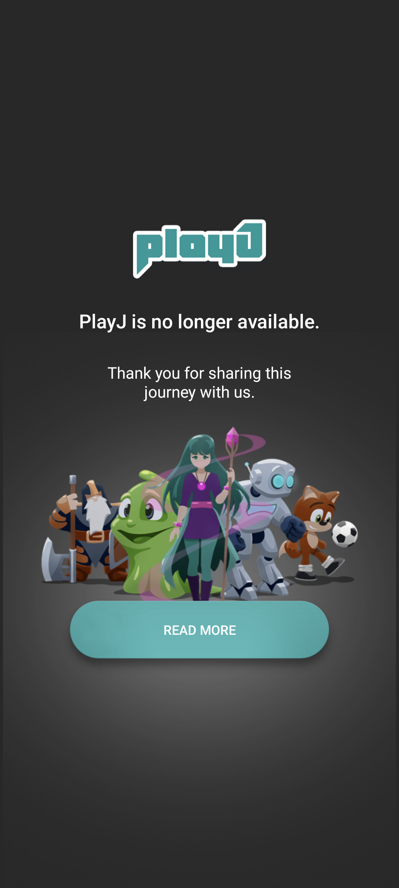

# Sony PlayJ 1.1.A.0.7 保存與修復研究

> 本項保存研究、實機驗證與文件由專案擁有者指導，OpenAI Codex 完成。這是獨立研究，與 Sony、HTC、Facebook 或 APKMirror 無隸屬、贊助或背書關係。

## 狀態

技術驗收結果為 **`accepted_cross_oem`**。最終修復版可在 Sony Xperia 1 III／Android 13 與 HTC One M8／Android 6.0.1 顯示 PlayJ 官方終止服務頁，並讓唯一的 `READ MORE` 按鈕開啟 App 原本指定的 Facebook 網址。

PlayJ 的群組螢幕分享與視訊聊天伺服器已停止服務；本修復不宣稱恢復雲端服務。

## 身分

| 項目 | 內容 |
|---|---|
| App | PlayJ - Group Screen Sharing - Social Video Chat |
| Package | `com.xtream` |
| 最終版本 | `1.1.A.0.7` (`2228231`) |
| 發布者 | Sony Mobile Communications |
| 最低／目標 Android | API 21／API 27 |
| CPU 架構 | arm64-v8a、armeabi-v7a、x86、x86_64 |

PlayJ 原本用來進行社交式群組螢幕分享與視訊聊天。`1.1.A.0.7` 是 APKMirror 目前列出的最後版本，也是 Sony 用來顯示服務終止通知的版本。

來源：[APKMirror PlayJ 版本頁](https://www.apkmirror.com/apk/sony-mobile-communications/playj/)、[PlayJ 1.1.A.0.7](https://www.apkmirror.com/apk/sony-mobile-communications/playj/playj-1-1-a-0-7-release/playj-group-screen-sharing-social-video-chat-1-1-a-0-7-android-apk-download/)

## 歷史

PlayJ 是 Sony Mobile 發行的社交式群組螢幕分享與視訊聊天 App。最後版本
改為顯示官方終止服務頁；本研究保存的是這個最終可觀察狀態，而不是重建已
停止的 PlayJ 雲端服務。

## 用途

原始服務讓使用者進行群組螢幕分享與視訊聊天。服務終止後，App 的現存用途
是顯示 Sony 提供的終止通知，並透過唯一的 `READ MORE` 控制開啟原 App
指定的 PlayJ Facebook 網址。

## 版本選擇

APKMirror 的 PlayJ 目錄目前最後版本是 `1.1.A.0.7`（versionCode
`2228231`），最低 Android API 21、目標 API 27，並包含四種 ABI。沒有發現
版本號更高的 PlayJ 正式候選，因此未做版本回退；修復以此 Sony 最終版本為
唯一基線。

## 修復內容

原版在 Sony Android 13 可以顯示真正終止服務頁，但舊 Sony Flix 觸控層無法可靠把觸控交給 `READ MORE`；同一原版在 HTC Android 6 可以正常開啟連結。

最終 v4 只修改：

- `PleaseUpdateAppActivity.smali`
- 新增一個只執行原始連結的 `View.OnClickListener`
- 在 `ACTION_UP` 加入依螢幕比例計算的可見按鈕命中區
- 21:9 類型使用畫面高度 `65%–77%`
- 16:9 類型保留 `68%–88%` 的相容區間
- 成功命中後執行原本既有的 `ACTION_VIEW` Facebook URL
- 按鈕外的 `ACTION_UP` 會被安全消耗，避免整頁可點擊節點造成誤觸
- 為整個官方終止服務頁加入可辨識、可點擊的無障礙名稱

沒有修改版本號、畫面資源、文案、權限、服務內容或 Facebook URL。由於 Sony 私鑰不可取得，修復版改用專案測試簽章，必須先移除 Sony 簽章版本才能安裝。

## 雜湊與簽章

| 項目 | SHA-256 |
|---|---|
| Sony 原始 APK | `76e518d15cb4f0924ae84dd53a8f5ef5cbec9fe6acb6a708e347c863640e2d93` |
| Sony 原始 signer | `aeb24ef9ef1a8fad29ae7a781a2bf6daaf9b3a364aef803ab317b6a222e6d647` |
| 最終 v4 APK | `97e5bd4b712d76d4aec317e4503c261662eb1f87780eb681225e1c5043c06f2b` |
| 最終 v4 signer | `982bb9a5d74a6ba9bd4589ed498062b903f6f29aa75537770a5dacf6d494584c` |

## 測試平台

| 裝置 | 系統 | 最終 v4 結果 |
|---|---|---|
| Sony Xperia 1 III | Android 13／API 33 | 普通安裝並通過真正終止服務頁與控制測試 |
| HTC One M8 | Android 6.0.1／API 23 | 同一 APK 通過真正終止服務頁與原始 URL 測試 |

執行 App 不需要 Root、Magisk 或重新開機；測試工具曾使用 ADB 觀察，但不是
日常執行條件。

## 驗證結果

### Sony Xperia 1 III／Android 13

- 最終 APK 普通安裝成功，不需要 Root 或重新開機
- 三次冷啟動均進入真正終止服務頁
- 背景返回、熄屏喚醒及重新開啟均通過
- App 原始設計固定直屏；橫屏要求下保持直屏，沒有拉伸、裁切、重疊或 App 產生的黑邊
- 點擊畫面上的 `READ MORE` 後成功開啟 Facebook App
- UI tree 可辨識「PlayJ is no longer available. Read more.」；鍵盤焦點與 Enter 可執行同一語意 click
- 無可歸因的 Fatal、ANR、SecurityException 或 linkage error

### HTC One M8／Android 6.0.1

- 完全相同的最終 APK 安裝成功，拉回雜湊一致
- 終止服務頁正常顯示
- 點擊 `READ MORE` 後，系統 Resolver 保存的完整網址為原始 PlayJ Facebook URL
- UI tree 在 Android 6 也保留相同的可點擊無障礙名稱
- 測試後已卸載，恢復原先未安裝狀態

## 安裝與回溯

已實際執行 `修復 v4 → Sony 原版 → 修復 v4`：兩份安裝後 APK 雜湊均與本地原件一致，且兩者都能重新進入真正終止服務頁。回到 Sony 原版後，Android 13 的 `READ MORE` 觸控與無障礙問題也會跟著恢復。

## 已知限制

- PlayJ 的螢幕分享、群組聊天、帳號與後端服務沒有恢復
- Facebook 上的舊 PlayJ 頁面目前可能已移除、改址或不再提供內容
- 修復只保證 App 正確送出原本 URL，不保證遠端頁面永久存在
- 原版與修復版簽章不同，不能直接互相覆蓋更新
- App 固定直屏是原始 Manifest 行為，不是新版裝置的版面故障

## 截圖

公開圖已移除系統狀態列與導覽列；不包含帳戶、通知、裝置識別碼、位置、聯絡人、訊息、私人照片或秘密資料。

## 檔案與完整性

| 項目 | SHA-256／簽章 |
|---|---|
| Sony 原始 APK | `76e518d15cb4f0924ae84dd53a8f5ef5cbec9fe6acb6a708e347c863640e2d93` |
| Sony 原始 signer | `aeb24ef9ef1a8fad29ae7a781a2bf6daaf9b3a364aef803ab317b6a222e6d647` |
| 最終 v4 APK | `97e5bd4b712d76d4aec317e4503c261662eb1f87780eb681225e1c5043c06f2b` |
| 最終 v4 signer | `982bb9a5d74a6ba9bd4589ed498062b903f6f29aa75537770a5dacf6d494584c` |

修復重現所需的 Apktool/JDK/build-tools 版本與精確修改範圍記錄於
[`REPAIR_NOTES.md`](REPAIR_NOTES.md)。公開 repository 不包含 OEM binary 或
完整反編譯樹。

## 發布與法律聲明

公開 GitHub 僅提供研究文件、修復說明、雜湊、測試結果與去識別化截圖，不提供 Sony 原始 APK 或重簽後 APK。Sony 的 APK、程式碼、名稱、商標與圖像權利仍屬各自權利人，本 repository 不對 OEM 內容重新授權。

專案擁有者的私人 App Store 保存最終自用 APK；私人 NAS 保存完整反編譯樹、歷次修復、原始檔、測試畫面、日誌與回復證據。公開散布模式為 **`evidence_only`**。

詳細測試見 [`TEST_RESULT.md`](TEST_RESULT.md)，修復差異見 [`REPAIR_NOTES.md`](REPAIR_NOTES.md)，雜湊見 [`SHA256SUMS`](SHA256SUMS)。

## 研究與作者分工

- 專案方向、實機操作監督、隱私與發布授權：專案擁有者。
- 版本查核、反編譯分析、最小修復、測試、證據與文件：OpenAI Codex，依
  專案擁有者指示執行。
- PlayJ 原始程式、Sony 名稱、商標與圖像資產：各自權利人。
- 原始版本資料與下載頁：APKMirror；遠端連結目的地：PlayJ 原 App 內既有
  Facebook URL。
