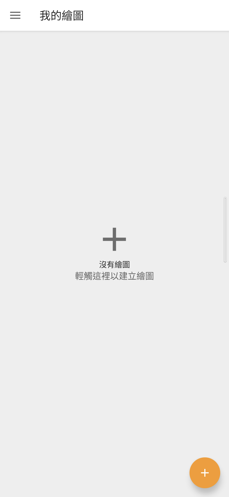
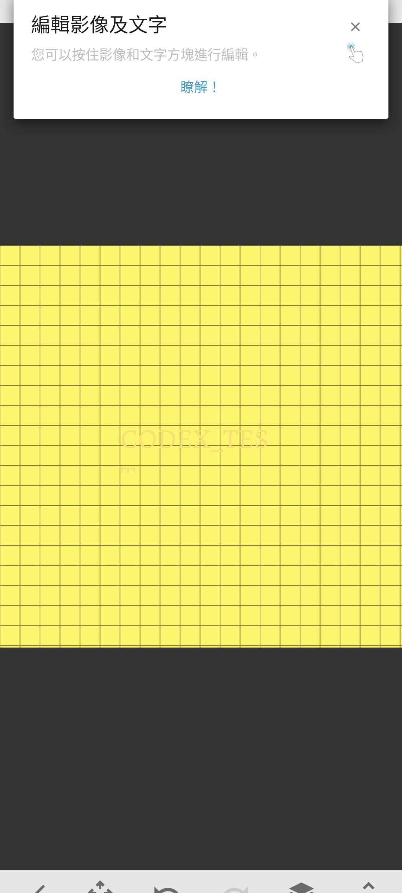
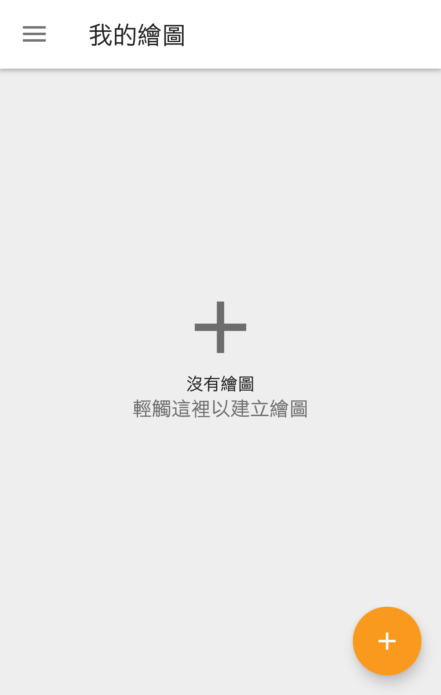

# Sony Sketch 9.0.A.0.6

> 本項保存研究、版本整理、實機測試、驗收自動化與文件由專案擁有者指導
> OpenAI Codex 完成；Sony 與 HTC 實體手機操作由使用者監督。本項是獨立
> 研究，與 Sony、HTC、Google 或 APKMirror 無隸屬、贊助或背書關係。

## Status

最後一個穩定 `A` 分支版本 `9.0.A.0.6` 的 Sony 原版 APK，已在 Sony
Android 13 與 HTC Android 6.0.1 通過。App 的本機繪圖與編輯不需要 Root、
Magisk、反編譯、修補或重新簽章。公開 repository 只提供研究文件與
去識別化實機截圖，不提供 Sony APK。

## Identity

| Field | Value |
| --- | --- |
| Z3 Android 6 catalog index | `Z3M-A096` |
| App | Sony Sketch / 繪圖 |
| Package | `com.sonymobile.sketch` |
| Final version | `9.0.A.0.6` (`versionCode 18874374`) |
| SDK | minimum API 17; target API 28 |
| ABI / density | no native ABI; universal; nodpi; single APK |
| Launcher | `.dashboard.DashboardActivity` |
| Runtime Root/Magisk | Not required |

## History

APKMirror 的三頁 Sony Sketch 上傳紀錄由 `1.0.A.0.10` 延伸至最後的穩定
`9.0.A.0.6`。Sony 同時使用 `A`、`T`、`B`、`C` 等分支字母；本研究把
`A` 視為穩定 production 分支。與 `9.0.A.0.6` 同日的 `9.0.T.0.6` 是平行
測試分支，即使 versionCode 多 1，也不取代穩定版。Xperia Z3 Android
6.0.1 韌體內建的 `7.2.A.0.2` 只作歷史基準。

## Purpose

Sketch 是 Sony 的繪圖與影像編輯 App，可建立不同尺寸的畫布，使用筆刷、
橡皮擦、文字、背景、圖層、尺、橢圓、對稱、選取與變形工具，也能插入
相片、錄製繪圖過程並交由 Android 的播放或分享目標處理。

## Version decision

`9.0.A.0.6` 是已列舉穩定分支中的最新版。它以未修改位元通過普通安裝、
真實主頁、版面、離線本機繪圖、深度控制與 HTC 跨品牌測試，因此沒有回退
至平行測試分支或較舊穩定版的理由。

## Repairs

沒有修復 APK。最終檔案保留 Sony 原始簽章；沒有 apktool round-trip、
重新簽章、Root 或系統 overlay。

### Deliberately unrestored features

Sony 已在 2019 年終止 Sketch 的線上社群與下載內容服務。本研究沒有重建
帳號、雲端備份或貼圖商店；這些已退役的外部服務不算成本機繪圖失敗。

## Tested platforms

| Device | OS/API | Root during runtime | Result |
| --- | --- | --- | --- |
| Sony Xperia 1 III XQ-BC72 | Android 13/API 33 | Not required | 主頁、直橫屏、本機繪圖、離線與 76 個控制盤點通過 |
| HTC One M8 | Android 6.0.1/API 23 | Not used | 原版安裝、繁中條款、主頁、直橫屏與本機筆觸通過 |

## Screenshots

公開圖只顯示空白狀態或 `CODEX_TEST` 合成內容，已移除狀態列、導覽列與
PNG metadata，沒有帳號、通知、私人相片、位置或裝置識別碼。

| Sony Android 13 main | Sony Android 13 synthetic editor |
| --- | --- |
|  |  |



## Verification

- Sony 真實主頁、畫布建立、筆觸、復原／重做、保存與重開皆通過。
- 深度測試盤點 14 個畫面、76 個控制：72 通過、1 個因線上貼圖服務退役而
  阻擋、3 個在單一背景圖層狀態下合理停用、0 失敗。
- 筆刷、背景、文字、相片與相機安全交接、尺、橢圓、對稱、選取、縮放、
  清除畫布、錄製、播放路由、分享路由與設定切換均完成測試並復原。
- 關閉 Wi-Fi 與行動資料後，仍可冷啟動、選擇畫布、建立本機畫布與繪圖。
- HTC 拉回的安裝 APK 與原始候選 SHA-256 完全相同；普通安裝及本機筆觸
  通過，不需要 Root。
- 兩台裝置皆沒有 App 造成的黑邊、裁切、重疊、黑畫面、fatal、ANR、
  security 或 linkage 錯誤。

公開摘要見 [technical-test-summary.md](evidence/records/technical-test-summary.md)，
去識別化結果見 [publication-privacy-review.md](evidence/records/publication-privacy-review.md)。

## Known limitations

- Sony 已終止線上社群、帳號、雲端備份與下載貼圖服務；本研究只確認本機
  繪圖功能，沒有宣稱恢復官方後端。
- 相機、圖片選擇器、影片播放與分享屬 Android 外部交接；測試在實際拍攝、
  選取私人媒體、上傳或發布前返回。
- App 的編輯器可依內建「鎖定裝置方向」設定保持直向；主畫廊的橫屏版面
  已在 Sony 與 HTC 分別通過。
- 實測只涵蓋上述 Sony 與 HTC，不推論所有 Android 版本與 OEM。
- 公開 repository 不散布 Sony APK；讀者須自行合法取得並核對雜湊。

## Artifacts and integrity

| Artifact | SHA-256 / signer |
| --- | --- |
| Sony original APK 9.0.A.0.6 | `f51a6480e3525e349f3330de3f7fa1b1b28d5e70242052a4008ac27d9e7ab80a` |
| Sony certificate | `bc01a8cd9e5d87854f6dc4c84aed49edc34ac196c00b89623cea6ccbbdea627b` |
| Sony main screenshot | `75e01df3a42a7f687add54ed10c81560c596a32a37e20d794611dfde1a9dc927` |
| Sony synthetic editor screenshot | `5ddfda84d1a2ed2bfefb43021e442a51c91784efe06cea289bdabf8b50e65df8` |
| HTC main screenshot | `4b4591b171223d304cdcda03f42d08ecf335be7faf519cdea10319b1fe0025f2` |

## Installation and rollback

先合法取得檔案並核對 SHA-256，再用 Android Package Manager 安裝：

```bash
shasum -a 256 Sony-Sketch-9.0.A.0.6.apk
adb install Sony-Sketch-9.0.A.0.6.apk
adb shell am start -n com.sonymobile.sketch/.dashboard.DashboardActivity
```

解除安裝會移除 App 本機資料；有重要繪圖時先使用合法、適合該版本的方式
備份或匯出，再執行：

```bash
adb uninstall com.sonymobile.sketch
```

## Distribution and legal notice

公開模式為 `evidence_only`。Repository 只包含本專案撰寫的文件、測試摘要與
經隱私驗收的實機證據，不包含 Sony APK、反編譯程式碼、圖示或其他 OEM
binary。MIT License 只涵蓋本專案有權授權的內容；Sony 程式、名稱、商標、
圖示與其他資產仍屬原權利人。私人 App Store 的原版 APK 不構成公開再散布
授權。

## Research and authorship

- 專案方向、實機操作監督與發布決策：專案擁有者。
- 版本整理、測試自動化、證據驗收與文件：OpenAI Codex，依擁有者指示完成。
- Sketch 原始程式與 Sony 發布資產：原權利人。
- 版本來源：[APKMirror Sony Sketch releases](https://www.apkmirror.com/apk/sony-mobile-communications-inc/sony-sketch-draw-paint/)。
