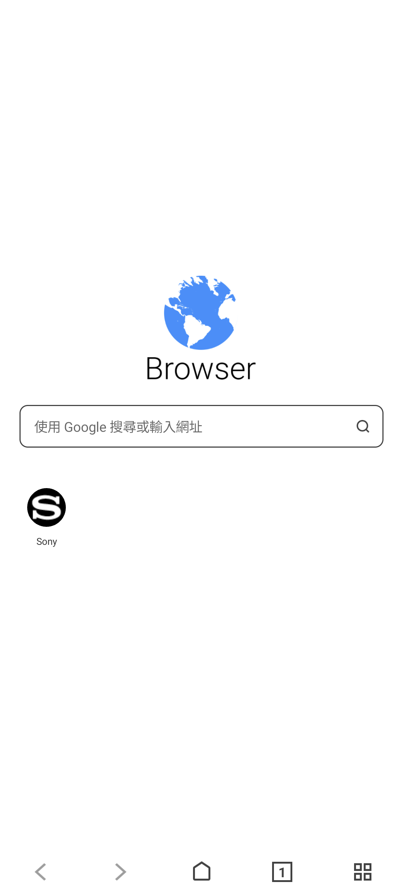
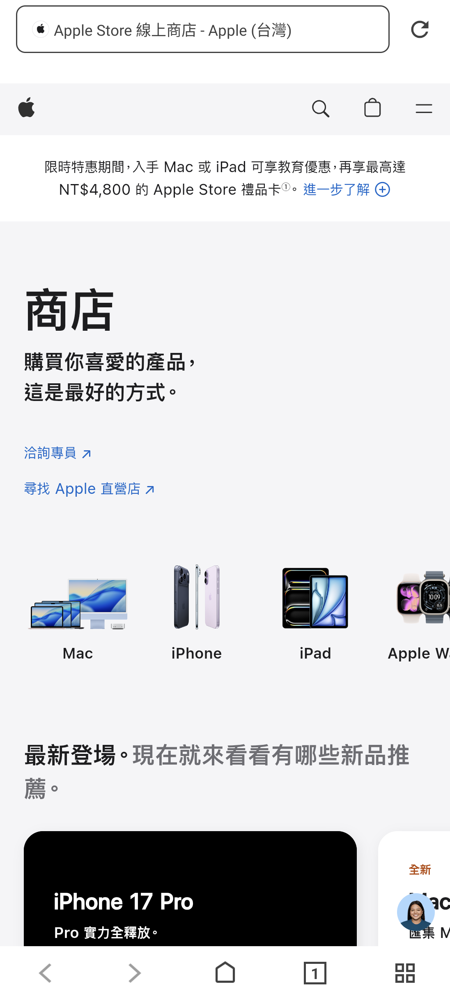
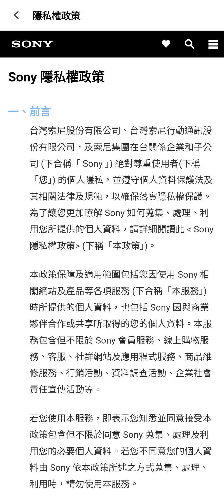

# Sony Browser 3.0.A.0.10 台灣繁中修復紀錄

> 本項版本研究、反編譯分析、修復實作、實機測試、隱私驗收與文件整理，
> 由專案擁有者指導 OpenAI Codex 完成；Sony 實體手機操作由使用者監督。
> 這是獨立保存研究，未受 Sony、Google、Microsoft 或 APKMirror 贊助、
> 認可或背書。

## 狀態

Sony Browser `3.0.A.0.10` 的 `v3.3.4-tw-final` 台灣繁中修復版，已在
Sony Xperia 1 III／Android 13 通過真正首頁、現代網站、版面、深度控制、
TalkBack、離線錯誤與本機廣告阻擋測試。執行不需要 Root、Magisk 或重新
開機。

專案擁有者已明確跳過本版 HTC Android 6.0.1 測試。因此本頁只接受 Sony
實測範圍，不宣稱 HTC、Android 6、其他品牌或所有 Android 裝置皆相容。

## 身分

| 欄位 | 值 |
| --- | --- |
| 840 筆全域目錄索引 | `516` |
| App | Sony Browser |
| Package | `jp.co.sony.mc.browser` |
| 原始／最終版本 | `3.0.A.0.10`（versionCode `300000010`） |
| 最終修復分支 | `v3.3.4-tw-final` |
| SDK | minimum API 31；target API 35 |
| ABI／密度 | 無 native ABI 限制；nodpi；single APK |
| Launcher | `jp.co.sony.mc.browser.MainActivity` |
| 真正主頁 Activity | `jp.co.sony.mc.browser.WebPageActivity` |
| Runtime Root／Magisk | 不需要 |

## 歷史

這一代 Sony Browser 是 Sony Mobile Communications 發布的 Android 12+
瀏覽器。APKMirror 收錄的版本序列中，`3.0.A.0.10` 是可核對的最後版本；
原始發行內容以中國區入口、百度搜尋與中國區 Sony 服務頁為主。

版本與來源：

- [APKMirror：Sony Browser 發布頁](https://www.apkmirror.com/apk/sony-mobile-communications/sony-browser-3/)
- [APKMirror：3.0.A.0.10 APK 頁](https://www.apkmirror.com/apk/sony-mobile-communications/sony-browser-3/sony-browser-3-0-a-0-10-release/sony-browser-3-0-a-0-10-android-apk-download/)

## 用途

Sony Browser 是獨立 WebView 瀏覽器，提供網址／搜尋列、首頁捷徑、分頁、
書籤、瀏覽記錄、下載、分享、深色模式、網站位置／相機權限與一般瀏覽器
設定。網頁由裝置的 Android System WebView 負責渲染，本 App 管理導覽、
本機資料與 Sony 介面。

## 版本選擇

完整檢查 APKMirror 同一 App 的發布頁與唯一 nodpi Android 12+ variant 後，
選用最新的 `3.0.A.0.10`，沒有回退舊版。原始檔案的 package、版本、SDK、
簽章與 SHA-256 均完成靜態核對；沒有比它更新而被排除的同代候選。

原版可在 Xperia 1 III 普通安裝並進入真正 Browser 首頁，但不符合台灣使用
需求，也缺少本次要求的 Google 預設搜尋、本機廣告阻擋、現代版面修正與
Sony 台灣政策入口，因此以原版作為可回溯修復基線。

## 修復內容

- 補齊並修正繁體中文（台灣）介面與 `zh-TW` locale 宣告。
- 將首頁、網址列與建議流程的預設搜尋引擎調整為 Google。
- 將中國 Sony 捷徑改為 Sony 台灣官方購物網站。
- 讓一般 HTTP／HTTPS 網頁留在 Sony Browser 內，不委派給其他瀏覽器。
- 以 App 內本機規則加入 Edge／EasyList 類型的請求與元素阻擋；不使用
  VPN、代理伺服器、外部憑證或其他瀏覽器。
- 新增可持久保存的「阻擋廣告」設定。
- 移除不再需要的 `QUERY_ALL_PACKAGES` 廣泛套件列舉權限。
- 修正首頁、頂部網址列、底部工具列、隱私對話框與記錄列的現代螢幕版面。
- 將中國區隱私權與條款入口改為 Sony 台灣繁中官方頁面。

修復版保留原 package 與版本號，但 Sony 私有簽章無法重製，因此使用獨立
保存測試簽章，不能直接覆蓋 Sony 原始簽章版本。

### 刻意未恢復或未改動

- 網頁核心仍使用 Android System WebView，沒有移植 Chromium 或 Edge。
- 沒有新增雲端同步、Sony 帳號、跨裝置書籤或遠端廣告阻擋服務。
- 相機、麥克風、位置、下載、書籤、記錄與分頁沿用 App 原有資料模型。
- 「清除全部 App 資料」與「更改全機預設瀏覽器」只驗證入口、警告、
  取消與返回；為保護資料與全機行為，沒有提交破壞性變更。

## 測試平台

| 裝置 | OS／API | Runtime Root | 結果 |
| --- | --- | --- | --- |
| Sony Xperia 1 III XQ-BC72 | Android 13／API 33 | 不需要 | 主頁、版面、現代網站、49 個控制、TalkBack、離線與生命週期通過 |
| HTC Android 6.0.1 | API 23 | 未測 | 專案擁有者明確跳過；`minSdk 31`，不宣稱支援 |

## 截圖

三張公開圖均來自精確最終 APK，已裁除 Android 狀態列與導覽列、移除 PNG
metadata，並完成 OCR、原始像素與公開資料去識別化檢查。

### 台灣繁中首頁

Sony Xperia 1 III／Android 13／直向。



### Apple 台灣商店

Sony Xperia 1 III／Android 13／直向；頁面留在 Sony Browser 內。



### Sony 台灣隱私權政策

Sony Xperia 1 III／Android 13／直向。



## 驗證結果

- 冷啟動 `518 ms` 進入真正繁中首頁；兩張穩定畫面與 UI hierarchy 相同。
- Google 預設搜尋、上一頁／下一頁、首頁、分頁與主選單通過。
- Apple 台灣、Google Store 台灣、Amazon、淘寶均在本 App 內載入主要
  圖文，沒有跳轉其他瀏覽器。
- 受控廣告測試同時通過網路規則攔截與元素隱藏。
- 書籤 CRUD、記錄、下載、分享、深色模式、JavaScript、文字大小、首頁
  選擇、網站位置／相機權限與台灣政策頁通過。
- 深度控制盤點 13 個畫面、49 個控制：47 通過、2 個基於資料／全機風險
  刻意不提交、0 失敗、0 阻擋。
- 直向及支援的橫向閱讀路徑沒有 App 造成的黑邊、裁切、重疊或觸控錯位。
- TalkBack 可聚焦 Google 搜尋／網址欄，工具列圖示具有繁中朗讀標籤；
  系統字體 130% 沒有裁切或重疊。
- 背景切換回來為 warm resume；斷網顯示可理解的繁中錯誤頁，恢復網路後
  正常重開。測試後權限、網路、旋轉、字體與輔助設定均恢復。
- 測試路徑的 attributable crash、ANR、linkage 與 security finding 為 0。

## 已知限制

- 只在上述 Sony Xperia 1 III／Android 13 驗證；HTC 與跨品牌相容性未測。
- `minSdk 31`，不適用 Android 11 或更舊系統。
- 現代網站相容性取決於裝置 Android System WebView、網站區域、登入與
  服務端政策；網站日後改版可能改變結果。
- 本機廣告阻擋不是完整 Microsoft Edge／Adblock Plus 產品，不能保證阻擋
  每個網站或日後新增的規則。
- 修復版使用獨立簽章，無法直接更新 Sony 簽章原版。

## 檔案與完整性

| 檔案／證據 | SHA-256 |
| --- | --- |
| Sony 原始 APK 3.0.A.0.10 | `f8f2cb322d8ba2a3ed55642d12a450c24a64a895a7be1a0a8bcd8d0a61a12a8c` |
| 最終修復 APK | `cc7d840d7082ff845f1a55bbcfae893ae03f76df4eab0f33656b805e3a92de82` |
| Sony 原始 signer | `bc01a8cd9e5d87854f6dc4c84aed49edc34ac196c00b89623cea6ccbbdea627b` |
| 最終保存測試 signer | `982bb9a5d74a6ba9bd4589ed498062b903f6f29aa75537770a5dacf6d494584c` |
| 台灣繁中首頁圖 | `5f883f510b8b77b72fd4c4182f6e63bbfb1bf29bf1381c010317133ad858fd4a` |
| Apple 台灣商店圖 | `9377d7a979b379e1ab81186b46df91a36aaf81e0f52699540eae8a85b3b7329b` |
| Sony 台灣隱私權圖 | `d80a90b6a743f6ec1488d06e45c6322896c23174ff82c31f39fe3e3713f0793d` |

`patches/v3.3.4-taiwan-policy-and-locale.patch` 只記錄
`v3.3.3 → v3.3.4` 的 Sony 台灣隱私權、服務條款與 `zh-TW` locale
最後差異，供稽核最末修復。它**不是**原始 APK 到完整繁中版的重建 patch，
不能單獨產生本頁驗證的最終 APK。完整差異可能包含 Sony 原始程式內容，
因此 GitHub 採證據型發布，不用不完整 patch 冒充可重現套件。

內部可重現流程固定使用 Apktool `3.0.2`、JDK 17、Android build-tools
`35.0.0`：合法原版解包、依修復台帳套用變更、重建、zipalign、簽章、
普通 Package Manager 安裝，再拉回 installed APK 比對 SHA-256。

## 安裝與回溯

公開 repository 不提供 APK。專案擁有者的私人自用檔先核對最終 SHA-256，
再以 Android Package Manager 安裝。因簽章不同，若已有 Sony 原版，必須
先備份資料並解除安裝；解除安裝會清除 Browser 本機資料。

```bash
shasum -a 256 Sony-Browser-3.0.A.0.10-v3.3.4-tw-final.apk
adb install Sony-Browser-3.0.A.0.10-v3.3.4-tw-final.apk
adb shell am start -n jp.co.sony.mc.browser/.MainActivity
```

回溯流程已實測：備份本機資料與已安裝 APK、解除安裝修復版、安裝雜湊
相符的 Sony 原版；需要回到修復版時，再解除安裝原版、安裝精確最終 APK
並還原權限正確的資料備份。

```bash
adb uninstall jp.co.sony.mc.browser
adb install Sony-Browser-3.0.A.0.10-original.apk
```

## 發布與法律聲明

公開模式為 `evidence_only`。Repository 僅包含本專案撰寫的研究文件、
雜湊、去識別化實機截圖與明確標示範圍的最後差異，不包含 Sony 原始 APK、
修改／重簽 APK、完整反編譯程式、簽章金鑰、私有 App 資料或裝置備份。
自用 APK 只交付專案擁有者的私人 App Store。

MIT License 只涵蓋本專案有權授權的內容；Sony、Xperia、Browser 名稱、
原始程式、介面、圖示、商標與其他資產仍屬各自權利人。

## 研究與作者分工

- 專案方向、實機操作監督、HTC 跳過決策、隱私授權與發布決策：
  專案擁有者。
- 版本解析、反編譯研究、修復、測試、證據驗收與文件：OpenAI Codex，
  依專案擁有者指示完成。
- Sony Browser 原始程式與 Sony 發布資產：原權利人。
- 版本來源與歷史 APK 索引：APKMirror；現代網頁內容屬各網站權利人。
