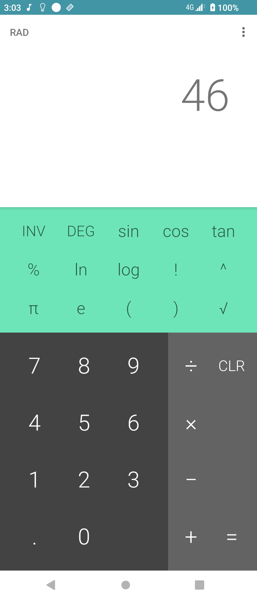
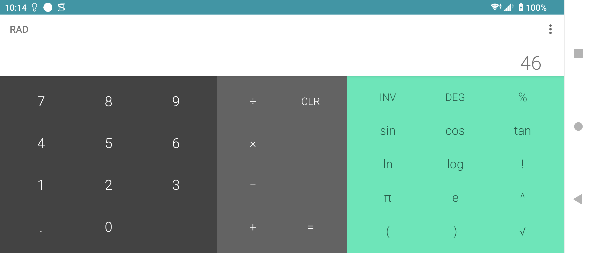
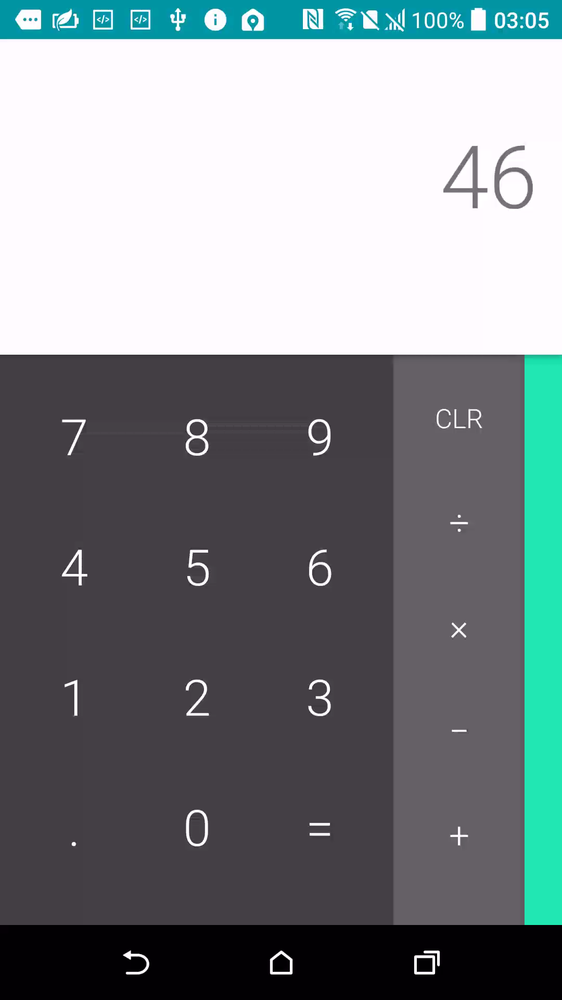
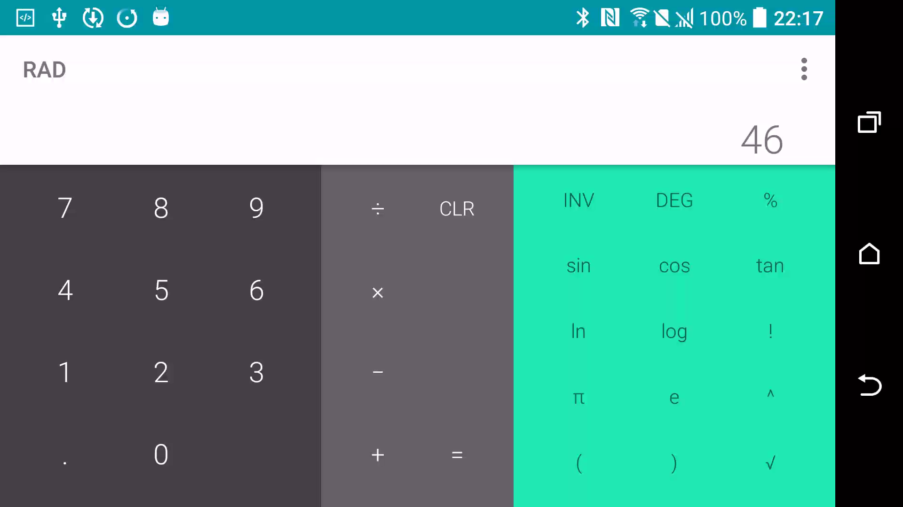

# Sony Calculator 1.0.B.1.0

> 本項研究、版本整理、實機測試、驗收自動化與文件由專案擁有者指導
> OpenAI Codex 完成；Sony 與 HTC 實體手機操作由使用者監督。本項是獨立
> 保存研究，與 Sony、HTC、Google 或 APKMirror 無隸屬、贊助或背書關係。

## Status

最新目錄版本 `1.0.B.1.0` 原封不動在 Sony Android 13 與 HTC Android 6
通過，不需要 Root、Magisk、反編譯修復或重新簽章。Sony 端 33/33 個深度
測試案例通過；兩台裝置的直屏、橫屏與 `12 + 34 = 46` 均正常。

## Identity

| Field | Value |
| --- | --- |
| 840-app catalog index | 518 |
| APKMirror catalog name | Sony Calculator |
| Catalog slug | `sony-calculator` |
| Publication brand | Sony |
| Package | `com.sonymobile.exactcalculator` |
| Final version | `1.0.B.1.0` (`versionCode 2098176`) |
| SDK | minimum API 23; target/compile API 34 |
| Component | Launcher App: `.Calculator` |
| Runtime Root/Magisk | Not required |

這是獨立的 catalog row，不是 catalog 72 `Calculator` 8.0.0，也不是
`Sony Calculator Small App`。

## History

[APKMirror 的 Sony Calculator 目錄](https://www.apkmirror.com/apk/sony-mobile-communications/sony-calculator/)
保存八個版本：`1.0.A.0.4`、`1.0.A.0.5`、`1.0.A.0.10`、
`1.0.B.0.10`、`1.0.B.0.17`、`1.0.B.0.18`、`1.0.B.0.21` 與
`1.0.B.1.0`。本頁只對最後一版及下列實測裝置提出聲明。

## Purpose

Sony Calculator 是可離線使用的基本與科學計算機，包含四則運算、百分比、
小數、括號、次方、平方根、階乘、三角函數、反函數、自然／常用對數、
圓周率、尤拉常數與角度／弧度模式。APK 未要求 Android 權限，也沒有帳號
或雲端服務依賴。

## Version decision

`1.0.B.1.0` 是該目錄八個版本中最新的版本，package、版本碼、SDK、正式
簽章與下載來源皆已核對。它在兩台目標裝置上直接安裝並執行，因此沒有合理
理由回退至 `1.0.B.0.21` 或更早版本。

## Repairs

沒有修復 APK。實測檔保持 Sony 原始位元、package、manifest、資源、程式碼
與正式簽章；沒有重簽、降 SDK、改版面、改權限或加入跨品牌補丁。

### Deliberately unrestored features

沒有未還原功能，也沒有建立系統整合、替代服務或額外 launcher。公開模式
不提供 Sony 原始 APK，並不表示 App 本身需要修改。

## Tested platforms

| Device | OS/API | Root during runtime | Result |
| --- | --- | --- | --- |
| Sony Xperia 1 III XQ-BC72 | Android 13/API 33 | Not required | Main page, 33/33 deep cases, portrait/landscape passed |
| HTC One M8 | Android 6.0.1/API 23 | Non-root device | Install, main page, `12 + 34 = 46`, portrait/landscape passed |

## Screenshots

以下皆為同一個未修改 `1.0.B.1.0` APK 的實機畫面。公開副本已檢查像素、
status bar 與 PNG metadata；畫面沒有帳號、通知文字或裝置識別碼。

| Sony Android 13 portrait | Sony Android 13 landscape |
| --- | --- |
|  |  |

| HTC Android 6 portrait | HTC Android 6 landscape |
| --- | --- |
|  |  |

## Verification

- 10 個數字鍵、小數點、四則運算、等號均逐項通過。
- `sin`、`cos`、`tan`、`ln`、`log`、階乘、次方、平方根、`π`、`e`、
  百分比及括號均得到預期結果。
- 短按刪除、長按清除、角度／弧度切換與反函數切換均通過。
- 除零顯示「除數不得為零」，沒有崩潰；Home/resume 正常。
- Sony 測試 log 沒有本 App 的 fatal exception 或 ANR。
- HTC 橫屏 UI hierarchy 保留 33 個可點控制，畫面與觸控區完整。
- HTC 測試後已卸載，旋轉設定已恢復；Sony 保留原始正式版。

逐項結果見 [deep-control-results.tsv](evidence/records/deep-control-results.tsv)，
摘要見 [technical-test-summary.md](evidence/records/technical-test-summary.md)。

## Known limitations

- 實測只涵蓋上述 Sony 與 HTC，不推論所有 Android/OEM 都相容。
- HTC Android 6 的原生 `screencap` 工具會獨立 segmentation fault；橫屏圖
  因此由系統 `screenrecord` 取幀。這不是 Sony Calculator 的崩潰。
- 公開 repository 不散布 Sony 原始 APK；讀者必須自行合法取得並核對雜湊。

## Artifacts and integrity

| Artifact | SHA-256 / signer |
| --- | --- |
| Sony original APK 1.0.B.1.0 | `abdc035a761a568f2eeff47a7c12fedbd52bb6839f3ecaa23e29492c83233162` |
| Sony certificate | SHA-256 `bc01a8cd9e5d87854f6dc4c84aed49edc34ac196c00b89623cea6ccbbdea627b` |
| Certificate subject | `CN=Sony_Ericsson_E_Application_Signing_Live_864f, O=Sony Ericsson Mobile Communications AB, C=SE` |
| APK signatures | v1, v2 and v3 verified |

## Installation and rollback

先確認合法取得的檔案雜湊與上表一致，再以一般 ADB 安裝：

```bash
shasum -a 256 Sony-Calculator-1.0.B.1.0.apk
adb install Sony-Calculator-1.0.B.1.0.apk
```

啟動與回溯：

```bash
adb shell am start -n com.sonymobile.exactcalculator/.Calculator
adb uninstall com.sonymobile.exactcalculator
```

若裝置已有同 package 不同簽章版本，安裝前應先備份並核對，不要直接覆蓋。

## Distribution and legal notice

發佈模式為 `evidence_only`。Repository 僅包含本專案撰寫的文件、測試台帳與
經隱私驗收的實機證據，不包含 Sony APK、反編譯程式碼、圖示或其他 OEM
binary。MIT License 只涵蓋本專案有權授權的內容；Sony 程式、名稱、商標、
圖示與其他資產仍屬原權利人。

## Research and authorship

- 專案方向、實機操作監督與發布決策：專案擁有者。
- 版本整理、測試自動化、證據驗收與文件：OpenAI Codex，依擁有者指示完成。
- Sony Calculator 原始程式與 Sony 發佈資產：原權利人。
- 版本來源：[APKMirror Sony Calculator releases](https://www.apkmirror.com/apk/sony-mobile-communications/sony-calculator/)。
