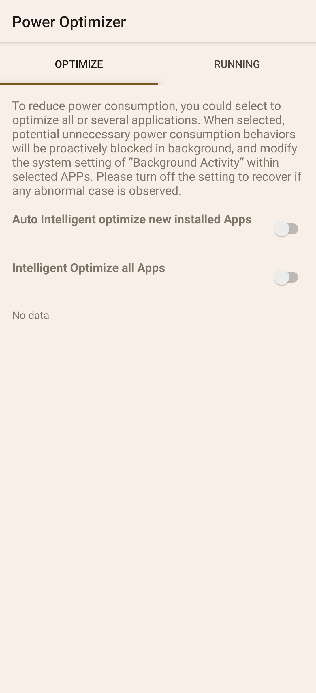

# Sony Power Optimizer 13.0.A.1.6 保存研究

> 本項版本研究、APK 分析、實機驗證、隱私驗收與文件由專案擁有者指導，
> OpenAI Codex 完成。這是獨立保存研究，與 Sony、HTC 或 APKMirror 無隸屬、
> 贊助或背書關係。

## 狀態

未修改的 Sony `13.0.A.1.6` 原始 APK 可在 Xperia 1 III Android 13 普通安裝，
並進入真正的 `OPTIMIZE`／`RUNNING` 主介面。兩個全域最佳化開關最後均保持
關閉；單一 Weather 程序的選取、清理、重新啟動及取消流程已通過。

HTC One M8 Android 6.0.1 可安裝同一 APK，但缺少 Sony
`com.sonymobile.cta` PowerOptimizerService，啟動後返回桌面。因此本項結果為
`accepted_sony_only`，不宣稱跨品牌可用。

## 身分

| 欄位 | 結果 |
|---|---|
| 全域目錄索引 | `556` |
| Package | `com.sonymobile.smartoptimizer` |
| 最終版本 | `13.0.A.1.6` (`versionCode 13000106`) |
| SDK／Variant | Android 6.0+、target API 33、noarch、nodpi |
| Sony 測試平台 | Xperia 1 III `XQ-BC72`，Android 13 |
| HTC 測試平台 | One M8，Android 6.0.1 |
| Root／Magisk／重新開機 | App 日常執行不需要 |

## 歷史

Power Optimizer 是後期 Xperia 的背景程序與耗電管理前端。它透過 Sony CTA
服務與 PO Provider 列出可最佳化或正在執行的 App，並可調整背景限制或終止
所選程序。這不是獨立於韌體的通用 Android 清理器。

## 用途

本研究保存它在相容 Xperia 韌體上的原始管理介面與安全操作方式，並如實記錄
新版服務契約失敗、個別 App 清單無資料及跨品牌依賴限制。

## 版本選擇

[APKMirror 的完整版本頁](https://www.apkmirror.com/apk/sony-mobile-communications/power-optimizer/)
目前列出的最新版本是 `15.0.A.0.5`。本研究先測最新版，再依實機相容性回退：

- `15.0.A.0.5` 可安裝，但與 Xperia 1 III 現有 CTA binder 介面不相容，
  `SmartOptCenter.isAutoStartSupported()` 收到服務端 `NullPointerException`。
- `14.0.A.0.8` 是中間世代，未在已確認的新版服務契約失敗後取代較匹配的
  Android 13 分支。
- `13.0.A.1.6` 是本機完整測試後可穩定進入主頁的最新相容版本。

## 修復內容

沒有修改 APK、Manifest、資源、程式碼、權限、端點或簽章；最終檔是 Sony
原始簽章 APK。研究中只將意外漂移為開啟的兩個全域最佳化開關恢復到安全的
關閉狀態，沒有把這項裝置設定包進 APK。

## 驗證結果

- 冷啟動可進入真正主頁，啟動時間約 `192–253 ms`。
- `OPTIMIZE`、`RUNNING`、單點提示、長按選取、返回取消與清理警告取消均通過。
- 以 Weather 作為唯一代表項目執行清理：原 PID 結束後可正常重新啟動。
- 全域清理與預設輸入法終止屬高影響動作，依安全規則只驗證入口、警告與取消，
  未真正清除全部 App。
- App 固定直向；提出橫屏要求時仍維持完整固定直向介面，沒有黑屏或拉伸。
- Home／恢復、冷啟動、熄屏／喚醒均通過，沒有可歸責 fatal 或 ANR。
- 深度測試閉合 `17` 個控制：`12` 通過、`2` 外部依賴受阻、`3` 安全略過。

## 已知限制

- `OPTIMIZE` 的個別 App 清單在本韌體顯示 `No data`；因此個別最佳化層級與
  `ResourceActivity` 無法由真實列項進入。
- 需要 Sony CTA 與 PO Provider；HTC 雖可安裝，但無法正常進入主頁。
- 未執行「同意最佳化所有 App」與「清除所有執行中 App」，避免改變其他 App
  的通知、背景工作與登入狀態。
- 只驗證上述 Sony 與 HTC，不推論其他 Xperia、Android 或 OEM。

## 測試平台

| 裝置 | 系統 | 結果 |
|---|---|---|
| Sony Xperia 1 III `XQ-BC72` | Android 13 / API 33 | `accepted_sony_only`；主頁與安全控制通過 |
| HTC One M8 | Android 6.0.1 / API 23 | 安裝通過；缺少 Sony CTA 服務而無法進入主頁 |

## 截圖

公開圖已裁除狀態列與導覽列，並檢查像素、OCR、metadata 與尾端資料；畫面只含
App 的一般主頁與關閉狀態，不含真實 App 清單或私人資訊。



## 檔案與完整性

| 項目 | SHA-256 |
|---|---|
| 最終 Sony 原始 APK | `9f6a041d4b8e57b82a31a77e828431216ca0d6f8d833d500080732b8e329d02c` |
| Sony 簽署憑證 | `bc01a8cd9e5d87854f6dc4c84aed49edc34ac196c00b89623cea6ccbbdea627b` |
| 公開主頁截圖 | `d93e657804ae1341eb5a718df5e7914ac1df3f2cb9ed0acddf8bed48df37dbb7` |

公開 repository 採 `evidence_only`，不提供 Sony 原始或重簽 APK。精確原版只
保存於專案擁有者的私人 App Store 與 NAS。

## 安裝與回溯

私人原版可透過一般 Package Manager 安裝：

```bash
adb install Sony-Power-Optimizer-13.0.A.1.6-original.apk
adb shell am start -n com.sonymobile.smartoptimizer/.MainActivity
```

回溯時先保存必要設定，再解除安裝 `com.sonymobile.smartoptimizer`。若手機原先
內建同 package 版本，應改用其原廠系統還原方式，不應直接以本檔覆蓋後推定可
無損降級。

## 發布與法律聲明

公開 repository 只發布本專案撰寫的文件、雜湊、測試結論與去識別化截圖。
Sony、Xperia、App 名稱、程式、介面、圖示、商標及其他資產仍屬原權利人；
MIT License 不涵蓋 OEM APK 或資產。

## 研究與作者分工

- 方向、實機操作監督與發布決策：專案擁有者。
- 版本研究、測試自動化、證據整理、隱私驗收與文件：OpenAI Codex。
- App 原始程式、介面與 Sony 發布資產：原權利人。
