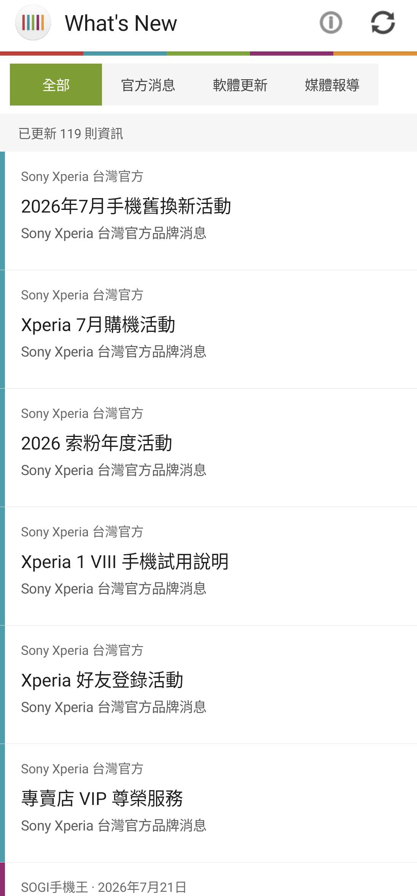
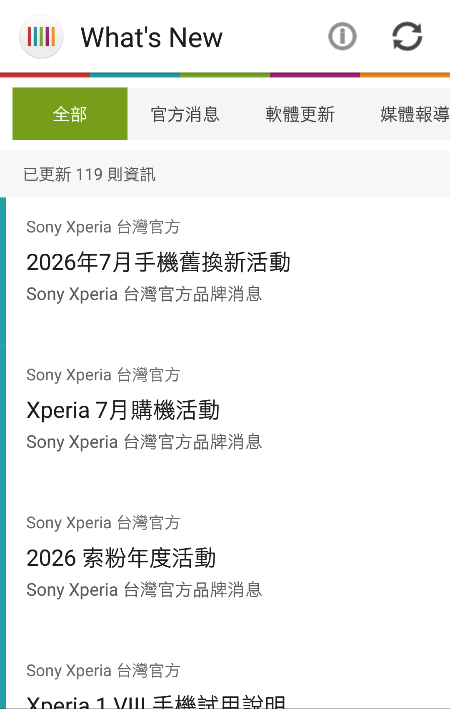
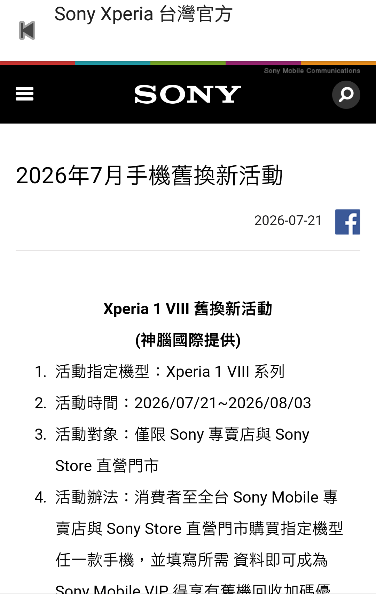

# What's New 5.0.A.0.0 保存研究

> 本項保存研究、版本整理、社群重建、實機測試與文件由專案擁有者指導
> OpenAI Codex 完成。這是獨立研究，與 Sony、HTC、Google、APKMirror
> 或資訊來源網站無隸屬、贊助或背書關係。

## 狀態

Sony 已於 2019 年 9 月 30 日終止 What's New。原版 `5.0.A.0.0` 現在只能
顯示服務終止頁，因此本項沒有假裝恢復 Sony 後端，而是以乾淨原始碼重建
一個保留 What's New 視覺語言的 Sony 資訊閱讀器。

社群重建版可取得最近一年 Sony Xperia 台灣官方消息與軟體更新，並彙整
最近兩年的 Sony Xperia 新聞 RSS；目前實測取得 119 則資訊。文章留在
App 內閱讀，最近一次成功內容可離線使用。

## 身分

| 欄位 | 結果 |
|---|---|
| Z3 目錄索引 | `Z3M-A286` |
| Package | `com.sonymobile.entrance` |
| 顯示版本 | `5.0.A.0.0` |
| Version code | `10485760` |
| SDK | minimum API 21；target API 34 |
| ABI／density | noarch；單一 APK |
| Launcher | `com.sonymobile.entrance.EntranceActivity` |
| Runtime Root／Magisk | 不需要 |

## 歷史

What's New 曾是 Xperia 內建的內容發現與更新入口，讓使用者尋找新 App、
遊戲、媒體內容與應用程式更新。Sony 官方說明確認服務於 2019 年 9 月
30 日終止，之後應用程式更新改由 Google Play 提供。

歷史資料：

- [Sony：What's New 終止服務說明](https://www.sony.com/electronics/support/mobile-phones-tablets-mobile-phones/xperia-xz1-compact/articles/SX916001)
- [APKMirror：What's New 完整版本紀錄](https://www.apkmirror.com/apk/sony-mobile-communications/whats-new/)

## 用途

原版 App 用來發現 Xperia 的新 App、遊戲、媒體內容與應用程式更新。
社群重建版把這個「Sony 資訊入口」定位保留下來，但資料改為公開消息與
RSS，不提供原版商店、帳號或購買功能。

## 版本選擇

APKMirror 的 noarch／Android 5.0+ 分支以 `5.0.A.0.0` 為最後版本，日期為
2019 年 10 月 9 日。它也是本研究採用的版本身分；較舊的 arm-v7a 分支
`4.2.A.0.14` 不比它新。

## 修復內容

- 使用乾淨原始碼建立現代、無外部依賴的 Android App。
- 保留 `com.sonymobile.entrance`、版本名稱與經典五色視覺識別。
- 以公開網頁與 RSS 組成「全部／官方消息／軟體更新／媒體報導」四類。
- 提供手動更新、來源說明、App 內 WebView 閱讀及最近成功內容快取。
- 網路來源個別失效時不拖垮整個 App。
- Android 7 以上與 Android 5／6 使用各自相容的 HTML 解析介面。
- 版面自動適應直向與橫向，不製造舊式黑邊。

完整界線見 [PATCH_NOTES.md](PATCH_NOTES.md)。

## 測試平台

| 裝置 | 系統 | 結果 |
|---|---|---|
| Sony Xperia 1 III `XQ-BC72` | Android 13 / API 33 | 安裝、119 則主頁、分類、更新、文章、直橫屏、離線快取通過 |
| HTC One M8 | Android 6.0.1 / API 23 | 同一 v2 APK 普通安裝、主頁、文章與直橫屏通過 |

兩台手機執行都不需要 Root、Magisk 或重新開機。HTC 測試後已將原有
What's New `3.6.A.0.6` APK 與 App 資料完整還原。

## 驗證結果

- 冷啟動可到達真正且可操作的資訊主頁。
- 四個分類、資訊來源、重新整理、代表文章與返回共 9 個控制全數通過。
- 文章在 App 內開啟，不交給其他瀏覽器。
- Sony 與 HTC 的直向、橫向列表及文章頁均無 App 自身黑邊、裁切或重疊。
- 完全關閉 Wi-Fi 與行動數據後，仍可冷啟動並顯示快取的 119 則資訊。
- 測試期間沒有可歸因的 fatal、ANR、security 或 linkage 錯誤。

## 已知限制

- 這不是 Sony 官方服務復活，也沒有 Sony 帳號、商店或舊版付費內容。
- 資訊來源與文章頁可能日後改版或停止；App 會保留最近一次成功內容。
- Google News RSS 是第三方彙整結果，不代表 Sony 官方認可。
- 實測只涵蓋上述 Sony 與 HTC，不推論所有 Android 版本與品牌。

## 截圖

公開副本已裁除狀態列與導覽列，移除 PNG metadata，並完成 OCR、原始像素
與尾端資料檢查。畫面只包含公開的 Sony 相關資訊，沒有帳號、通知、聯絡人、
位置、裝置識別碼或私人資料。

| Sony Android 13 主頁 | HTC Android 6 主頁 |
|---|---|
|  |  |

### HTC Android 6 App 內文章閱讀

## 檔案與完整性

| 項目 | SHA-256 |
|---|---|
| Sony 原版 APK `5.0.A.0.0` | `8186a7ce4d88d25c7ee3a83da152c4c06a062f95bba86bdf0d40eb7c43dd8fbf` |
| 私人社群重建 APK v2 | `834825a82fbdcf0f73d2a75136c233d84cd45799811eff38f688d06a30c243d3` |
| 本地測試簽章憑證 | `b5e26a13f091dd593e8f8024e7de21cc0426d0d383feae3300035b84def9d618` |
| Sony 主頁截圖 | `2fff356334e298eeab85914430d81cdf594c479e50e2d0d0ddf2920ffdbd5dd2` |
| HTC 主頁截圖 | `2e29f8d1b8b19a76008c3f50b17eebb5f62fdbb2f629d2c95e3e88ecbaeb2c14` |
| HTC 文章截圖 | `55973c3dd3d972e4dec33e80f80a095a847300d3ce23a9ac94a40611b48e4447` |

公開 repository 不包含 Sony 原始 APK、重簽 APK、社群重建 APK 或反編譯
Sony 程式碼。雜湊只用來辨認專案擁有者私人 App Store 與 NAS 中的精確
測試成品。

## 安裝與回溯

私人社群重建 APK 可用一般 Android Package Manager 安裝。因簽章與 Sony
原版不同，若裝置已有相同 package，必須先備份 App 資料並解除安裝原版。
回溯時解除安裝重建版，再安裝合法保存且雜湊相符的 Sony 原版；解除安裝會
移除 App 本機資料。

## 發布與法律聲明

公開模式為 `evidence_only`：只發布本專案撰寫的文件、測試結果、雜湊與
去識別化截圖。Sony、Xperia、What's New 名稱、原始程式、介面、圖示、
商標與其他資產仍屬其各自權利人。

## 研究與作者分工

- 方向、實機操作監督、隱私與發布決策：專案擁有者。
- 版本研究、重建、驗收自動化、證據整理與文件：OpenAI Codex。
- What's New 原始程式與 Sony 發布資產：原權利人。
