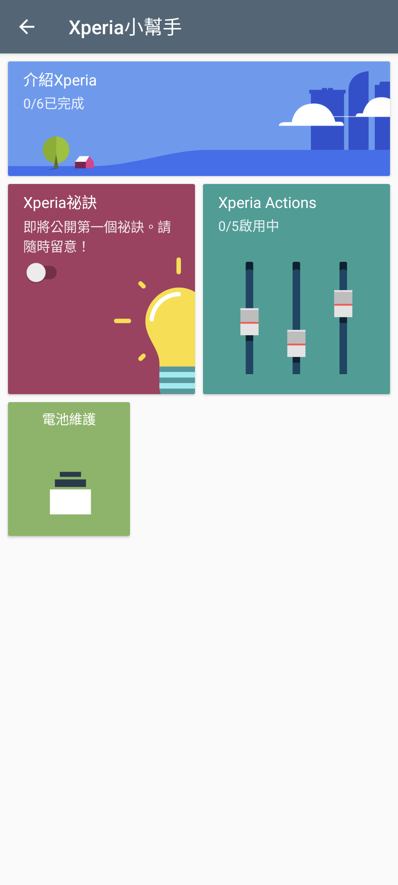

# Xperia Assist 2.3.A.0.13 保存研究

> 本項版本研究、APK 分析、最小修復、實機驗證、隱私驗收與文件由專案擁有者
> 指導，OpenAI Codex 完成。這是獨立保存研究，與 Sony、HTC 或 APKMirror
> 無隸屬、贊助或背書關係。

## 狀態

最新版 `2.3.A.0.13` 經最小共存修復後，可在 Xperia 1 III Android 13 進入
真正的繁體中文主頁。介紹 Xperia、Xperia 祕訣、Xperia Actions 與電池維護
入口皆已實測；35 個可發現控制均有結論。

HTC One M8 Android 6.0.1 在安裝階段被 `INSTALL_FAILED_OLDER_SDK` 拒絕，
因為本版最低需求為 API 28。因此結論是 `accepted_sony_only`，不宣稱跨品牌
或舊 Android 可用。

## 身分

| 欄位 | 結果 |
|---|---|
| 全域目錄索引 | `708` |
| Package | `com.sonymobile.assist` |
| 最終版本 | `2.3.A.0.13` (`versionCode 4587533`) |
| SDK／Variant | Android 9+、min/target API 28、noarch、nodpi |
| Sony 測試平台 | Xperia 1 III `XQ-BC72`，Android 13 |
| HTC 測試平台 | One M8，Android 6.0.1 / API 23 |
| 日常執行 | Xperia 測試機上不需 Root；測試資料備份使用 Root |

## 歷史

Xperia Assist 是 Sony 後期 Xperia 的情境式說明與設定入口，整合新機介紹、
Xperia 祕訣、Xperia Actions、電池維護、工作帳號與企業設定教學。這個完整
版本與後來的 `com.sonymobile.assist_light` 是不同世代、不同 package 的 App。

## 用途

本研究保存 Xperia Assist 的繁體中文主頁、離線教學卡片與相容 Sony 元件的
跳轉行為，並區分仍可使用的本機功能與已退役的 Sony 帳號服務。

## 版本選擇

[APKMirror 精確版本頁](https://www.apkmirror.com/apk/sony-mobile-communications/xperia-assist/xperia-assist-2-3-a-0-13-release/xperia-assist-2-3-a-0-13-android-apk-download/)
列出的 `2.3.A.0.13` 是完整 Xperia Assist 的最新版本。本研究沒有回退版本：
原檔大小與 APKMirror 公布值一致，但下載檔的 JAR metadata 宣稱存在 APK
Signature Scheme v2 區塊，實際檔案缺少該區塊，Android 13 因此以
`INSTALL_PARSE_FAILED_NO_CERTIFICATES` 拒絕原檔。

## 修復內容

修復保留 package、版本、Launcher、繁體中文資源與主要程式邏輯，只處理兩項：

1. 重新建立可由 Android 13 驗證的簽章。
2. 將歷史 ContributionProvider authority 從 `com.sonymobile.getmore` 改為
   `com.sonymobile.assist.legacy.getmore`，並同步修改該 Provider 在兩個類別
   中的自我 URI 參照。

原因是手機已安裝的 Xperia 祕訣 `com.sonymobile.getmore` 正在使用原 authority；
若不改名，Package Manager 會拒絕兩個 App 共存。沒有改動伺服器端點、教學
文字、Xperia Actions、電池維護或權限流程。

精確修復位置與重建步驟記錄在 [PATCH_NOTES.md](PATCH_NOTES.md)。

## 驗證結果

- 真正 Launcher `.AssistMainActivity` 正確導向
  `com.sonymobile.gettoknowit.main.MainActivity`。
- 主頁沒有 App 造成的黑邊、裁切、重疊、黑屏或觸控錯位。
- 四種上一支手機來源、六個介紹區段及全部有限頁面均已實測。
- Wi-Fi、Email、VPN、Sony SSO、Album、Sony Browser、Xperia Actions 與
  Battery Care 都能開啟真正宿主並安全返回。
- Xperia 祕訣開關的拒絕、同意、啟用與恢復關閉均通過。
- 130% 字體仍可閱讀；App 固定直向，橫屏要求會維持完整直向畫面。
- 熄屏／喚醒與 10 次冷啟動通過，沒有可歸責 fatal、ANR、linkage 或
  SecurityException。
- 深度控制閉合 `35` 項：`33` 通過、`1` 外部依賴受阻、`1` 外部傳送略過。

## 已知限制

- Xperia Services 建立帳號流程顯示「此裝置對於建立 Xperia 帳號無效」；這是
  已退役或不接受此裝置的 Sony 服務依賴，App 會以可讀訊息處理，不會崩潰。
- 「提交介紹評分」會向外部服務傳送資料；研究只驗證選分後按鈕正確啟用，
  沒有送出虛構評分。
- Xperia 祕訣卡片目前顯示尚未公開第一個祕訣，點卡片不會進入內容頁。
- HTC API 23 無法安裝；未降低 minSdk 或加入舊系統專用分支來假裝跨品牌通過。
- 只驗證上述 Sony 與 HTC，不推論其他 Xperia、Android 或 OEM。

## 測試平台

| 裝置 | 系統 | 結果 |
|---|---|---|
| Sony Xperia 1 III `XQ-BC72` | Android 13 / API 33 | `accepted_sony_only`；主頁與 35 控制閉合 |
| HTC One M8 | Android 6.0.1 / API 23 | 失敗：`INSTALL_FAILED_OLDER_SDK` |

## 截圖

公開圖只保留 App 一般主頁，已裁除狀態列與導覽列，並檢查像素、文字、metadata
與尾端資料。畫面沒有帳號、通知、聯絡人、位置、裝置識別碼或私人內容。



## 檔案與完整性

| 項目 | SHA-256 |
|---|---|
| APKMirror 原始 APK | `89d8f59efd1f3410c8210b9a19ce6f1b1a25e3b176f597b91424792274af88f0` |
| 原始 Sony 憑證 | `6339375ac295cb0cd22811b97accd40104bd4a0185d4dd2289b81860c15d623c` |
| 最終共存修復 APK | `6ec6e0a347cf5f731d92f085c6bf469a7a6ccfa03b3de3c082744b1b6e8d3b6e` |
| 最終本地研究憑證 | `86057e2e6e7fe3c8389f6d2c48c8aab543e78313b61d0482a7278ca4f25d5129` |
| 公開主頁截圖 | `f27d7432932787e2893f9c8429af3426b97084a394561bb47b9aea26b3b95b76` |

公開 repository 採 `evidence_only`，不提供 Sony 原始或重簽 APK。精確修復版只
保存於專案擁有者的私人 App Store 與 NAS。

## 安裝與回溯

從私人保存位置取得並核對上方雜湊後，可在相容 Xperia 上使用 Package Manager：

```bash
adb install -r Xperia-Assist-2.3.A.0.13-coexist-v2.apk
adb shell am start -n com.sonymobile.assist/.AssistMainActivity
```

回溯前應先保存 Xperia Actions 與 Assist 資料。若裝置原本內建同 package，應
使用原廠韌體或已保存的原版還原；不能直接假定解除安裝資料版就能恢復系統版
與原資料。Xperia 祕訣 package 不需移除。

## 發布與法律聲明

公開 repository 只發布本專案撰寫的文件、雜湊、測試結論、修復說明與
去識別化截圖。Sony、Xperia、App 名稱、程式、介面、圖示、商標與其他資產仍
屬原權利人；MIT License 不涵蓋 OEM APK 或資產。

## 研究與作者分工

- 方向、實機操作監督與發布決策：專案擁有者。
- 版本研究、最小修復、測試、隱私驗收與文件：OpenAI Codex。
- App 原始程式、介面與 Sony 發布資產：原權利人。
