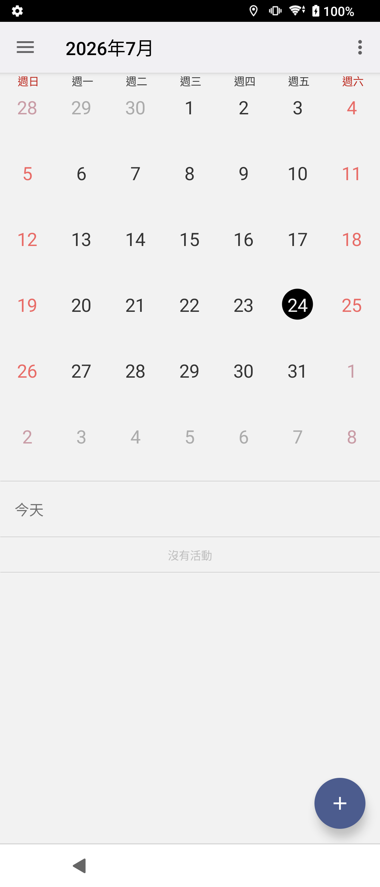
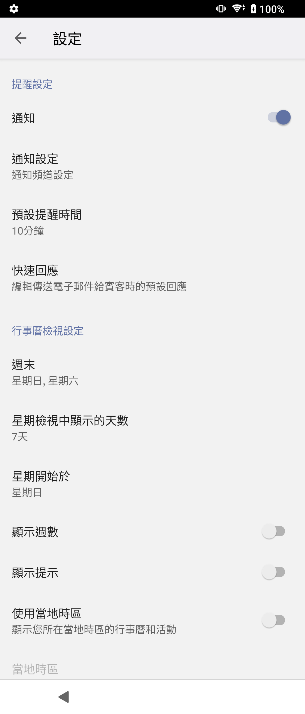

# Xperia Calendar 20.4.C.3.10

> 本項研究、實機測試、驗收自動化與文件由專案擁有者指導 OpenAI Codex
> 完成；實體手機操作由使用者監督。這是獨立保存研究，未受 Sony、HTC、
> Google 或 APKMirror 贊助、認可或背書。

## 狀態

未修改的 Sony 正式簽章 APK 已在 Sony Xperia 1 III Android 13 通過主頁、
版面、事件流程、離線、生命週期及深度控制驗收。HTC Android 6.0.1 的
API 23 低於本版 minimum API 26，因此原版無法安裝。

## 身分

| 欄位 | 值 |
| --- | --- |
| 目錄索引 | `Z3M-A224` |
| Package | `com.sonymobile.calendar` |
| 最終版本 | `20.4.C.3.10` (`versionCode 42470410`) |
| SDK | minimum API 26; target API 34 |
| Launcher | `.LaunchActivity` |
| 執行時 Root/Magisk | 不需要 |
| 公開模式 | `evidence_only` |

## 歷史

Xperia Z3 韌體基準是 `20.1.B.0.8`。Sony Mobile 延續同一 package 發展至
20.4 分支；本研究依完整版本矩陣選出 `20.4.C.3.10`。

## 用途

Xperia Calendar 提供月、週、日、年檢視，搜尋、事件建立與編輯、提醒、
重複規則、參與者、可用性、隱私、時區、顏色及通知設定。

## 版本選擇

`20.4.C.3.10` 是盤點中最新且符合 Xperia 1 III 的候選。精確原版為 nodpi、
無 native ABI payload 的單一 APK，manifest 與正式簽章均已核對。

## 修復內容

沒有修改 APK，也沒有建立本地 calendar provider 或替代雲端服務。

## 測試平台

| 裝置 | 系統 | 結果 |
| --- | --- | --- |
| Sony Xperia 1 III XQ-BC72 | Android 13 / API 33 | 通過 |
| HTC One M8 | Android 6.0.1 / API 23 | 安裝失敗：低於 minimum API 26 |

## 截圖

公開圖使用空白月曆與一般設定頁，沒有真實帳號或事件。

| 空白月份 | 設定 |
| --- | --- |
|  |  |

## 驗證結果

- 14 個畫面、72 個控制：71 通過、0 失敗、1 個外部內容依賴受阻。
- 事件建立、編輯、刪除、搜尋、檢視切換及設定保存與復原均通過。
- 直屏、橫屏、邊緣觸控、冷啟動與離線啟動通過。
- 沒有歸因於 Calendar 的 fatal exception、ANR、security 或 linkage 錯誤。

## 已知限制

- App 內天氣內容需要外部 Sony 天氣環境，隔離測試中未能取得內容。
- HTC Android 6 無法安裝這個 API 26 版本，因此不宣稱跨品牌可用。
- 未執行完整 TalkBack 手勢稽核。

## 檔案與完整性

| 項目 | SHA-256 |
| --- | --- |
| Sony original APK | `195d958f8777b32ba05cb3d226faf2a7953198b8b4beab1d4b806096e0719006` |
| Sony certificate | `bc01a8cd9e5d87854f6dc4c84aed49edc34ac196c00b89623cea6ccbbdea627b` |

## 安裝與回溯

```bash
shasum -a 256 Sony-Calendar-20.4.C.3.10-original.apk
adb install Sony-Calendar-20.4.C.3.10-original.apk
adb shell am start -n com.sonymobile.calendar/.LaunchActivity
adb uninstall com.sonymobile.calendar
```

卸載或清除資料前應確認事件所屬帳戶與同步狀態，避免遺失尚未同步的資料。

## 發布與法律聲明

公開 repository 只包含本專案撰寫的文件、測試摘要與經隱私驗收的截圖，
不包含 Sony APK、反編譯程式碼、圖示或其他 OEM binary。MIT License
不涵蓋 Sony 程式、名稱、商標與資產。

## 研究與作者分工

- 專案方向、實機操作監督與發布決策：專案擁有者。
- 測試自動化、證據驗收與文件：OpenAI Codex，依擁有者指示完成。
- Xperia Calendar 原始程式與 Sony 發布資產：原權利人。
- 版本來源：[APKMirror Xperia Calendar](https://www.apkmirror.com/apk/sony-corporation/xperia-calendar/)。
