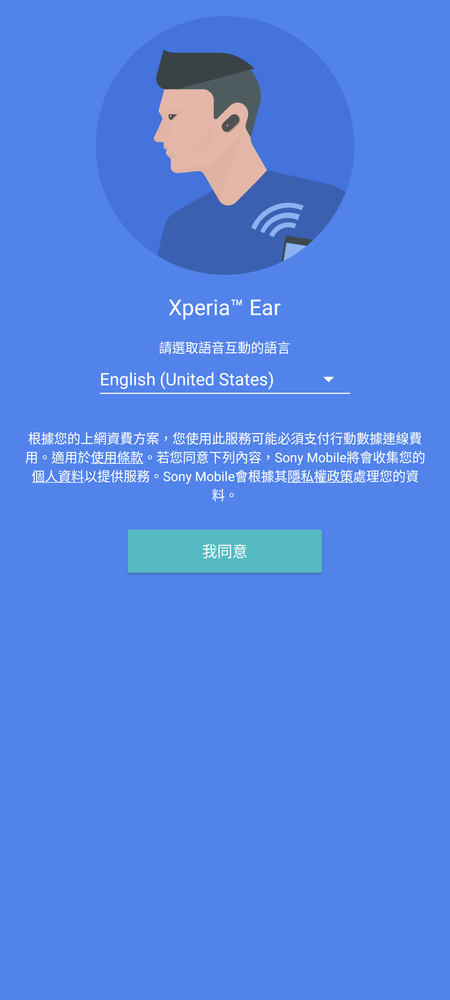
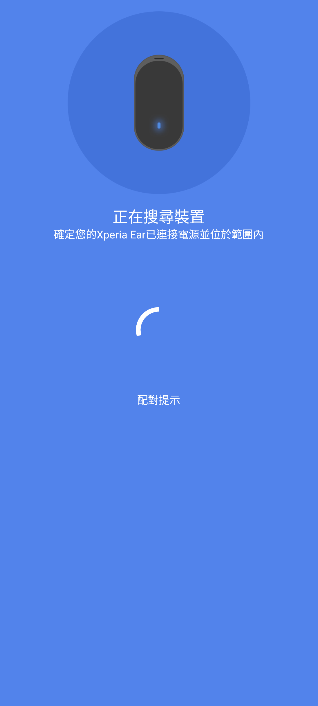
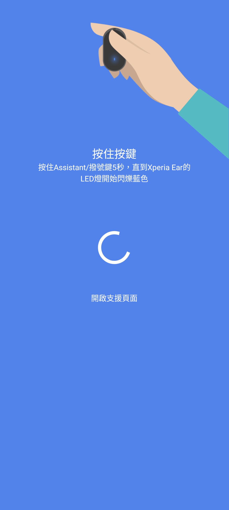

# Sony Xperia Ear 1.3.3.A.2.0 保存與相容性紀錄

> 本研究的版本盤點、實機驗證、相容性分析、隱私驗收與文件整理，由專案
> 擁有者指導 OpenAI Codex 完成。這是獨立保存研究，與 Sony、HTC 或
> APKMirror 無隸屬、贊助或背書關係。

## 狀態

`1.3.3.A.2.0` 是 APKMirror 目前列出的最新 Xperia Ear 版本。未修改、未重簽
的 Sony 原始 APK 可在 Xperia 1 III Android 13 顯示完整歡迎頁，並在允許
Android 12 以後的「附近裝置」權限後進入搜尋與配對教學。

本頁標示為 **PARTIAL / hardware-and-service-limited**。測試期間沒有實體
XEA10，Sony 亦已終止部分連線服務；因此不宣稱實際耳機配對、配對後設定、
語音助理、頭部手勢或 Anytime Talk 已通過。HTC One M8 的跨品牌流程在同意
後穩定重現 Sony Agent 服務 ANR，明確標記為不相容。

公開 repository 僅提供研究紀錄與去識別化截圖，不提供 Sony 原始 APK。

## 身分

| 欄位 | 內容 |
| --- | --- |
| 840 筆總目錄索引 | 771 |
| App | Sony Xperia Ear（XEA10 Host Application） |
| Package | `com.sonymobile.hostapp.xea10` |
| 版本 | `1.3.3.A.2.0`（`versionCode 2516992`） |
| SDK／ABI | minimum API 19、target API 29、`arm64-v8a`／`armeabi`、nodpi |
| 最終 APK SHA-256 | `4252f99148f844f228ea158ca254f8eb5c608a45da1c089b1436a2082dbb3f5d` |
| Sony 憑證 SHA-256 | `bc01a8cd9e5d87854f6dc4c84aed49edc34ac196c00b89623cea6ccbbdea627b` |
| Launcher | `com.sonymobile.hostapp.xer10.activities.WelcomeActivity` |
| 公開模式 | `evidence_only` |

## 用途

這個 Host App 是第一代 Xperia Ear XEA10 的手機端配套程式，用來進行耳機
配對、設定按鍵操作、通知、語音互動、頭部手勢與 Battery Care 等功能。
沒有 XEA10 時，App 仍能呈現原廠歡迎、語言選擇與配對教學流程。

## 歷史

Xperia Ear 是 Sony 的單耳智慧藍牙裝置。Sony 後續公告 App 下載於 2022 年
11 月後結束，Anytime Talk 於 2022 年 12 月 20 日停止，語音助理及頭部手勢
相關服務於 2023 年 3 月 31 日停止。耳機本身仍可作為一般藍牙裝置使用，但
本研究沒有把已退役的 Sony 雲端服務改接到其他後端。

## 版本選擇

本研究以 APKMirror Xperia Ear 發布序列中最新的 `1.3.3.A.2.0` 為最終候選，
頁面記錄於 2021 年 3 月上傳。沒有比它更新而被回退的候選，也沒有用較舊版
取代。驗證檔保留 Sony 原始簽章，雜湊與安裝後拉回的 APK 一致。

來源：

- [APKMirror Xperia Ear 1.3.3.A.2.0](https://www.apkmirror.com/apk/sony-mobile-communications/xperia-ear/xperia-ear-1-3-0-a-2-0-release/)
- [Sony Xperia Ear 支援頁](https://www.sony.com/electronics/support/other-products-xperia-smart-devices/xperia-ear)

## 修復內容

本研究沒有修改 APK、程式碼、資源、簽章或網路端點。Xperia 1 III 上唯一的
相容前置條件，是在首次使用前允許 Android 12 以後的「附近裝置」藍牙權限；
否則舊 App 會因 `BLUETOOTH_CONNECT` 權限檢查而停止。

研究期間 Root／ADB 僅用於可回復的 App 資料備份、權限狀態控制與觀察。原始
App 安裝後的日常執行不需要持續 Root，但 Android 13 裝置必須完成上述權限
設定。

## 刻意未復原的功能

- 沒有模擬 XEA10、偽造藍牙配對或宣稱硬體功能通過。
- 沒有繞過 Sony 已終止的 Anytime Talk、語音助理及頭部手勢服務。
- 沒有略過失效舊支援網址的 TLS 安全警告。
- 沒有針對 HTC 的 Sony Agent 服務 ANR 建立裝置專用繞過。

## 測試平台

| 裝置 | 結果 |
| --- | --- |
| Sony Xperia 1 III `XQ-BC72`／Android 13／`61.2.A.0.472A` | 歡迎頁、8 種語言、搜尋、NFC／按鍵配對、支援入口、返回與生命週期在硬體前置範圍內通過 |
| HTC One M8／Android 6.0.1 | 原始 APK 可安裝並顯示完整歡迎頁；同意後 `jp.co.sony.agent.service.SAgentExternalService` 重複 ANR，因此不通過 |

## 驗證結果

Sony 端測試了 13 個目前可達控制合約：語言選單、8 種語言、同意、配對提示、
NFC 轉手動配對及支援頁。另完成三次冷啟動、Home／返回、熄屏恢復、App UID
離線、返回堆疊與強制橫向。原廠 Activity 固定直向，因此橫向裝置狀態下仍
維持完整直向介面，沒有裁切、重疊、Fatal 或 ANR。

支援按鈕會正確交給瀏覽器開啟 `support.sonymobile.com`，但該舊站憑證已
失效；這代表控制契約仍工作，不代表遠端頁面可安全使用。

HTC 端未修改的同一 APK 與原始檔雜湊一致，歡迎頁兩次穩定畫面雜湊相同。
同意後即使預先授予標準危險權限，仍因 Sony Agent 服務逾時重現 ANR；測試後
已卸載，沒有把失敗結果包裝成跨品牌通過。

## 截圖



*Sony Xperia 1 III／Android 13／直向：歡迎頁與原廠語言選擇。*



*Sony Xperia 1 III／Android 13／直向：等待搜尋 XEA10 的畫面。*



*Sony Xperia 1 III／Android 13／直向：原廠按鍵配對教學。*

三張公開截圖均裁除狀態列與導覽列、移除非必要 metadata，並檢查沒有帳號、
通知、位置、聯絡人、裝置識別碼或其他私人資訊。

## 已知限制

- 沒有實體 XEA10，無法驗證真實藍牙配對與配對後設定。
- Sony 已終止部分服務，原始 App 的線上功能不可能完整重現當年狀態。
- 舊支援網址的 TLS 憑證失效，不應繞過瀏覽器警告。
- HTC One M8 在 Sony Agent 服務階段 ANR，跨品牌結果為失敗。
- TalkBack 語意焦點沒有形成完整有效證據。
- 測試只涵蓋上述兩台裝置，不推論其他 Android 裝置必然相容。

## 檔案與完整性

私人自用檔案為未修改的 Sony 原始 APK：

| 項目 | SHA-256 |
| --- | --- |
| Sony 原始／最終 APK | `4252f99148f844f228ea158ca254f8eb5c608a45da1c089b1436a2082dbb3f5d` |
| Sony 簽章憑證 | `bc01a8cd9e5d87854f6dc4c84aed49edc34ac196c00b89623cea6ccbbdea627b` |
| 歡迎頁截圖 | `af9e9ac5a11a43fa4062fdbe35af5a8a5470cfd9808fa1c2a52f63ac560c95ca` |
| 搜尋頁截圖 | `f68cfb6974d0ccc8bb4f5742d004d9de373321c0f5f4c9e190f9da798b675b99` |
| 按鍵配對截圖 | `23b70c4f15cce01c5a72755e34c9229a595bd16d98844084c3ef4a17626300ee` |

沒有補丁或重建步驟；可重現性檢查就是取得同一來源檔、驗證上述 APK 與簽章
雜湊，再以 Package Manager 安裝。GitHub 僅保存文件與隱私檢視通過的截圖。

## 安裝與回溯

私人自用 APK 可透過 Package Manager 安裝：

```bash
adb install Xperia-Ear-1.3.3.A.2.0-PARTIAL-original.apk
adb shell am start -n \
  com.sonymobile.hostapp.xea10/.xer10.activities.WelcomeActivity
```

Android 12 以上需在系統設定允許「附近裝置」。若裝置仍阻擋舊 App 的藍牙
權限，應保留原始 APK 與資料備份後停止，不應以不明通用模組改寫藍牙服務。

本輪在 Sony 上的測試前資料、AppOps、套件權限與旋轉狀態均已備份；測試後
反向比對 App 資料一致並恢復權限模式。HTC 測試後已卸載 App，核心程序正常。
一般回溯可卸載 App；本研究沒有替換 Sony 系統核心元件。

## 發布與法律聲明

公開模式為 `evidence_only`。Sony APK、程式碼、圖示、名稱、商標及其他 OEM
資產仍屬原權利人；repository 的 MIT License 只涵蓋本專案自行撰寫的文件與
工具，不涵蓋 Sony 二進位檔。私人 App Store 的 APK 僅供擁有者自用，並以
`PARTIAL` 標示硬體與服務限制。

## 研究與作者分工

- 專案方向、實機操作監督與發布決策：專案擁有者。
- 版本分析、實機與跨品牌測試、隱私驗收及文件：OpenAI Codex。
- App 原始程式、介面與 Sony 發布資產：原權利人。

參考資料：

- [Sony：Xperia Ear 服務終止通知](https://www.sony.com/electronics/support/articles/00280982)
- [Sony：XEA10 Host Application 下載說明](https://www.sony.com/electronics/support/articles/00281170)
- [Sony：Xperia Ear 支援頁](https://www.sony.com/electronics/support/other-products-xperia-smart-devices/xperia-ear)
- [APKMirror：Xperia Ear 1.3.3.A.2.0](https://www.apkmirror.com/apk/sony-mobile-communications/xperia-ear/xperia-ear-1-3-0-a-2-0-release/)
