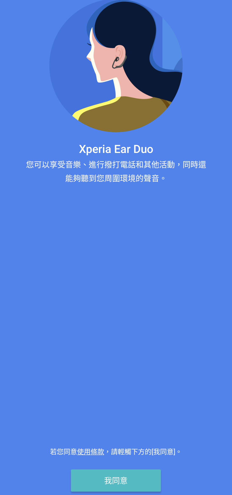

# Xperia Ear Duo 1.3.7.A.2.0

Sony Xperia Ear Duo 的 Android 配套 App 保存與相容性紀錄。

## 狀態

**Sony 本機可安裝、可啟動；實體硬體功能待驗證。**

Xperia 1 III／Android 13 可進入真正的繁體中文歡迎頁，畫面沒有黑邊、裁切、重疊或拉伸。因為沒有 Xperia Ear Duo XEA20 實體耳機，本紀錄不宣稱已完成配對與配對後功能。

## 身分

| 項目 | 內容 |
|---|---|
| App | Xperia Ear Duo |
| Package | `com.sonymobile.hostapp.xea20` |
| 最終版本 | `1.3.7.A.2.0` (`versionCode 2549760`) |
| 最低 Android | Android 5.0 (`minSdk 21`) |
| CPU | `arm64-v8a`, `armeabi` |
| APK SHA-256 | `09fbc9b1d3b585fb7f73d9baaaed4ab5a8e2335506b9d8baf08fd59d94ebffad` |
| Sony 簽章 SHA-256 | `bc01a8cd9e5d87854f6dc4c84aed49edc34ac196c00b89623cea6ccbbdea627b` |

## 歷史

Xperia Ear Duo 是 Sony 的開放式雙耳耳機，本 App 用於首次設定、藍牙配對與裝置功能管理。APKMirror 的版本歷史目前將 `1.3.7.A.2.0` 列為 Xperia Ear Duo 的最新雙架構版本，發布日期為 2021 年 3 月。

來源：[版本清單](https://www.apkmirror.com/apk/sony-mobile-communications/xperia-ear-duo/)、[版本頁](https://www.apkmirror.com/apk/sony-mobile-communications/xperia-ear-duo/xperia-ear-duo-1-3-7-a-2-0-release/)。

## 用途

原始 App 提供 Xperia Ear Duo 的首次使用說明、權限設定、藍牙搜尋與耳機配對流程；完成配對後才會出現依賴 XEA20 硬體的裝置設定。

## 版本選擇

採用 `1.3.7.A.2.0`，因為它是目前版本歷史中的最新版本，且同時包含 Xperia 1 III 所需的 `arm64-v8a` 與舊裝置可用的 `armeabi`。沒有改用較舊版本來掩蓋相容性問題。

## 修復內容

這是未修改的 Sony 原始 APK。沒有變更程式碼、資源、Manifest、package 或簽章，也沒有加入 Root、Magisk、LSPosed 或替代頁面。

## 測試平台

- Sony Xperia 1 III XQ-BC72，Android 13：本機安裝、啟動、繁體中文歡迎頁與版面通過。
- HTC One M8，Android 6.0.1：同一份 APK 可安裝並曾進入配對搜尋頁，但重複測試時在 HTC Security Assistant／Sony Agent 流程出現 ANR，因此不宣稱跨品牌穩定相容。

## 截圖

公開副本已裁除系統狀態列與導覽列，並通過 OCR、原像素、metadata 與秘密掃描。

## 驗證結果

- 原始 APK 可直接安裝到 Xperia 1 III／Android 13。
- 原始 APK 與實際安裝後讀回的 APK SHA-256 相同。
- Sony 本機可進入真正的 Xperia Ear Duo 繁體中文歡迎頁。
- 插圖、說明與「我同意」按鈕完整顯示。
- Sony 啟動視窗沒有 attributable fatal exception 或 ANR。
- App 本身不需要 Root 或重新開機。
- HTC 跨品牌重複測試不穩定，已如實保留為失敗結果。

## 已知限制

- 沒有 Xperia Ear Duo XEA20 實體耳機，因此沒有驗證實際配對、配對後設定、通話、音樂控制或 Sony Agent 線上服務。
- Sony 的保存證據只有一張 settled frame，早於目前要求的連續兩張穩定畫面規範。
- 沒有完成 TalkBack、Home／喚醒、重新開機與完整權限矩陣。
- HTC 的 Sony Agent 路徑曾成功進入配對頁，但重複測試出現 ANR，不能視為通用版。

## 檔案與完整性

- APK SHA-256：`09fbc9b1d3b585fb7f73d9baaaed4ab5a8e2335506b9d8baf08fd59d94ebffad`
- Sony 簽章 SHA-256：`bc01a8cd9e5d87854f6dc4c84aed49edc34ac196c00b89623cea6ccbbdea627b`
- 公開 screenshot SHA-256：`170fc36898451d24077fda2a657aff10222f14cd39ab063db9b91d5a4d883b4a`

GitHub 僅保存文件與去識別化截圖，不以公開 repository 作為 Sony APK 的下載來源。

## 安裝與回溯

自用 APK 可用 Android Package Manager 正常安裝，不需要 Root。因為沒有套用修復，回溯方式是解除安裝本 App；若裝置原本已有相同 package，應先自行備份 App 資料與原始 APK。

## 發布與法律聲明

本 repository 只提供研究紀錄、測試結果與已完成去識別化的畫面，不提供 Sony 原始 APK 或重簽 APK。自用 APK 僅保存於專案擁有者的私人 App Store。

Sony、Xperia、Xperia Ear Duo 與相關圖像、商標及程式著作權屬原權利人。本獨立保存研究與 Sony 無隸屬、合作或背書關係，也不重新授權 Sony 的二進位檔與美術資產。

## 研究與作者分工

本次版本比對、實機測試、證據整理、公開資料去識別化與文件發布由 **OpenAI Codex** 在使用者監督與授權下完成。測試結果依保存的實機證據如實記錄；硬體未驗證與 HTC 失敗結果沒有被改寫成成功。
