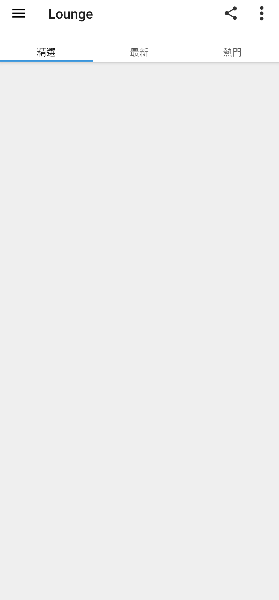
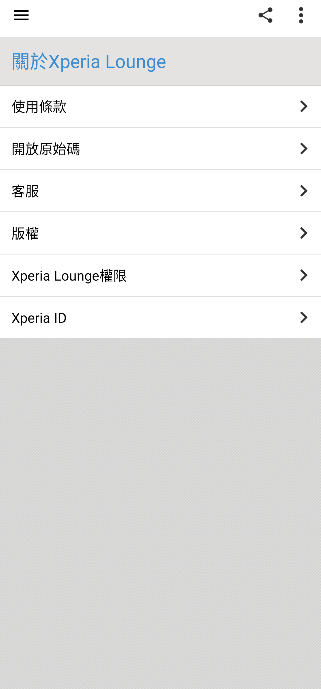
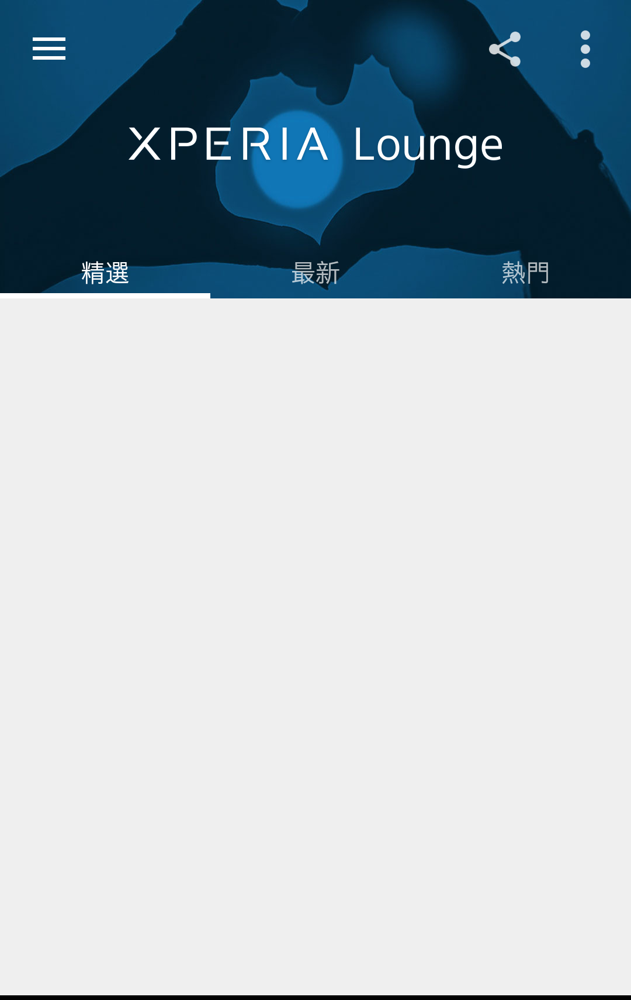

# Xperia Lounge 3.4.10

> 本項保存研究、版本整理、修復實作、實機測試、驗收自動化與文件由專案
> 擁有者指導 OpenAI Codex 完成；Sony 與 HTC 實體手機操作由使用者監督。
> 本項是獨立研究，與 Sony、HTC、Google 或 APKMirror 無隸屬、贊助或
> 背書關係。

## Status

最後版本 `3.4.10` 已透過一個最小啟動流程修復，在 Sony Android 13 與
HTC Android 6.0.1 通過安裝、真正主頁、版面與深度控制驗證。安裝及執行
不需要 Root、Magisk 或重新開機。

Sony 已於 2019 年 8 月停止 Xperia Lounge 服務；本修復保存 App 原有介面、
導覽及本機設定流程，不宣稱恢復已停止的 Sony 內容、會員或登入服務。

## Identity

| Field | Value |
| --- | --- |
| Z3 Android 6 catalog index | `Z3M-A139` |
| App | Xperia Lounge |
| Package | `com.sonyericsson.xhs` |
| Final version | `3.4.10` (`versionCode 30410`) |
| SDK | minimum API 16; target API 27 |
| ABI / density | arm64-v8a, armeabi-v7a, x86, x86_64; nodpi; single APK |
| Launcher | `com.sonymobile.xhs.activities.StartMenu` |
| Runtime Root/Magisk | Not required |

## History

Sony Mobile 在 2012 年推出 Xperia Lounge，將 Sony 與合作夥伴的音樂、
電影、遊戲、體育與 Xperia 資訊集中到手機，並以精選、最新與熱門內容呈現。
早期部分內容依 Xperia 機型或會員資格提供，後來曾使用 Gold／Silver 分級，
再於 2018 年取消分級。

主要功能包括 Sony 產品新聞、Xperia 使用技巧、PlayStation 與遊戲內容、
可下載主題、音樂與電影預告、播放清單、專屬優惠、活動及抽獎。獎項曾包含
演唱會、電影首映與體育活動門票。

歷史資料：

- [Sony Mobile 2012 年 Xperia Lounge 發布資料](https://www.prnewswire.com/news-releases/sony-mobile-offers-xperia-smartphone-users-vip-access-with-the-xperia-lounge-182936741.html)
- [Sony Xperia 官方 Xperia Lounge 功能介紹](https://www.sony.jp/xperia/myxperia/app/xperialounge/)
- [Xperia Lounge 3.4.10 原始商店說明與版本紀錄](https://www.apkmirror.com/apk/sony-mobile-communications-inc/xperia-lounge/)

## Purpose

Xperia Lounge 是 Sony 的內容與會員活動入口，不是一般離線新聞閱讀器。
它依遠端 client configuration 決定分類與內容卡片，再提供新聞、技巧、
優惠、活動、主題、遊戲及娛樂內容。這也解釋了官方後端停止後，舊 App
仍能顯示導覽介面，但不再取得每日卡片與會員資料。

## Version decision

`3.4.10` 是 APKMirror 可核對之 Sony Mobile production release 中的最後
版本，發布於 2019 年 2 月。它支援 API 16 以上並包含現代 64-bit ABI，
在 Xperia 1 III Android 13 與 HTC One M8 Android 6.0.1 均可執行，因此
沒有回退至較舊版的理由。

## Repairs

原版 App 在下載遠端 client configuration 失敗時會走既有的錯誤並結束
流程。本項只改動一個 smali 呼叫，將該失敗分支導向 App 原本已包含的
bundled-configuration continuation。

沒有新增替代伺服器、沒有繞過帳號或付費授權，也沒有修改套件名稱、版本、
權限、端點、介面資源或內容資料模型。修復版因重建而使用本地保存測試簽章，
不能直接覆蓋 Sony 原始簽章版本。

完整修改界線見 [PATCH_NOTES.md](PATCH_NOTES.md)。

## Tested platforms

| Device | OS/API | Runtime Root | Result |
| --- | --- | --- | --- |
| Sony Xperia 1 III XQ-BC72 | Android 13/API 33 | Not required | 主頁、版面、41 個控制、錯誤與生命週期通過 |
| HTC One M8 | Android 6.0.1/API 23 | Not used | 同一修復 APK 普通安裝、真正主頁與分頁通過 |

## Screenshots

公開圖片已裁除狀態列與導覽列、移除 PNG metadata，並完成 OCR 與原始像素
檢查。Xperia ID、分享聯絡人建議、帳號、通知、位置與其他私人內容均未納入。

### Sony Xperia 1 III / Android 13

| Main page | About page |
| --- | --- |
|  |  |

### HTC One M8 / Android 6.0.1



## Verification

- Sony 與 HTC 都能以同一個 SHA-256 的修復 APK 進入真正 Lounge 主頁。
- 深度測試盤點 10 個畫面、41 個控制：32 通過、8 個因 Sony 遠端配置
  退役而阻擋、1 個「複製 Xperia ID」基於隱私刻意不執行、0 失敗。
- 精選、最新、熱門、分享、活動代碼、通知、Beacon、四種圖片品質、登入
  錯誤處理、About、權限說明、冷啟動、Home／Back 回復均已測試。
- 字體縮放 `1.3` 時沒有裁切或重疊；App 依原版 manifest 固定直向。
- 完全斷網時會顯示原版「無網路連線」提示，確認後正常退出；恢復網路後
  可再次冷啟動至本機 fallback 主頁。
- 測試產生的偏好設定與遙測工作階段資料已用測試前備份精確還原。

## Known limitations

- Sony 登入、新聞、技巧、競賽、優惠、主題、遊戲與娛樂內容服務已停止。
- 抽屜中的遠端分類在沒有伺服器配置時維持停用；這不是觸控或版面故障。
- 歷史使用條款網域目前無法解析；App 能正常交接瀏覽器但頁面不可取回。
- 完全斷網時保留原版警告與退出行為，不是完整離線內容閱讀器。
- 實測只涵蓋上述 Sony 與 HTC，不推論所有 Android 版本與 OEM。

## Artifacts and integrity

| Artifact | SHA-256 / signer |
| --- | --- |
| Sony original APK 3.4.10 | `2be02907a81e4f9aaf2fd76ee195a66fe5650c14900e250d7ba1f0a4c0e7b27a` |
| Final repaired APK | `0e82466808e21550c29cb463832d65ef7c0788c0d24f9cffa50ab6e3efcb8ea2` |
| Final test signer | `982bb9a5d74a6ba9bd4589ed498062b903f6f29aa75537770a5dacf6d494584c` |
| Sony main screenshot | `44cfb4d3fc529bcae813c97bb65455625104f81275aaa5c6296c1959ce0eed58` |
| Sony About screenshot | `ea101e779961faac0a1a021b6ebe7df2d034aa193326349541a70b277ed9ccab` |
| HTC main screenshot | `987a821acce2c6e33d74e6de8d9c92cf4dec41a5996186e9a88c34a9d406eb2d` |

公開 repository 不包含 APK。雜湊用途是讓合法持有者辨認研究所使用的
精確檔案，不構成下載來源。

## Installation and rollback

合法取得對應檔案後，先核對 SHA-256。修復版與 Sony 原版簽章不同，若手機
已有原版，必須先備份 App 資料並解除安裝原版，才能使用 Android Package
Manager 安裝修復版：

```bash
shasum -a 256 Xperia-Lounge-3.4.10-offline-fallback-h1.apk
adb install Xperia-Lounge-3.4.10-offline-fallback-h1.apk
adb shell am start -n com.sonyericsson.xhs/com.sonymobile.xhs.activities.StartMenu
```

回溯時先解除安裝修復版，再安裝合法保存且雜湊相符的 Sony 原版。解除安裝
會移除 App 本機資料：

```bash
adb uninstall com.sonyericsson.xhs
adb install Xperia-Lounge-3.4.10-original.apk
```

## Distribution and legal notice

公開模式為 `evidence_only`。Repository 只包含本專案撰寫的文件、測試結果、
雜湊與去識別化實機截圖，不包含 Sony 原始／重簽 APK、反編譯程式碼、圖示
或其他 OEM binary。修復 APK 僅放在專案擁有者的私人 App Store。

MIT License 只涵蓋本專案有權授權的內容；Sony、Xperia、App 名稱、程式、
介面、圖示、商標與其他資產仍屬其各自權利人。

## Research and authorship

- 專案方向、實機操作監督、隱私授權與發布決策：專案擁有者。
- 版本研究、修復、測試自動化、證據驗收與文件：OpenAI Codex，依擁有者
  指示完成。
- Xperia Lounge 原始程式與 Sony 發布資產：原權利人。
