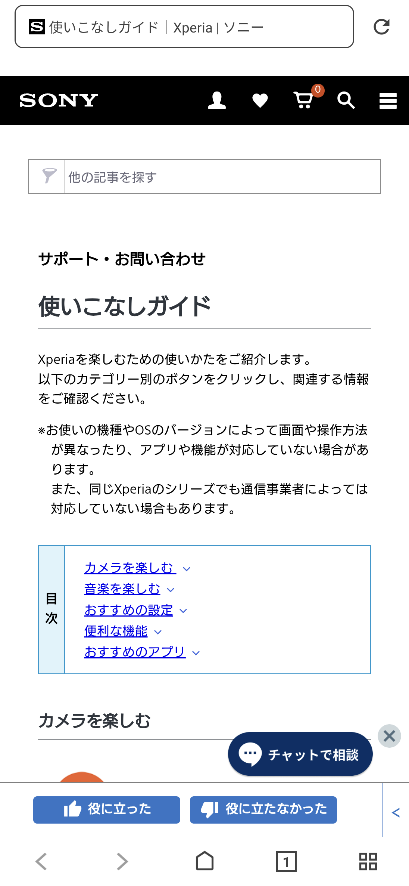
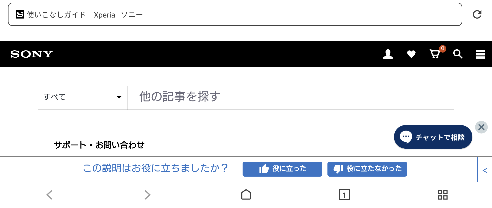

# Sony Xperia Usage Guide 3.00.00 保存研究

> 本項保存研究、實機驗證與文件由專案擁有者指導，OpenAI Codex 完成。這是獨立研究，與 Sony、HTC 或 APKMirror 無隸屬、贊助或背書關係。

## 狀態

技術驗收結果為 **`accepted_sony_only`**。原版 APK 可在 Sony Xperia 1 III／Android 13 正常執行入口功能；HTC One M8／Android 6.0.1 因系統版本低於最低需求而無法安裝。

## 身分

| 項目 | 內容 |
|---|---|
| App | Xperia使いこなしガイド／Xperia Usage Guide |
| Package | `com.sonymobile.xperia.guide` |
| 發布者 | Sony Mobile Communications |
| 類型 | Launcher 可見的外部瀏覽器入口 |

## 歷史

這是 Sony 為日本 Xperia 使用者提供的指南入口，讓 Xperia 使用者前往 Sony Japan 的線上使用指南。APKMirror 的版本紀錄目前以 `3.00.00` 為此 App 家族的最新版本。

## 用途

`Xperia使いこなしガイド` 是 Sony 為日本 Xperia 使用者提供的指南入口。這個小型 App 不包含內建文章頁面；啟動後會把固定的 Sony Japan 使用指南網址交給系統預設瀏覽器，然後立即結束自己的 Activity。

因此，本項目的「真正主功能」是 **外部瀏覽器入口契約**，不是 App 內閱讀器。截圖中可見的網址列、搜尋、購物車、聊天與網站分類均屬於 Sony Browser 或遠端 Sony 網站，不是本 App 的控制項。

## 版本選擇

| 項目 | 結果 |
|---|---|
| Package | `com.sonymobile.xperia.guide` |
| 版本 | `3.00.00` (`30000`) |
| 最低／目標 Android | API 30／API 30 |
| 架構 | noarch、nodpi、單一 APK |
| 原始 APK SHA-256 | `39326b33cae1f7c89148af7bde19a9f26addc0120f3e9017a328c1fd9483f72c` |
| Sony signer SHA-256 | `bc01a8cd9e5d87854f6dc4c84aed49edc34ac196c00b89623cea6ccbbdea627b` |

APKMirror 的版本頁顯示 `3.00.00` 為此 App 家族的最新版本；本研究保留 Android 11+、noarch、nodpi variant。

沒有比 `3.00.00` 更新而需淘汰的候選版本。

## 修復內容

沒有更動 APK。

- 未反編譯重包
- 未修改 Manifest、程式碼或資源
- 未重新簽章
- 不需要 Root、Magisk 或重新開機
- 安裝後拉回的 APK 與原始檔 SHA-256 完全一致

刻意未恢復的功能：沒有把遠端指南改造成離線文章庫，也沒有修改固定網址、語言或瀏覽器交接方式，以保留原版行為。

## 測試平台

### Sony Xperia 1 III

- Android 13／API 33
- 原版 APK 普通安裝成功
- 三次冷啟動均成功交接至 Sony Browser
- Sony Japan Xperia 指南頁目前仍能載入
- 直屏與橫屏可正常顯示，未見 App 所造成的黑邊、裁切或重疊
- 無可歸因於本 App 的 Fatal、ANR、SecurityException 或 linkage crash

### HTC One M8

- Android 6.0.1／API 23
- 同一份 APK 安裝失敗：`INSTALL_FAILED_OLDER_SDK`
- 因此技術結論是 `accepted_sony_only`，不宣稱跨品牌可攜性

## 驗證結果

本 App 內部可見控制項為 **0 個**。唯一工作流程是啟動固定網址。外部瀏覽器與網站控制項不納入本 App 的深度控制統計。

- Sony 上連續三次冷啟動均完成外部瀏覽器交接
- 直屏與橫屏均載入真正的 Sony Japan 指南頁面
- 未發現可歸因於本 App 的 Fatal、ANR、SecurityException、linkage 或 native crash
- 安裝後拉回 APK 的 SHA-256 與保存原件一致
- HTC 使用同一份原件測試，保留實際 `INSTALL_FAILED_OLDER_SDK` 結果

## 已知限制

已知限制：

- 內容與可用性依賴 Sony Japan 網站及網路連線
- 內容主要為日文
- 最低需求為 Android 11／API 30
- 網站未來若改址或停止服務，原版 App 不會自行提供離線內容
- 本次只驗證入口與頁面載入，未提交搜尋、購物車、聊天、回饋或帳號操作

## 截圖

### 直屏

### 橫屏

公開截圖已移除系統狀態列與導覽列，並完成像素、OCR、檔案中繼資料及公開候選內容檢查。

## 檔案與完整性

- 原始 APK SHA-256：`39326b33cae1f7c89148af7bde19a9f26addc0120f3e9017a328c1fd9483f72c`
- Sony signer SHA-256：`bc01a8cd9e5d87854f6dc4c84aed49edc34ac196c00b89623cea6ccbbdea627b`
- 公開檔案雜湊：見 [`SHA256SUMS`](SHA256SUMS)
- 完整測試摘要：見 [`TEST_RESULT.md`](TEST_RESULT.md)
- 重製修復步驟：不適用，因 APK 未修改、未重簽

## 安裝與回溯

在 Android 11 或更新版本，可用一般套件安裝方式安裝保存原件。測試過的回溯方式是從系統設定解除安裝 `com.sonymobile.xperia.guide`；本 App 未部署 systemless overlay、Magisk 模組或系統分割區檔案，因此解除安裝後不殘留修復元件。

## 發布與法律聲明

公開 GitHub 僅提供研究文件、雜湊、測試結果與去識別化截圖，不提供 Sony 專有 APK。Sony 的 APK、名稱、商標、程式碼與圖像權利仍屬各自權利人；本 repository 不對 OEM 內容重新授權。

專案擁有者的私人 App Store 與私人 NAS 另行保存完全相同的原版 APK 與完整研究證據。

公開散布模式：**`evidence_only`**。

## 研究與作者分工

專案擁有者提出保存目標、提供測試裝置並監督結果；OpenAI Codex 執行版本核對、實機測試、證據整理、去識別化檢查與文件製作。Sony 是原 App 與品牌的權利人；APKMirror 僅作為版本來源參考。本研究不代表 Sony、HTC 或 APKMirror。

來源：[APKMirror Xperia使いこなしガイド 3.00.00](https://www.apkmirror.com/apk/sony-mobile-communications/xperia%E4%BD%BF%E3%81%84%E3%81%93%E3%81%AA%E3%81%97%E3%82%AC%E3%82%A4%E3%83%89/xperia%E4%BD%BF%E3%81%84%E3%81%93%E3%81%AA%E3%81%97%E3%82%AC%E3%82%A4%E3%83%89-3-00-00-release/)
