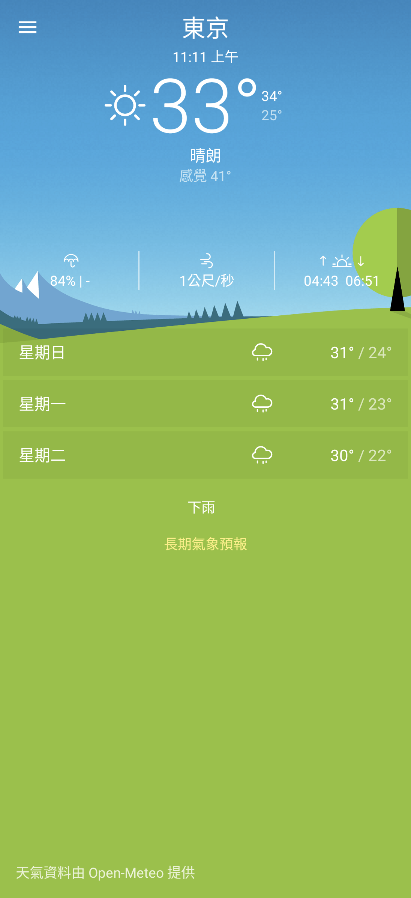
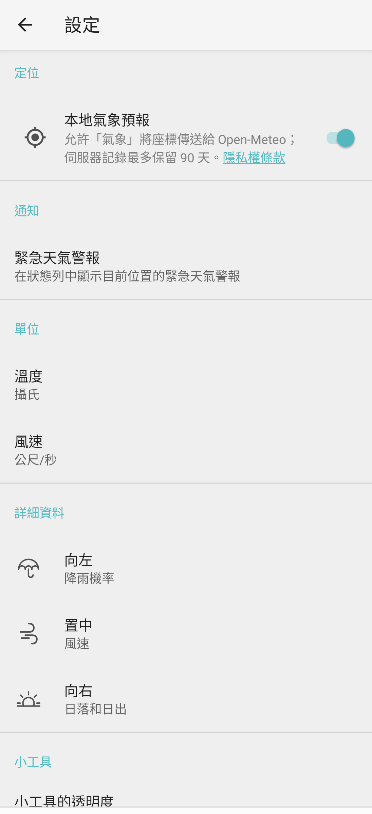

# Xperia Weather 1.3.A.4.27 Open-Meteo v3f

> 本項研究、反編譯分析、最小修復、實機測試及文件由專案擁有者指導，
> OpenAI Codex 完成。Sony 與 HTC 實體手機結果由使用者監督。這是獨立
> 保存研究，與 Sony、HTC、Open-Meteo 或 APKMirror 無隸屬、贊助或背書關係。

## 狀態

技術驗證完成。最終 v3f 可用一般 APK 安裝方式，在 Sony Android 13 與
HTC Android 6.0.1 進入真正主頁、搜尋並保存城市、取得即時天氣與預報。
原本失效的 AccuWeather 傳輸已換成 Open-Meteo，公開模式為
`evidence_only`；本 repository 不提供 Sony 原始 APK、重簽 APK、完整
反編譯程式碼或 Sony 圖像資產。

## 身分

| 欄位 | 內容 |
| --- | --- |
| Catalog index | `Z3M-A163` |
| App | Xperia Weather |
| Package | `com.sonymobile.xperiaweather` |
| 最終版本 | `1.3.A.4.27`（versionCode `2494491`） |
| 最終修復 | Open-Meteo portable v3f |
| 最低 Android | Android 5.0／API 21 |
| 元件類型 | App 抽屜可見 Launcher App，另含三個 Weather Widget Provider |
| 執行所需 Root／Magisk | 不需要 |

## 歷史

Xperia Weather 是 Sony Mobile 的天氣應用程式，提供目前天氣、每日預報、
多城市管理、溫度與風速單位、天氣警報及桌面小工具。APKMirror 所收錄的
[1.3.A.4.27](https://www.apkmirror.com/apk/sony-mobile-communications/xperia-weather/xperia-weather-1-3-a-4-27-release/xperia-weather-1-3-a-4-27-android-apk-download/)
發布於 2019 年，是該目錄目前可確認的最後版本。Sony 的裝置說明亦記載
Weather Widget 可在主畫面顯示基本天氣資訊。

## 用途

App 可搜尋及保存城市，在原有 Sony 介面中查看目前溫度、體感溫度、最高與
最低溫、濕度、風速、降雨機率、日出日落、UV 指數與多日預報。使用者可切換
攝氏／華氏、四種風速單位、三個詳細資料欄位及天氣警報偏好。

## 版本選擇

`1.3.A.4.27` 是 APKMirror Xperia Weather 目錄中目前可確認的最新版，
versionCode 為 `2494491`，支援 Android 5.0 以上、無 native ABI 限制。
沒有發現版本號更高且可作為同 package 正式候選的 Sony 發行版，因此未採用
較舊版本回退。

## 修復內容

原版可安裝及顯示介面，但其 AccuWeather HTTPS 請求因退役服務與 certificate
pinning 失敗而無法更新。最終 v3f 依序完成：

1. 以 Open-Meteo 相容層接回目前天氣、多日預報及城市搜尋；
2. 將舊 AccuWeather 標示、連結與首次啟動說明改成 Open-Meteo；
3. 修正 Android 6 對 Sony optional library 與 manifest metadata 的解析；
4. 保留 hostname／certificate-chain 驗證，補入官方 ISRG Root X1 以支援
   HTC Android 6 的舊 trust store；
5. 加入 `uv_index_max`，填入原有 UV 欄位，並用原 App 相同的四捨五入方式
   套用台灣中央氣象署五級 UV 分類；
6. 保留原 package、版本、Sony UI、資料庫、Activity 與 Widget Provider。

### 刻意未恢復

- 沒有重建 AccuWeather 官方後端、Sony 私有伺服器或原服務的帳號關係。
- 外部天氣／預報連結以現行資料來源對應，不宣稱等同退役服務內容。
- 未在使用者目前桌面放置實體小工具；三個 Provider 的註冊與更新事件已驗證，
  小工具透明度控制也已驗證。

## 測試平台

| 裝置 | OS／API | 安裝與執行 Root | 結果 |
| --- | --- | --- | --- |
| Sony Xperia 1 III XQ-BC72 | Android 13／API 33 | 不需要 | 主頁、即時資料、全部安全控制與離線恢復通過 |
| HTC One M8 | Android 6.0.1／API 23 | 不需要 | 同一 v3f 安裝、城市搜尋、即時天氣與 UV 通過 |

## 截圖

公開副本已裁掉狀態列與系統導覽列、移除 PNG metadata，並經 OCR、原始像素及
隱私檢查。東京是通用測試城市，不是使用者位置。

| Sony Android 13 主頁 | Sony Android 13 設定 |
| --- | --- |
|  |  |

## 驗證結果

- Sony 與 HTC 拉回的已安裝 APK SHA-256 均與凍結 v3f 完全一致。
- Sony 冷啟動兩次的畫面與 UI hierarchy 穩定，沒有 App 所屬 fatal、ANR、
  TLS、security、verification 或 linkage 錯誤。
- HTC 以一般 Package Manager 安裝，搜尋台北並載入即時天氣；UV 顯示
  `9 - 過量級`，Sony 同一控制顯示 `6 - 高量級`，分類與畫面整數一致。
- App 設計為固定直向；兩台裝置的橫向要求均維持正確直向，不是旋轉後壞版。
- 35 個控制合約已閉合：34 個通過；唯一外部宿主項目是未改動使用者桌面的
  實體 Widget 呈現。Provider 註冊、更新及 Widget 透明度均通過。
- 新增東京後 force-stop／重開仍保留；刪除後再次重開仍維持刪除。
- 網路關閉時保留快取畫面；恢復網路後可再次更新。
- 首次啟動的通知與定位允許／拒絕／略過分支均可到達可用主頁。
- v3f 降回 v3d、再升回 v3f 的實機回溯通過，既有城市資料保留。

## 已知限制

- 天氣資料取決於 Open-Meteo 網路服務；短暫過載時 App 顯示既有快取。
- 啟用「本地氣象預報」會把座標交給 Open-Meteo。修復版首次啟動畫面已明確
  告知用途；不想傳送位置時可略過並只加入一般城市。
- 固定直向是 App 原有契約；本研究沒有把它改成橫向版。
- 實體 Launcher Widget 尚未在可丟棄宿主中做像素驗收。
- 測試只涵蓋上述兩台實體裝置，不推論所有 Android／OEM 均相容。

## 檔案與完整性

| 項目 | SHA-256／簽署 |
| --- | --- |
| APKMirror 原始 APK | `78b3ebdcb1a18258b66b3282a69f6016cee7c24af1c267d5fbb0af2c2580e1f7` |
| 原始 Sony signer certificate | `bc01a8cd9e5d87854f6dc4c84aed49edc34ac196c00b89623cea6ccbbdea627b` |
| 內部最終 v3f 與兩機拉回 APK | `f7d0fe3e2880d362ce00b6c6fb9bf39452fb06fae61db2a82db6e1ca05559dda` |
| 最終 v3f 測試簽章 | `982bb9a5d74a6ba9bd4589ed498062b903f6f29aa75537770a5dacf6d494584c` |

最終檔使用本地研究憑證，不是 Sony production signer。公開紀錄提供可核對的
修復範圍與測試結果，但不提供 OEM binary 或完整反編譯來源。

## 安裝與回溯

私人自用 APK 由專案擁有者登入私人 App Store 取得，再以一般 Android 安裝
流程更新同一研究簽章版本。安裝前應核對 v3f SHA-256。

回溯已實測：先保留 App 資料與舊 APK，安裝 v3d，確認可啟動，再重新安裝
v3f。若要完全離開研究版，可解除安裝 `com.sonymobile.xperiaweather`；
解除安裝會刪除其城市與設定，應先備份。

## 發布與法律聲明

GitHub 發布模式為 `evidence_only`。本 repository 不含 Sony APK、重簽 APK、
完整反編譯程式碼、Sony 圖示或其他 OEM binary。MIT License 只涵蓋本專案
撰寫的文件與測試紀錄，不授權 Sony 程式、名稱、商標、圖像或其他第三方
內容；相關權利仍屬原權利人。

私人 App Store 的 APK 僅供專案擁有者本人登入、自用，不是公開 repository
的一部分，也不改變 GitHub 的 `evidence_only` 模式。

## 研究與作者分工

- 專案方向、實機操作監督、隱私授權與發布決策：專案擁有者。
- 版本查核、反編譯分析、修復、測試自動化、證據整理與文件：OpenAI Codex，
  依專案擁有者指示執行。
- Xperia Weather 原始程式、Sony 名稱與圖像資產：原權利人。
- 天氣與 geocoding 資料：[Open-Meteo](https://open-meteo.com/)。
- UV 分級：[交通部中央氣象署紫外線指數預報說明](https://www.cwa.gov.tw/Data/knowledge/announce/service13.pdf)。
- 原始版本與雜湊：[APKMirror Xperia Weather 1.3.A.4.27](https://www.apkmirror.com/apk/sony-mobile-communications/xperia-weather/xperia-weather-1-3-a-4-27-release/xperia-weather-1-3-a-4-27-android-apk-download/)。
